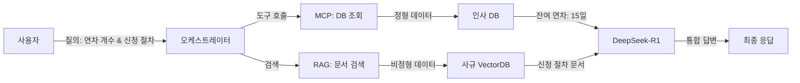
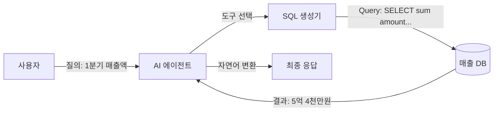
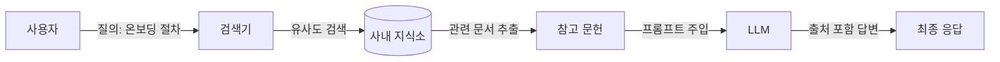
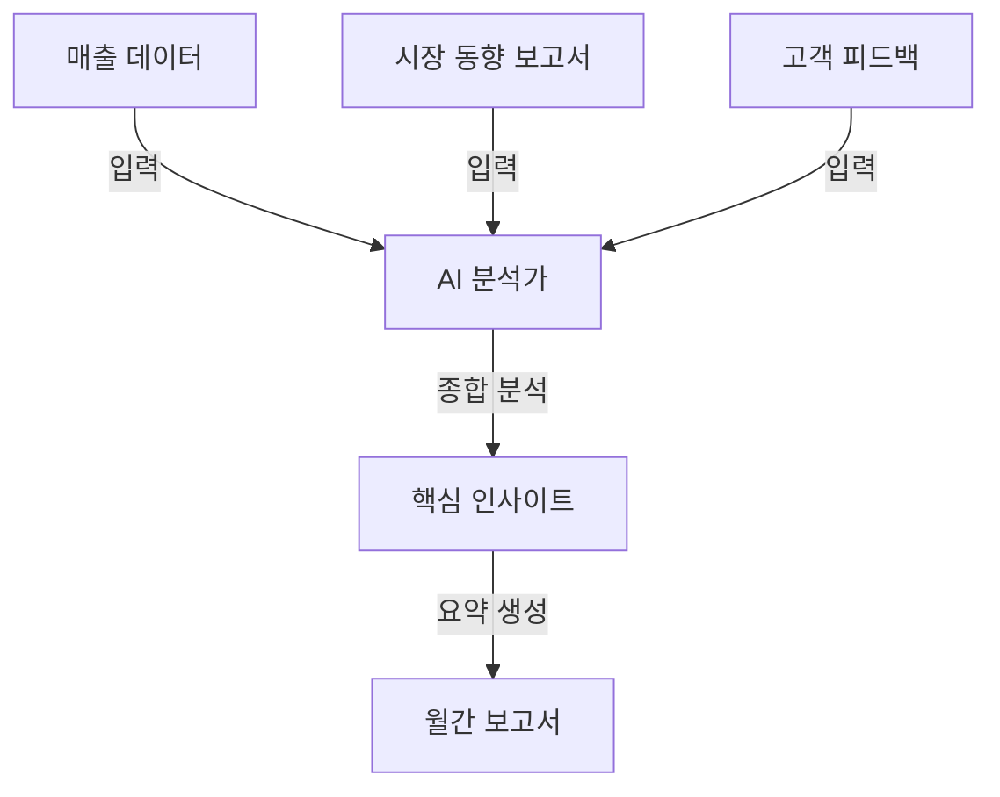
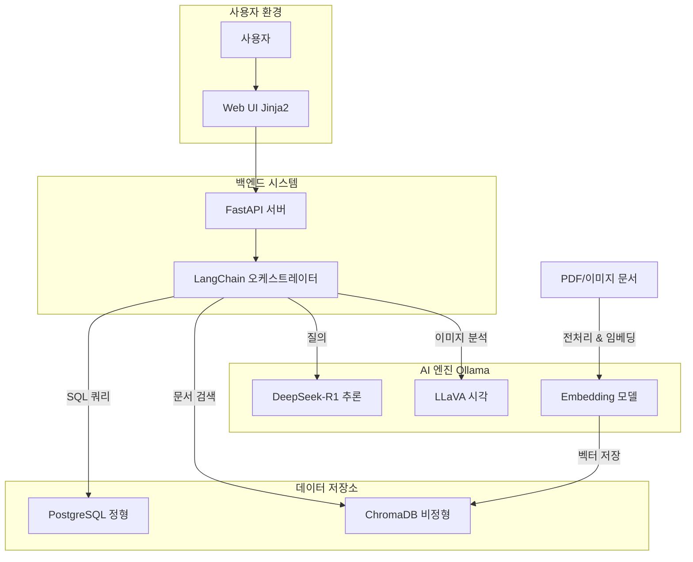

# 1장. 이 책의 목표와 최종 완성본 미리보기

사내 비즈니스 지식 엔진 구축 과정을 시작하기 전, 우리가 도달하게 될 최종 목적지를 확인합니다. 본 장에서는 시스템의 핵심 철학인 RAG와 MCP의 결합 전략을 소개하고, 완성된 'AI 업무 비서'가 실제 비즈니스 현장에서 어떻게 동작하는지 미리 살펴봅니다.

---

## 1. 이 책이 다루는 범위와 핵심 전략

기업 내부의 지식은 파편화되어 있습니다. 직원의 인사 정보는 데이터베이스(정형)에, 회사의 규정은 수많은 PDF 문서(비정형) 속에 잠들어 있습니다. 이 책은 이러한 흩어진 지식들을 하나로 묶어 LLM이 자유롭게 다룰 수 있는 통합 시스템을 구축하는 방법을 제시합니다.

### 1.1 모델 Fine-tuning이 아닌 'RAG 파이프라인 튜닝'

과거에는 특정 도메인 지식을 주입하기 위해 모델 자체를 재학습시키는 **파인튜닝** (Fine-tuning)이 필수적이었습니다. 하지만 이는 비용이 높고 최신성 유지가 어려우며, 데이터베이스의 실시간 값을 반영하지 못한다는 치명적인 단점이 있습니다.

본 서적은 모델을 건드리지 않는 대신, 외부 지식을 실시간으로 참조하는 **검색 증강 생성(RAG)** 과 외부 도구를 호출하는 **모델 컨텍스트 프로토콜(MCP)** 을 결합합니다. 특히 **DeepSeek-R1의 사고 능력(Reasoning)** 을 파이프라인의 컨트롤 타워로 배치하여, 단순한 검색을 넘어선 '문제 해결형' 시스템을 구축합니다.

### 1.2 비용 효율적이며 안전한 로컬 환경

사내 데이터 보안을 위해 외부 API 호출을 최소화합니다. Ollama를 활용하여 로컬 환경에서 **LLM** (DeepSeek R1, LLaVA)을 직접 실행하고, 모든 데이터 처리를 사내망 내에서 완결하는 보안 강화형 구축 전략을 기본으로 삼습니다.

---

## 2. 최종 결과물 데모 시나리오

우리가 완성할 시스템은 단순한 챗봇을 넘어, 정형 데이터와 비정형 문서를 넘나드는 진정한 '지능형 비서'입니다. 다음은 시스템이 처리하게 될 주요 시나리오입니다.

### 2.1 정형+비정형 복합 질의

> _"김대리님 남은 연차 개수와 올해 휴가 신청 절차를 함께 알려줘."_

_그림 1-1: 정형(MCP) + 비정형(RAG) 하이브리드 처리 흐름도_

- **처리**: MCP로 DB에서 실시간 연차 정보를 조회하고, RAG로 사내 규정 문서를 검색하여 하나의 문장으로 통합 답변합니다.

---

### 2.2 실시간 정형 데이터 조회

> _"지난 분기 우리 팀 총 매출액은 얼마야?"_

_그림 1-2: MCP를 활용한 실시간 정형 데이터 조회 구조_

- **처리**: MCP 기술을 활용하여 LLM이 직접 데이터베이스(PostgreSQL)에서 정확한 수치를 추출합니다.

---

### 2.3 비정형 문서 검색 및 근거 제시

> _"신입사원 온보딩 절차와 관련 서류를 알려줘."_

_그림 1-3: 벡터 검색을 통한 비정형 지식 추출_

- **처리**: VectorDB를 검색하여 방대한 문서 중 필요한 정보를 찾아내고, 답변 시 반드시 참고한 문서명과 섹션을 명시하여 신뢰도를 확보합니다.

---

### 2.4 지식 요약 및 합성

> _"위 내용들을 바탕으로 이번 달 업무 보고서를 요약해줘."_

_그림 1-4: 수집된 지식의 분석 및 요약 리포트 생성_

- **처리**: 수집된 정형/비정형 데이터를 LLM이 종합적으로 분석하여 환각(Hallucination) 없이 최종 요약본을 생성합니다.

---

## 3. 시스템 아키텍처 한 장 요약

전체 시스템은 실시간 질의응답을 처리하는 **런타임 단계** 와 문서를 지식화하는 **인덱싱 단계** 로 나뉩니다.

### 3.1 아키텍처 다이어그램 (System Architecture)

_그림 1-5: 사내 업무 비서 시스템 전체 아키텍처 (런타임 & 인덱싱 파이프라인)_

### 3.2 핵심 기술 스택

| 영역               | 기술 스택                | 용도                                |
| :----------------- | :----------------------- | :---------------------------------- |
| **추론 엔진**      | Ollama + DeepSeek R1     | 논리적 사고(Reasoning) 및 답변 생성 |
| **멀티모달**       | Ollama + LLaVA / EasyOCR | 이미지 의미 분석 및 텍스트 추출     |
| **백엔드**         | FastAPI + Jinja2         | 시스템 API 및 웹 UI 템플릿          |
| **데이터베이스**   | PostgreSQL / ChromaDB    | 정형 데이터 및 텍스트 벡터 저장     |
| **오케스트레이션** | LangChain                | 에이전트 브레인 및 도구 연동        |

---

## 4. 이 책을 마치면 얻게 될 역량

이 과정을 완수하면 여러분은 다음과 같은 실무 능력을 확보하게 됩니다.

- **로컬 LLM 기반 보안 시스템 운영**: 기업 보안을 유지하며 AI 인프라를 구축하는 역량.
- **하이브리드 데이터 설계**: DB와 문서를 통합하여 다루는 차세대 AI 아키텍처 설계 기술.
- **고도화된 RAG 파이프라인**: 텍스트를 넘어 이미지와 표까지 처리하는 지능형 검색 엔진 구현 능력.

이제 본격적인 학습을 시작하겠습니다. 다음 장(2장)에서는 DeepSeek-R1을 활용하여 RAG의 핵심 원리를 직접 실습해 보겠습니다.
