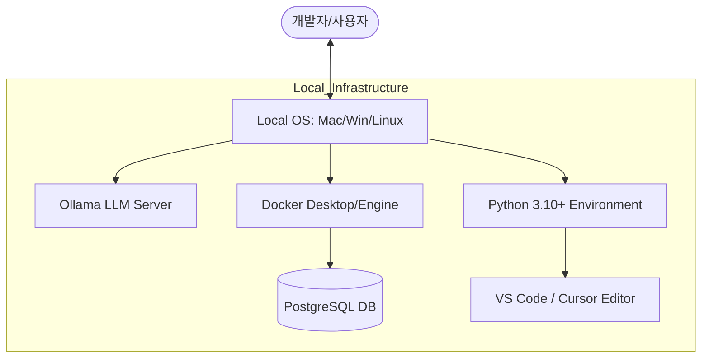

# 3장. 개발 환경 설정

본 장에서는 'AI 업무 비서'를 구축하기 위한 개발 인프라를 로컬 환경에 구성합니다. 우리는 외부 클라우드 의존성을 최소화하고 보안을 강화하기 위해 모든 LLM 추론과 데이터 관리를 로컬 머신 내에서 수행하는 것을 원칙으로 합니다.

---

## 1. 필수 시스템 요구사항

원활한 실습과 로컬 LLM 구동을 위해 다음과 같은 사양을 권장합니다.

- **CPU**: Apple Silicon (M1/M2/M3) 또는 Intel/AMD (AVX2 지원)
- **RAM**: 16GB 이상 (모델 구동 및 DB 동시 실행 시 필수)
- **저장공간**: 최소 20GB 이상의 여유 공간
- **OS**: macOS, Windows (WSL2 권장), 또는 Linux

---

## 2. 개발 환경 아키텍처

우리가 구축할 개발 환경의 구성 요소와 연결 구조입니다.



---

## 3. 실습용 프로젝트 초기화 (Git Clone)

우리는 미리 준비된 **베이스 시스템** 을 클론하여 실습을 시작합니다. 먼저 이 작업을 수행해야 이후의 DB 설정 등을 진행할 수 있습니다.

- **클론 명령어**:

```bash
git clone https://github.com/nomadlab/ai-llm-rag-study.git
cd ai-llm-rag-study
```

이 저장소에는 실습에 필요한 `docker-compose.yaml`, 파이썬 스크립트, 예제 문서들이 포함되어 있습니다.

---

## 4. 로컬 LLM 환경: 모델 확장 및 점검

2장에서 Ollama와 추론 모델(DeepSeek-R1)을 이미 설치했습니다. 본 장에서는 이미지 처리를 위한 **멀티모달 모델** 을 추가하고, 시스템이 정상적으로 API 요청을 받을 준비가 되었는지 점검합니다.

### 4.1 추가 모델 설치 (LLaVA)

이미지를 이해하고 분석하는 시각 지능 모델인 **LLaVA** 를 다운로드합니다. 이 모델은 이후 8장 (멀티모달 RAG)에서 사용됩니다.

```bash
ollama pull llava
```

### 4.2 Ollama 동작 상태 확인

터미널에서 다음 명령어를 입력하여 설치된 모델 목록과 서비스 상태를 확인합니다.

```bash
ollama list
# 출력 예시:
# NAME                ID              SIZE    MODIFIED
# deepseek-r1:8b      (hash값)       (용량)  (시간)
# nomic-embed-text    (hash값)       (용량)  (시간)
# llava               (hash값)       (용량)  (시간)
```

만약 목록이 보이지 않거나 연결 오류가 발생한다면, `ollama serve` 명령어로 백그라운드 서버를 실행해야 합니다.

> **Tip**: macOS나 Windows 앱 설치 시 Ollama는 자동으로 실행됩니다. 만약 `Error: address already in use` 메시지가 뜬다면 이미 서버가 잘 돌아가고 있다는 뜻이니 안심하고 다음 단계로 넘어가십시오.


_그림 3-1: Ollama 모델 목록 확인_

---

## 5. 데이터베이스 인프라: PostgreSQL 설치

정형 데이터(사원 정보, 급여 대장 등)를 관리하기 위해 PostgreSQL을 사용합니다.

> **Q. MCP만 있으면 되는 것 아닌가요?**
> MCP(Model Context Protocol)는 AI가 데이터를 조회할 수 있게 해주는 **'연결 통로(Interface)'**입니다. 하지만 실제로 데이터가 저장될 **'창고(Database)'**는 별도로 필요합니다. 우리는 그 창고로 **PostgreSQL**을 사용하며, 설치와 관리를 쉽게 하기 위해 **Docker**를 활용합니다.

로컬 환경을 더럽히지 않기 위해 **Docker** 로 컨테이너화하여 실행합니다. 이때 설정된 계정 정보는 다음과 같습니다:

- **User**: `metacoding`
- **Password**: `metacoding1234`
- **Database**: `metacoding_db`

### 5.1 Docker 설치 및 실행

- **Docker Desktop 설치**: [docker.com](https://www.docker.com/)에서 OS에 맞는 버전을 설치합니다.
- **실행 확인**: 터미널에서 `docker ps`를 입력했을 때 에러가 없어야 합니다.

### 5.2 데이터베이스 실행

방금 클론한 프로젝트 폴더 내의 `docker-compose.yaml` 파일을 사용하여 DB를 실행합니다.

```bash
# DB 컨테이너 백그라운드 실행
docker-compose up -d
```

실행 후 `docker ps` 명령어로 `postgres` 컨테이너가 `Up` 상태인지 또는 Docker Desktop에서 03_setup을 확인하십시오.


_그림 3-2: Docker 컨테이너 실행 확인_

---

이제 모든 도구가 준비되었습니다. 다음 장(4장)에서는 클론한 베이스 시스템을 실행하고 내부 구조를 분석해 보겠습니다.
