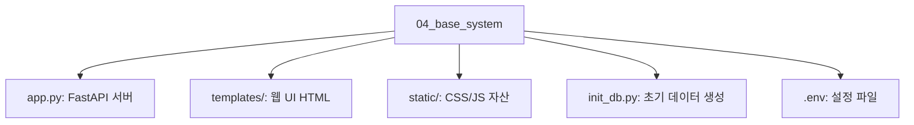

# 4장. 베이스 시스템 실행: "사내 AI 비서"의 무대

AI 에이전트가 똑똑하게 작동하려면 먼저 대화할 대상, 즉 **데이터와 시스템 환경** 이 있어야 합니다. 본 장에서는 미리 준비된 사내 시스템 코드를 확보하고, 에이전트의 활동 무대가 될 DB 구조를 분석합니다.

---

## 1. 베이스 소스 코드 준비

이미 3장에서 클론한 `ai-llm-rag-study` 저장소 내의 실습 폴더로 이동합니다.

### 1단계: 실습 폴더로 이동

실습 폴더인 `04_base_system` 으로 이동합니다.

### 2단계: 프로젝트 구조 확인

이 폴더는 AI 비서가 탑재될 가상의 사내 시스템(백엔드 + DB)을 담고 있습니다.



---

## 2. 데이터 아키텍처 이해 (3대 핵심 테이블)

에이전트가 조회하게 될 데이터베이스는 3개의 핵심 테이블로 구성되어 있습니다.

### 2.1 테이블 상관 관계도 (ERD)


_그림 4-2: 데이터베이스 ER 다이어그램 (Employee, Leave_Balance, Sales)_

- **직원 (Employee)** : 사내 구성원 기본 정보.
- **휴가 잔여 (Leave Balace)** : 잔여 연차 등 수치 데이터.
- **매출 (Sales)** : 부서별 실적 데이터.

---

## 3. 시스템 실행 및 확인

서버를 실행하여 관리자 대시보드가 정상적으로 출력되는지 확인합니다.

### 1단계: 의존성 설치

`04_base_system` 폴더 내의 라이브러리를 설치합니다.

```bash
pip install -r requirements.txt
```

> **Tip**: `pip`은 파이썬 라이브러리 관리 도구이며, `requirements.txt` 파일에 적힌 모든 라이브러리를 한 번에 설치합니다.

### 2단계: DB 초기화

가상의 사내 데이터를 생성합니다. (직원 정보, 매출 데이터 등)

```bash
python init_db.py
```

> **Tip**: `python` 명령어 뒤에 파일명을 적으면 해당 스크립트가 실행됩니다. 이 파일은 `init_db.py` 코드를 실행하여 DB에 초기 데이터를 채워 넣습니다.

### 3단계: 서버 실행

FastAPI 서버를 실행합니다.

```bash
uvicorn app:app --reload
```

> **Tip**: `uvicorn`은 FastAPI 서버를 실행하는 도구입니다. `--reload` 옵션은 코드를 수정할 때마다 자동으로 서버를 재시작해주는 편리한 기능입니다.

### 4단계: 접속 확인

브라우저를 열고 `http://localhost:8000` 에 접속합니다. 아래와 같은 **관리자 대시보드** 가 보이면 정상입니다.


대시보드에서 직원 명단과 부서별 매출 그래프가 잘 보이는지 확인하십시오.

---

이제 에이전트의 '몸체'인 시스템을 갖추었습니다. 다음 장(5장)에서는 에이전트가 읽게 될 '지식'인 사내 문서를 수집하고 표준화하는 전략을 학습하겠습니다.
