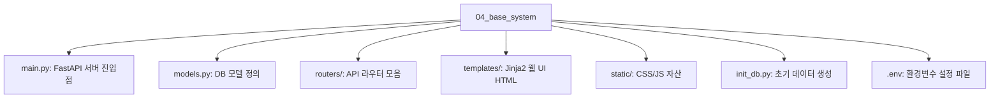

# 4장. 베이스 시스템 설정: 사내 AI 비서의 무대

AI 에이전트가 똑똑하게 작동하려면 먼저 대화할 대상, 즉 **데이터와 시스템 환경**이 있어야 합니다. 본 장에서는 `git clone`으로 미리 준비된 사내 시스템 코드를 확보하고, 에이전트의 활동 무대가 될 DB 구조와 API를 분석합니다.

---

## 1. FastAPI로 "초간단 사내 시스템" 만들기

우리의 목표는 **`git clone`으로 바로 시작할 수 있는 기본 시스템**을 구축하는 것입니다. 복잡한 설정 없이 명령 한 줄로 사내 시스템(ERP)을 내 로컬 환경에 띄우는 것부터 시작합니다.

### 1.1 프로젝트 구성

이미 3장에서 클론한 `ai-llm-rag-study` 저장소 내의 실습 폴더(`04_base_system`)로 이동합니다. 이 폴더는 AI 비서가 탑재될 가상의 사내 시스템(백엔드 + DB)을 담고 있습니다.

#### 폴더 구조 설명



- **환경변수 설정 (.env)**: DB 접속 정보나 API 키 등 민감한 정보를 관리합니다. 실습에서는 `sqlite:///./company.db`로 설정되어 있습니다.
- **실행 방법**: `uvicorn main:app --reload` 명령어로 서버를 실행합니다.

---

## 1.2 데이터 모델 설계 (3테이블)

에이전트가 조회하고 관리하게 될 데이터베이스는 3개의 핵심 테이블로 구성되어 있습니다.


_그림 4-1: 데이터베이스 ER 다이어그램 (Employee, Leave_Balance, Sales)_

### 테이블 컬럼 설명

| 테이블 명                | 주요 컬럼                                                 | 설명                                            |
| :----------------------- | :-------------------------------------------------------- | :---------------------------------------------- |
| **직원 (Employee)**      | `id`, `name`, `dept`, `email`, `hire_date`                | 사내 구성원의 기본 인적 사항 및 소속 부서 정보. |
| **휴가 (Leave_Balance)** | `id`, `employee_id`, `year`, `total`, `used`, `remaining` | 직원의 연차 총량, 사용량, 잔여량 관리.          |
| **매출 (Sales)**         | `id`, `dept`, `amount`, `date`, `description`             | 부서별 실적 데이터 및 날짜별 매출 기록.         |

---

## 1.3 CRUD API 구현

시스템의 핵심 기능인 데이터 조회 및 조작(Create, Read, Update, Delete)을 위한 API가 미리 구현되어 있습니다.

### 주요 API 목록

1.  **직원 관리 API**:
    - `POST /employees`: 신규 직원 등록
    - `GET /employees/{id}`: 특정 직원 정보 조회
    - `PUT /employees/{id}`: 직원 정보 수정
    - `DELETE /employees/{id}`: 직원 삭제

2.  **휴가 관리 API**:
    - `GET /leaves/{emp_id}`: 특정 직원의 잔여 휴가 조회
    - `POST /leaves/usage`: 휴가 사용 등록 (잔여량 자동 차감)
    - `PUT /leaves/{id}`: 휴가 데이터 강제 수정 (관리자용)

3.  **매출 관리 API**:
    - `POST /sales`: 매출 데이터 입력
    - `GET /sales/period`: 특정 기간별 매출 조회
    - `GET /sales/dept/{dept_name}`: 부서별 매출 집계 결과 조회

---

## 1.4 관리자 Admin UI

백엔드 API만 있으면 사용하기 불편하므로, **Jinja2 템플릿**을 기반으로 한 간단한 관리자 UI가 제공됩니다.

### 주요 기능 화면

1.  **간단한 입력 화면**: 직원 등록, 휴가 신청, 매출 입력을 위한 HTML 폼(Form).
2.  **데이터 조회/수정**: DB에 저장된 데이터를 테이블 형태로 조회하고 즉시 수정할 수 있는 어드민 페이지.


_그림 4-2: 관리자 대시보드 메인 화면_


_그림 4-3: 직원 데이터 리뷰 화면_

---

## 1.5 시스템 실행 실습

이제 실제로 서버를 띄워보고 위에서 설명한 기능들이 정상 작동하는지 확인해 봅시다.

### 1단계: 의존성 설치 및 DB 초기화

```bash
cd 04_base_system
pip install -r requirements.txt
python init_db.py
```

### 2단계: 서버 실행

```bash
uvicorn main:app --reload
```

브라우저에서 `http://localhost:8000`으로 접속하여 대시보드를 확인합니다.

---

## 마무리

이제 에이전트의 활동 무대인 **시스템(System)** 과 **데이터(Data)** 가 준비되었습니다. 다음 5장에서는 에이전트가 읽어야 할 **지식(Knowledge)** 인 사내 문서(PDF, 이미지)를 수집하고 표준화하는 과정을 다루겠습니다.
