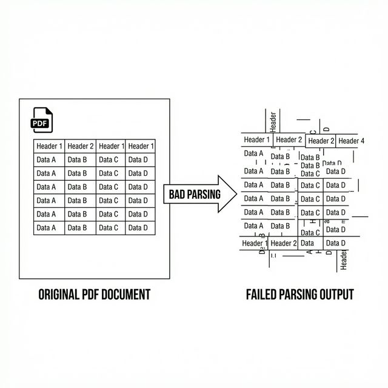

# 5장. 지식의 디지털화: 문서를 AI가 읽도록 만들기

RAG 시스템의 성능은 문서 품질에 직결됩니다. 아무리 똑똑한 모델이라도 깨진 글자를 주면 엉뚱한 답을 합니다. 본 장에서는 PDF 같은 **비정형 데이터** 를 AI가 이해하기 쉬운 **정형 텍스트(Markdown)** 로 변환하는 전처리 과정을 실습합니다.

---

## 1. 왜 그냥 PDF를 쓰면 안 되나요?

사람은 PDF의 레이아웃, 표, 다단 편집을 눈으로 쉽게 구분합니다. 하지만 컴퓨터가 이를 그대로 읽으면 순서가 뒤죽박죽 섞이거나 표가 텍스트 뭉치로 깨지는 문제가 발생합니다.



따라서 우리는 원본 문서를 **데이터 전처리(Preprocessing)** 과정을 거쳐 깨끗한 텍스트로 만들어야 합니다.

---

## 2. [실습] PDF 텍스트 추출 및 정제

이미 3장에서 클론한 `ai-llm-rag-study` 저장소 내의 실습 폴더로 이동합니다.

### 1단계: 실습 폴더로 이동

실습 폴더인 `05_preprocessing` 으로 이동합니다.

### 2단계: 필요한 라이브러리 설치

PDF 처리를 위한 `pymupdf` 와 이미지 처리를 위한 `pillow` 등을 설치합니다.

```bash
pip install -r requirements.txt
```

### 3단계: PDF 텍스트 추출 실행

`pdf_parser.py` 파일을 확인합니다. 이 스크립트는 `data/sample_policy.pdf` 파일을 읽어 텍스트만 추출합니다.

```bash
python pdf_parser.py
```

> **Tip**: `pdf_parser.py`는 PDF 파일에서 순수 텍스트를 추출하여 `.txt` 파일로 저장하는 전처리 스크립트입니다.

- **실행 결과**:
  터미널에 문서 내용이 출력되고, `parsed_data/policy.txt` 파일이 생성됩니다. 생성된 파일을 열어 줄바꿈이나 특수문자가 어떻게 처리되었는지 확인하십시오.

---

## 3. [실습] 이미지도 읽을 수 있나요? (LLaVA 맛보기)

문서 안에 있는 도표나 이미지는 텍스트 추출만으로는 의미를 알 수 없습니다. 3장에서 설치한 **LLaVA(멀티모달 모델)** 를 사용하여 이미지를 텍스트로 변환해 봅니다.

### 1단계: 이미지 캡셔닝 실행

`image_captioning.py` 파일을 확인합니다. 이 코드는 샘플 이미지(`data/chart_sample.png`)를 LLaVA에게 보여주고 설명을 요청합니다.

```bash
python image_captioning.py
```

> **Tip**: `image_captioning.py`는 LLaVA 모델에게 이미지를 보여주고, 그 내용을 텍스트로 설명해달라고 요청하는 스크립트입니다.

- **실행 결과**:

```text
설명: 이 이미지는 2024년도 부서별 매출 현황을 보여주는 막대형 차트입니다.
영업팀이 가장 높은 매출을 기록하고 있으며, 그 뒤를 마케팅팀이 따르고 있습니다.
```

이렇게 생성된 **텍스트 설명(Caption)** 은 나중에 벡터DB에 저장되어, 사용자가 "매출 차트 보여줘"라고 검색할 때 그 근거로 활용됩니다.

---

## 4. AI를 위한 문서 표준 규칙

전처리된 데이터는 최종적으로 **Markdown** 형식으로 저장하는 것이 가장 좋습니다.

- **헤더 활용**: `#`, `##` 로 문단 위계를 명확히 합니다. 청킹(Chunking) 시 이 헤더가 기준이 됩니다.
- **메타데이터**: 문서 상단에 YAML 형식으로 작성자, 수정일 등을 명시합니다.

```markdown
---
title: 2024년 인사 규정
author: HR팀
date: 2024-01-01
---

# 1. 근무 시간

...
```

이제 에이전트가 읽을 수 있는 깨끗한 **'지식 데이터'** 가 준비되었습니다. 다음 장(6장)에서는 이 텍스트들을 기계가 이해하는 숫자, 즉 **임베딩(Embedding)** 으로 변환하여 벡터DB에 저장해 보겠습니다.
