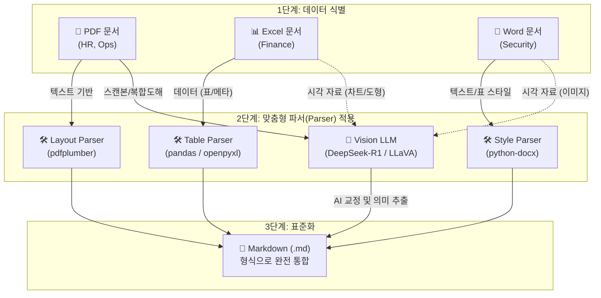

# 5장. 지식의 디지털화: 현실의 악성 문서를 번역하다

RAG 시스템을 처음 구축할 때 개발자들이 흔히 하는 착각이 있습니다. **"PDF나 엑셀 파일을 그대로 읽어와서 벡터 DB에 넣으면 알아서 검색되겠지?"** 라는 생각입니다.

아무리 똑똑한 AI 모델이라도 인간이 보기 좋게 꾸며 놓은 '형식(Format)'을 그대로 욱여넣으면 엉뚱한 대답을 내놓습니다. 본 장에서는 **실제 사내에 굴러다니는 가장 다루기 까다로운 형태의 문서들을 분석**하고, 이를 AI가 가장 잘 이해하는 형태인 **마크다운(Markdown)**으로 통합하여 지식화하는 '전처리 전략'을 설계해 보겠습니다.

---

## 1. 왜 굳이 Markdown으로 변환해야 하나요?

결론부터 말씀드리면 **"벡터 DB와 LLM에게 마크다운은 사람의 '표준어'와 같기 때문입니다."**

실습을 위해 준비한 `실습용/ex01-1/data/docs/` 폴더 안에는 우리가 흔히 마주하는 세 가지 부서의 골칫거리 문서들이 있습니다. 이들을 전통적인 텍스트 추출기로 무작정 읽어 들이면 어떤 대참사가 벌어지는지 확인해 보겠습니다.

### 대참사 1. 다단 편집과 머리글의 역습 (HR 부서)


*그림 5-1: 취업규칙 다단 레이아웃 예시*

* **대상 문서**: `HR_취업규칙_v1.0.pdf`
* **문제점**: 신문처럼 좌우 2단으로 나뉘어 있습니다. 단순 추출기는 왼쪽 끝부터 오른쪽 끝까지 한 줄씩 무식하게 읽어 버립니다(Text Shredding). 
* **결과**: "제1조 (목적) *사외비* 본 규칙은 주식회사회사명의..." 처럼 중간에 박힌 워터마크나 오른쪽 단의 문장이 끼어들어 **문맥이 완전히 파괴**됩니다.

### 대참사 2. 다중 병합 헤더와 문서형 엑셀 (Finance 부서)


*그림 5-2: 부서별 예산기안서 엑셀 병합 헤더 예시*

* **대상 문서**: `FIN_2025_상반기_매출현황.xlsx`, `FIN_부서별_예산기안서.xlsx`
* **문제점**: 엑셀이 순수한 데이터 테이블이 아니라 '보고서'처럼 쓰였습니다. 상단에는 결재란이 있고, 표 헤더는 '아시아-한국-서울' 처럼 3단으로 병합되어 있습니다.
* **결과**: AI는 'Unnamed: 0', 'NaN' 같은 쓰레기 데이터에 묻혀 **"아시아 지역의 1분기 매출이 얼마야?"** 라는 질문에 대답하지 못합니다.

### 대참사 3. 중첩 표와 체크박스의 늪 (Security 부서)


*그림 5-3: 보안규정 중첩 표 및 기호 예시*

* **대상 문서**: `SEC_보안규정_v1.0.docx`
* **문제점**: 표 안에 또 표가 있고, 작성자가 편의상 넣은 ☑, ☐ 같은 특수 기호가 난무합니다.
* **결과**: 표의 계층 구조가 무너지며, AI는 "필수 점검 항목이 뭐야?"라는 질문에 체크박스의 의미를 이해하지 못해 엉뚱한 조항을 긁어옵니다.

### 마크다운(Markdown)이 구원자인 이유
AI는 인터넷상의 수억 개 코드를 학습하며 깃허브(GitHub) 스타일의 마크다운 문법을 네이티브 언어처럼 익혔습니다.

1. **구조의 완벽한 보존**: `# 헤더`, `| 표 |`, `- 목록` 기호를 통해 문단과 표의 원래 논리 구조를 살려냅니다.
2. **토큰(비용) 다이어트**: HTML 태그에 비해 군더더기가 없어 비용을 극적으로 절감합니다.

## 즉, **5장과 6장은 '인간용 껍데기'를 벗겨내고 문서를 AI 최적화 표준어(Markdown)로 번역하는 과정**입니다.

---

## 2. 문서 형식별 맞춤형 전처리 파이프라인

모든 문서를 하나의 방식(One-size-fits-all)으로 처리할 수는 없습니다. 문서의 특성에 따라 '가성비(Rule-based)'를 택할 것인지, '지능(AI-based)'을 택할 것인지 전략을 달리해야 합니다.

아래는 우리가 맞닥뜨릴 3가지 포맷에 대한 **"표준 변환 파이프라인"** 입니다. 전체 아키텍처를 눈에 담아 주십시오.



### 2.1 형식별 상세 변환 순서와 AI의 역할

각 파일 형식마다 "어떻게 Markdown으로 바꾸는지", 그리고 "AI가 어디서 개입하는지" 전략이 다릅니다. 비용과 정확도를 고려하여 최적의 도구를 선택해야 합니다.

#### 1. PDF (.pdf) & HWP (.hwp)

가장 까다로운 형식입니다. 텍스트 추출 자체는 쉽지만 **"구조 복원"** 이 어렵습니다. 특히 HWP는 1차로 PDF 저장 후 처리하는 것을 권장합니다.

- **변환 순서**:
  - **PDF (.pdf)**:
    ```mermaid
    graph LR
        A["PDF 문서"] --> B["파서(pdfplumber 등):<br>단/표 레이아웃 기반 추출"]
        B --> C{"AI 교정 필요여부 판단"}
        C -- "Yes (복합도해/스캔본)" --> D["AI 교정 (Vision LLM)"]
        C -- "No (규칙 파싱 성공)" --> E["깔끔한 마크다운 저장"]
        D --> E
    ```
  - **판단 기준**: 파서가 추출한 텍스트의 밀도와 페이지 내 이미지(도해/표) 비율로 자동 판단하거나, 사용자(개발자)가 미리 문서의 성격에 따라 Flag를 켜두는 방식을 사용합니다.
    - **No (규칙 파싱 성공)**: 줄바꿈 문자가 규칙적이거나, `pdfplumber` 같은 전처리 스크립트를 통해 **좌표(x_tolerance 등) 기반으로 다단이나 표를 완벽하게 분리해 낼 수 있는 문서**입니다.
    - **Yes (복합도해/스캔본)**: 프레젠테이션(PPT), 인포그래픽, 선이 없는 투명 표 등. 전처리 스크립트가 아무리 규칙을 매겨도 텍스트가 파편화(Shredding)되어 복구 불가능할 때만 최후의 수단으로 개입합니다.

> **팁: 다단이나 표가 깨졌다고 무조건 AI에게 던져서 교정시키나요?**
> **절대 아닙니다.** 엉망으로 추출된 텍스트 조각들을 AI에게 주면서 "알아서 문맥 맞춰봐"라고 하면 '환각(Hallucination)'이 발생할 확률이 매우 높고, 호출 비용도 폭발적으로 증가합니다.
> 엔터프라이즈 RAG의 핵심은 **"전처리 스크립트(라이브러리)를 깎고 다듬어 최대한 구조를 스스로 살려내는 것"** 입니다. AI(특히 Vision LLM에 문서 이미지를 넘기는 방식)는 파이썬 코드로 도저히 규칙화할 수 없는 '시각적 한계치'에 도달했을 때만 사용하는 것이 올바른 비용 대비 효율(ROI) 전략입니다.
> 
> **다만, 본서의 이어지는 실습(ex01-1)들에서는 여러분이 Vision LLM의 강력함을 경험할 수 있도록, 복잡한 표나 런칭 전략 도해 등에는 의도적으로 AI를 전면 투입하여 교정하는 과정을 진행할 것입니다.**
  - **HWP (.hwp)**:
    ```mermaid
    graph LR
        A["HWP 파일"] -- "전용 도구" --> B["PDF로 저장"]
        B --> C["PDF 변환 흐름 위임"]
        C --> D["깔끔한 마크다운 저장"]
    ```
- **AI의 역할**: **"문맥 교정자(Context Cleaner)"** 입니다. 줄바꿈이 엉망이거나 표가 깨진 텍스트를 읽고, 앞뒤 문맥을 파악하여 깔끔한 마크다운 문법으로 다시 써줍니다.

> **팁: HWP 파일은 어떻게 하나요?**
> HWP 전용 파이썬 라이브러리(`pyhwp` 등)가 있지만, 설정이 복잡하고 표가 깨지는 경우가 많습니다.
> 가장 확실하고 간단한 방법은 **"PDF로 저장"** 하여 AI에게 제공하는 것입니다. 어떤 도구(한컴오피스, 폴라리스, 클라우드 변환기 등)를 쓰든 상관없습니다. 레이아웃이 유지된 PDF만 있다면, DeepSeek와 같은 고성능 LLM이 완벽하게 문서를 이해할 수 있습니다.

#### 2. Word (.docx) & Excel (.xlsx)

텍스트와 표 데이터가 이미 구조화된 포맷이기 때문에, 이를 추출하는 단계에서는 **기본적으로 AI 없이 라이브러리만으로 처리가 가능합니다.** 단, 문서 내에 삽입된 '이미지'나 '도형 형태의 차트'는 예외입니다.

- **변환 순서**:
  ```mermaid
  graph LR
      A["Office 파일"] --> B{"라이브러리 처리"}
      B -- "python-docx" --> C["텍스트/표 추출 (Word)"]
      B -- "pandas" --> D["표 데이터 추출 (Excel)"]
      B -- "openpyxl" --> E["좌표 기반 메타데이터<br>또는 이미지 추출 (Excel)"]
      C --> F["표준 마크다운 변환"]
      D --> F
      E --> F
  ```
- **AI의 역할**: 기본적으로 개입하지 않습니다. 단, 복잡한 표의 의미론적 해석이 필요하거나 문서에 포함된 **차트/이미지의 시각적 분석이 필수적일 경우에만 제한적으로 Vision LLM을 호출**합니다.

> **팁: 엑셀이나 워드 안의 그래프, 이미지는 어떻게 처리하나요?**
> `pandas`나 `python-docx` 라이브러리는 기본적으로 텍스트와 표의 셀 데이터만 추출하며, 삽입된 도형이나 부동(Floating) 이미지는 무시합니다. 만약 해당 데이터가 RAG 검색에 반드시 필요한 핵심 지식이라면, `openpyxl`의 이미지 추출 기능 등을 활용해 **이미지 객체를 별도로 뽑아낸 뒤 Vision LLM에게 이미지 해석을 맡기는 파이프라인**을 추가로 구축해야 합니다.

### 2.2 코드 구현 전략 1 - PDF: 규칙 기반 레이아웃 분석 vs 지능형 AI 교정

PDF는 가장 다루기 까다로운 녀석입니다. 상황에 따라 두 가지 전략을 병행합니다.

1. **규칙 기반(Rule-based) 파싱**: `HR_취업규칙_v1.0.pdf` 처럼 텍스트 기반 객체가 남아있는 경우.
   - 파이썬 라이브러리(`pdfplumber` 등)를 이용해 물리적인 좌표(`x_tolerance`)를 계산하여 다단 텍스트를 순서대로 읽거나, 투명 표를 2차원 리스트(`extract_table()`)로 깔끔하게 뜯어냅니다. 빠르고 저렴합니다.
2. **AI 기반 지능형 정제**: `OPS_신규서비스_런칭전략.pdf` (화살표 도해) 또는 스캔된 서약서 등.
   - 글자가 사방에 흩어져 있어 규칙을 세우는 것이 불가능합니다. 이럴 땐 문서를 거칠게 읽어 들인 후 혹은 이미지 모듈로 캡처하여 **"로컬 LLM"** 에게 넘겨 구조를 다시 쓰게 합니다(AI Refinement). 약간 느리지만 가장 강력한 궁극기입니다.

### 2.3 코드 구현 전략 2 - Excel: 좌표 슬라이싱과 다중 인덱싱

엑셀은 무조건 `pandas` 하나로 해결하려 하면 안 됩니다.

1. **문서형 엑셀 처리**: `FIN_부서별_예산기안서.xlsx` 처럼 상단에 결재란이 있다면 `openpyxl`을 이용해 `[A1]` 같은 **셀 좌표 기반**으로 메타데이터(기안부서, 날짜)만 발라냅니다.
2. **다중 헤더 테이블**: 진짜 표가 시작되는 지점부터만 `pandas`로 자르고(`iloc`), 병합 셀 오류를 막기 위해 멀티 인덱스(`header=[0, 1]`)로 읽어 들여 마크다운 테이블(`to_markdown()`)로 변환합니다.
3. **시각 데이터 개별 추출**: 차트나 그래프가 포함된 경우 `openpyxl`의 이미지 추출 기능 등을 이용해 객체만 별도로 뽑아낸 후, Vision LLM 파이프라인으로 넘겨 의미를 복원합니다.

### 2.4 코드 구현 전략 3 - Word: 스타일(Style) 속성 1:1 매핑

가장 나이스한 케이스입니다. 작성자가 부여한 메타데이터를 극한으로 활용합니다.

- Word 내부에는 눈에 보이지 않는 `Heading 1`, `List Bullet` 같은 속성이 이미 저장되어 있습니다. `python-docx` 라이브러리로 이 속성을 감지하여 마크다운의 `#` 과 `-` 기호로 1:1 치환합니다. 
- 이 과정은 향후 벡터 DB로 넘길 때 **어느 단위로 문서를 쪼갤 것인지(Chunking)** 를 결정하는 완벽한 이정표가 됩니다.

---

## 3. 사내 문서 네이밍(Naming) 표준 규칙

마지막으로 짚고 넘어가야 할 것은 **'파일 이름'**입니다.

"문서를 파싱해서 마크다운으로만 만들면 AI가 부서별 규정을 구분할 수 있겠지?" 라고 생각하기 쉽습니다. 하지만 로컬 컴퓨터에 쌓여있는 `2025년본.pdf`, `최종수정(진짜최종).xlsx` 같은 파일들을 그대로 RAG 시스템에 밀어 넣으면, 메타데이터가 꼬여 검색 품질이 박살 납니다.

따라서 우리는 `ex01-1` 모의 문서들에 세팅해 둔 것처럼 엄격한 파이프라인 규칙을 적용해야 합니다.

1. **카테고리 폴더화**: `hr/`, `finance/`, `ops/` 처럼 폴더 자체가 문서의 소속 부서라는 메타데이터를 갖도록 분리합니다.
2. **파일명 표준화**: 검색 시 가장 강력한 힌트를 주기 위해 **`{부서}_{문서명}_{버전}.확장자`** 포맷을 강제합니다. (예: `HR_취업규칙_v1.0.pdf`)

## 4. 정리하며

5장에서는 텍스트를 마구잡이로 긁어오는 관행을 버리고, 실무 부서의 **'비정형적이고 복잡한 양식'들을 어떻게 AI 친화적으로 제련(Preprocessing)할 것인지** 전략을 수립했습니다.

* **맞춤형 파싱 전략**: 규칙 기반 추출(pdfplumber, pandas, python-docx)과 AI 기반 정제(Vision LLM)를 문맥에 맞게 선택합니다.
* **마크다운(Markdown) 표준화**: 모든 문서를 LLM이 가장 잘 이해하는 포맷으로 통합하여 토큰 효율성과 문맥 유지율을 극대화합니다.
* **메타데이터 네이밍**: 폴더명과 파일명(`{부서}_{문서명}_{버전}.확장자`)을 통해 검색 효율성을 확보합니다.

자, 이론은 여기까지입니다.
이어지는 **6장**에서는 우리가 기획한 전략을 바탕으로, `ex01-1` 폴더 내에 심어둔 6개의 실습 파이썬(Python) 스크립트를 독자님 컴퓨터에서 **실제로 하나씩 돌려보고 벡터 DB에 밀어 넣는 실전 실습**을 시작하겠습니다. 

**6장으로 이동하여 지식 저장소를 직접 구축하십시오!**
