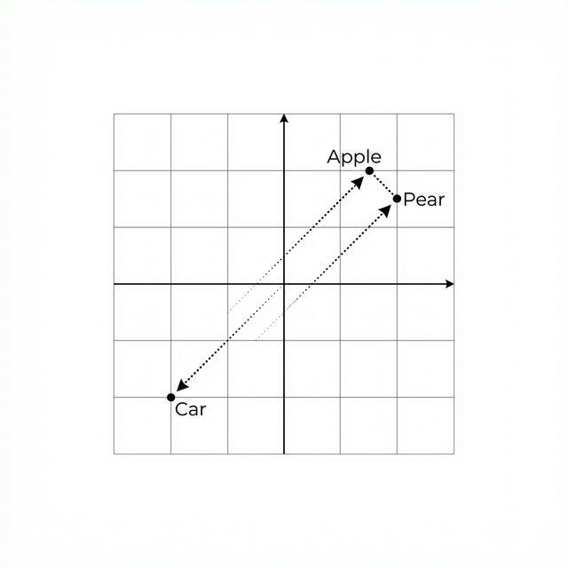

# 6장. 지식 저장소 구축: 임베딩과 벡터DB 실습

5장에서 우리는 문서 지식화의 **표준과 전략**을 수립했습니다. 하지만 컴퓨터가 이해하기 위해서는 문서들을 실제로 **마크다운(Markdown)** 으로 변환하는 **전처리**과정이 반드시 필요합니다.

본 장에서는 5장의 전략을 바탕으로 원시 데이터를 **마크다운**으로 변환하고, 이를 **숫자(벡터)** 로 만들어 AI가 검색할 수 있는 **지식 저장소(VectorDB)** 를 구축하는 전체 과정을 실습합니다.

---

## 1. 텍스트를 숫자로: 임베딩(Embedding)

임베딩은 단어의 의미를 다차원 공간의 좌표로 변환하는 기술입니다.


_그림 6-1: 임베딩 개념도_

위 그림처럼 "사과"와 "배"는 가깝게, "자동차"는 멀게 배치됩니다. 이를 통해 AI는 단순 키워드 매칭이 아니라 **의미적 유사성(Semantic Similarity)** 을 판단할 수 있습니다.

---

## 2. [실습] PDF 지식화: Markdown 변환

### [6장 실습 로드맵]

이번 장에서는 **'원시 데이터'** 를 **'검색 가능한 지식'** 으로 바꾸는 전체 파이프라인을 실습합니다.

1.  **전처리(Preprocessing)**: PDF, Word, 이미지를 **Markdown** 으로 변환 (현재 단계)
2.  **적재(Ingestion)**: Markdown을 **Vector(숫자)** 로 변환하여 DB에 저장 (Section 5)
3.  **검색(Search)**: 질문과 가장 유사한 지식을 찾아내기 (Section 6)

---

### [실습 목표: 전처리]

- **무엇을 하나요?**: 뒤죽박죽인 사내 문서(PDF, Image, Excel)를 **'표준 마크다운(Markdown)'** 포맷으로 통일합니다.
- **왜 하나요?**: 화려한 레이아웃이나 서식은 AI에게 소음(Noise)일 뿐입니다. 순수한 텍스트와 구조(Header)만 남겨야 AI가 정확히 이해합니다.
- **Output**: `data/docs/` (원본) $\rightarrow$ `parsed_data/` (마크다운)

본격적인 벡터 DB 구축에 들어가기에 앞서, 우리가 가진 문서를 AI가 읽기 좋은 **마크다운으로 변환하는 간단한 실습**을 진행하겠습니다. 이 과정은 데이터 품질을 결정하는 가장 중요한 첫 단추입니다.

지저분한 텍스트를 정제된 지식으로 바꾸는 데는 상황에 따라 여러 방법이 존재합니다. 본 섹션에서는 **방법 A: 규칙 기반(Rule-based)** 방식과, **방법 B: AI 기반(AI-based)** 정제 실습을 모두 배웁니다.

이미 3장에서 클론한 `ai-llm-rag-study` 저장소 내의 실습 폴더로 이동합니다.

### [실습 준비물 확인]

실습을 시작하기 전에 `06_vectordb/data` 폴더에 다음과 같은 파일들이 준비되어 있는지 확인하십시오.


_그림 6-2: 실습을 위해 준비된 비정형 데이터 구조_

- **HR 메타코딩 사내규정\_v1.0.pdf**: 규정 문서 (PDF)
- **OPS\_매출현황\_v1.0.png**: 차트 이미지 (PNG)
- **Guide_v1.docx**: 업무 가이드 (Word)
- **Stats_2025.xlsx**: 통계 데이터 (Excel)

### 1단계: 실습 환경 준비

실습용 폴더인 `06_vectordb`으로 이동합니다. 이곳에는 전처리 실습을 위한 다양한 파이썬 스크립트가 준비되어 있습니다.

```bash
cd 06_vectordb
pip install -r requirements.txt
```

### 2단계: [방법 A] 규칙 기반 마크다운 변환 (Python & Regex)

프로그래밍 규칙(정규표현식)을 사용하여 번호 체계를 인식하고 마크다운 헤더로 변환합니다. 속도가 빠르고 비용이 들지 않는 장점이 있습니다.

```bash
python pdf_to_md.py
```

#### 코드 워크플로우 (Code Workflow)

1.  **패턴 인식**: `re.match` 정규표현식을 사용하여 번호 체계를 찾아냅니다.
2.  **헤더 변환**: 인식된 번호 체계에 마크다운 기호(`###`)를 붙여 위계 구조를 만듭니다.
3.  **메타데이터 삽입**: 작성일과 출처 정보를 자동으로 생성합니다.

- **실행 결과**: `parsed_data/standard_policy.md` 파일이 생성됩니다.

### 3단계: [방법 B] AI 기반 지능형 정제 (LLM)

단순한 규칙으로 처리하기 힘든 복잡한 문서(표, 깨진 문장)는 AI에게 정제를 맡깁니다.

- **추출(Extraction)**: PDF에서 텍스트만 긁어옵니다.
- **정제(Refinement)**: AI가 문맥을 파악하여 완벽한 마크다운으로 재구성합니다.

```bash
python ai_pdf_to_md.py
```

#### 코드 워크플로우 (Code Workflow)

1.  **추출(Extraction)**: `PyMuPDF`로 텍스트를 긁어모읍니다.
2.  **지시문(Prompting)**: AI에게 "전문 문서 편집가" 페르소나를 부여하고 정제를 요청합니다.
3.  **표준화(Standardization)**: AI가 가장 읽기 좋은 형태의 마크다운을 출력합니다.

- **실행 결과**: `parsed_data/ai_standard_policy.md` 파일이 생성됩니다.

> **❓ 질문: ChatGPT나 Claude도 이렇게 텍스트를 따로 뽑나요?**
> **네, 그렇습니다.** 우리가 채팅창에 PDF를 업로드하면, 내부적으로는 파이썬(Python) 스크립트가 돌거나 OCR 엔진이 작동하여 텍스트를 먼저 추출합니다.
>
> - **ChatGPT (Advanced Data Analysis)**: 내부적으로 `pdfplumber` 같은 라이브러리를 사용해 텍스트를 긁어냅니다.
> - **Gemini / Claude**: 대용량 처리가 가능하지만, 정확한 검색(Retrieval)을 위해 텍스트 레이어를 최우선으로 분석합니다.
>
> 즉, 여러분이 지금 실습한 **'추출(Extraction) → 정제(Refinement)'** 파이프라인은 구글이나 오픈AI가 사용하는 방식과 본질적으로 동일한 **업계 표준(Industry Standard)** 입니다.

> **💡 팁: 선택의 기준**
> 수만 장의 문서를 빠르게 변환할 때는 **방법 A(규칙 기반)** 가 유리하고, 한 장 한 장의 품질이 최고로 중요한 사규나 지침서는 **방법 B(AI 기반)** 이 압도적으로 우수합니다.

---

## 3. [실습] 시각 지능의 활용: 이미지 지식화

문서 내 도표나 이미지는 정보의 보물창고입니다. **멀티모달 모델(LLaVA)** 를 사용하여 이미지의 의미를 해석합니다.

### 1단계: 검색 품질을 높이는 '이중 언어(Bilingual)' 지식화

이미지 설명은 한글과 영문을 동시에 생성하는 것이 좋습니다. 에이전트가 나중에 영어 질문으로도 이미지를 찾을 수 있게 되고, 한글 모델의 한계(환각)를 보완하는 효과도 있기 때문입니다. 특히, AI가 분석한 내용을 **Markdown 표기법(헤더, 목록, 굵게)** 에 맞춰 저장하면 가독성이 비약적으로 상승합니다.

```bash
python image_to_md.py
```

#### 코드 워크플로우 (Code Workflow)

1.  **멀티모달 호출**: 이미지를 **Base64**로 인코딩하여 모델에게 전달합니다.
2.  **이중 언어 분석**: 한국어와 영어 설명을 동시에 요구합니다.
3.  **시각 지능 결합**: 차트의 경향성이나 함축적 의미를 텍스트로 변환합니다.

- **실행 결과**: `parsed_data/chart_description.md` 파일이 생성됩니다.

> **주의: 문제 해결 - 멀티모달의 환각(Hallucination)**
> 실습 중 이미지 내용과 전혀 다른 답변(예: 로봇 공급량 등)이 나올 수 있습니다. 이는 AI가 이미지 속의 작은 한글이나 숫자를 정확히 읽지 못하고, 시각적 패턴만으로 오해하여 발생하는 '환각' 현상입니다.
>
> **해결책**: 실무에서는 텍스트 정보가 중요한 차트의 경우, 멀티모달 모델에만 의존하지 않고 **OCR(광학 문자 판독)** 라이브러리로 수치를 먼저 뽑아낸 뒤 LLM에게 전달하거나, 더 고성능의 대형 모델을 사용하여 정확도를 높입니다.

이렇게 생성된 이미지 마크다운은 일반 텍스트 문서와 동일한 지위를 갖게 됩니다. 나중에 사용자가 "최근 매출 추이가 어때?"라고 물을 때, 에이전트는 이 마크다운 설명본을 근거로 답변합니다.

---

## 4. [실습] 구조화된 문서: Office 파일 변환

이미 구조가 잡혀있는 Word(.docx)나 Excel(.xlsx) 문서는 별도의 복잡한 처리 없이도 쉽게 변환이 가능합니다.

### 1단계: Office 문서 변환

```bash
python office_to_md.py
```

#### 코드 워크플로우 (Code Workflow)

1.  **형식 감지**: 파일 확장자(.docx, .xlsx)에 따라 처리 방식을 분기합니다.
2.  **구조 매핑**:
    - **Word**: 제목 스타일(Heading 1, 2)을 Markdown Header(#, ##)로 1:1 매핑합니다.
    - **Excel**: 시트(Sheet) 내의 데이터를 Markdown Table 형식으로 변환합니다.
3.  **저장**: 원본 구조를 최대한 보존한 상태로 Markdown 파일을 생성합니다.

- **실행 결과**: `parsed_data/general/Guide_v1.md` 및 `parsed_data/finance/Stats_2025.md` 파일이 생성됩니다.

---

## 5. [실습] 지식 적재(Ingestion) 파이프라인

### [실습 목표: 적재]

- **무엇을 하나요?**: 마크다운 문서를 잘게 쪼갠 뒤(Chunking), **임베딩(Embedding)** 모델을 통해 숫자로 변환하여 **ChromaDB**에 저장합니다.
- **왜 하나요?**: 컴퓨터는 글자를 이해하지 못합니다. 텍스트를 숫자로 바꿔야만 질문과 문서 간의 **'의미적 유사도'**를 계산할 수 있기 때문입니다.
- **Output**: `parsed_data/` (마크다운) $\rightarrow$ `chroma_db/` (벡터 저장소)

이제 전철된 모든 마크다운 파일들을 벡터로 변환하여 DB에 저장하겠습니다.

### 1단계: 실습 폴더로 이동

이전 단계(`06_vectordb`)에서 생성된 `parsed_data` 폴더의 내용물을 활용하거나, 6장 실습을 위해 미리 준비된 데이터를 사용합니다.

`06_vectordb` 폴더로 이동합니다.

```bash
cd ../06_vectordb
pip install -r requirements.txt
```

### 2단계: 벡터DB 저장 (Ingest)

이제 잘라낸 텍스트를 벡터로 변환하여 **ChromaDB** 에 저장합니다. 이때 2장에서 설치한 `nomic-embed-text` 모델을 사용합니다.

`ingest.py` 파일을 확인하고 실행합니다.

```bash
python ingest.py
```

> **Tip**: `ingest.py`는 잘라낸 텍스트 청크를 임베딩 모델을 통해 벡터로 변환하고, 이를 ChromaDB에 영구 저장하는 스크립트입니다.

- **실행 결과**:
  터미널에 "Stored 15 chunks to ChromaDB" 같은 메시지가 뜨며, 폴더 내에 `chroma_db/` 라는 디렉토리가 생성됩니다. 이것이 바로 우리만의 **지식 저장소** 입니다.

#### 코드 워크플로우 (Code Workflow)

1.  **로드(Load)**: 변환된 마크다운 파일들을 메모리로 불러옵니다.
2.  **청킹(Chunking)**: 긴 텍스트를 AI가 처리하기 좋은 크기(예: 500자)로 잘게 쪼갭니다. 문맥 유지를 위해 앞뒤 내용을 조금씩 겹치게(Overlap) 합니다.
3.  **임베딩(Embedding)**: 텍스트 조각을 `nomic-embed-text` 모델에 통과시켜 768차원의 벡터(숫자 배열)로 변환합니다.
4.  **저장(Upsert)**: 벡터와 원본 텍스트를 **ChromaDB**에 저장합니다. 이때 파일명(Category)을 메타데이터로 함께 기록합니다.

---

## 6. [실습] 잘 저장되었나? 검색 테스트

저장이 잘 되었는지 확인하기 위해 질문을 던져보겠습니다.

### 1단계: 검색 실행

`query.py` 파일을 확인합니다. "연차 규정 알려줘"라는 질문과 가장 유사한 문서를 DB에서 찾아옵니다.

```bash
python query.py
```

> **Tip**: `query.py`는 사용자의 질문을 벡터로 변환한 뒤, DB에 저장된 문서 중 코사인 유사도가 가장 높은 문서를 찾아오는 검색 테스트 스크립트입니다.

- **실행 결과**:

```text
질문: 신입사원 연차 규정
--------------------------------------------------
검색된 문서 1: [인사규정] 신입사원은 입사 후 3년 동안...
유사도 점수: 0.85
--------------------------------------------------
```

질문과 가장 관련 높은 문서를 정확히 찾아냈다면 성공입니다.

#### 코드 워크플로우 (Code Workflow)

1.  **질문 임베딩(Query Embedding)**: 사용자의 질문("연차 규정 알려줘")을 문서와 동일한 임베딩 모델(`nomic-embed-text`)로 벡터화합니다.
2.  **유사도 검색(Similarity Search)**: 질문 벡터와 가장 가까운(거리가 짧은) 문서 벡터를 ChromaDB에서 찾아냅니다. 이때 **코사인 유사도(Cosine Similarity)** 공식을 사용합니다.
3.  **반환(Return)**: 유사도가 높은 상위 N개의 문서 조각을 반환합니다. 이것이 나중에 LLM에게 전달될 **'참고 자료(Context)'**가 됩니다.

---

## 7. 로컬 벡터DB의 장점

우리는 클라우드(Pinecone 등)를 쓰지 않고 **로컬 ChromaDB** 를 구축했습니다.

- **보안**: 사내 데이터가 외부로 나가지 않습니다.
- **비용**: 100% 무료이며, API 비용이 들지 않습니다.
- **속도**: 네트워크 대기 시간이 없어 검색이 매우 빠릅니다.

이제 우리 시스템은 수만 페이지의 문서 중 질문과 가장 관련 있는 내용을 밀리초(ms) 단위로 찾아낼 수 있게 되었습니다. 다음 장(7장)에서는 이 지식 창고를 활용하여 실제 답변을 생성하는 **RAG 엔진**을 완성하겠습니다.
