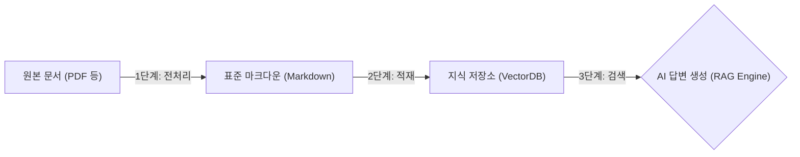
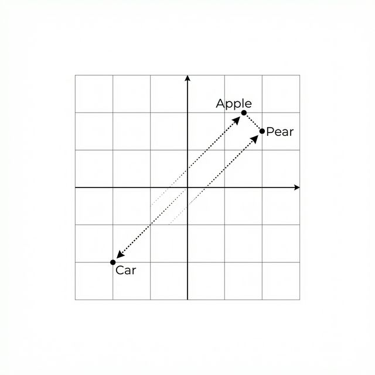

# 6장. VectorDB 구축: 문서를 "검색 가능한 지식"으로 바꾸기

5장에서 우리는 문서 지식화의 **표준과 전략**을 수립하고 시각화했습니다. 하지만 AI가 문서를 '읽기' 위해서는 설계도를 바탕으로 원시 데이터를 실제 **마크다운(Markdown)** 으로 변환하는 집짓기 과정이 필요합니다.

본 장에서는 5장의 전략과 실무에서 자주 겪는 복잡한 레이아웃을 가진 `ai-list.pdf` 데이터를 기반으로, **마크다운**으로 전처리하고 이를 **숫자(벡터)** 로 만들어 AI가 검색할 수 있는 **지식 저장소(VectorDB)** 를 구축하는 전체 과정을 실습합니다.

---

## 1. 지식 저장소 구축 로드맵

이번 장에서는 '원시 데이터'를 '검색 가능한 지식'으로 바꾸는 전체 파이프라인을 실습합니다.



1.  **전처리(Preprocessing)**: 뒤죽박죽인 사내 문서를 AI가 가장 좋아하는 **표준 마크다운**으로 통일합니다. (Section 2, 3, 4)
2.  **적재(Ingestion)**: 텍스트를 AI의 언어인 **숫자(벡터)** 로 임베딩하여 벡터 DB에 저장합니다. (Section 5)
3.  **검색(Search)**: 질문이 들어왔을 때 가장 유사한 지식을 초고속으로 찾아냅니다. (Section 6)

---

## 2. [실습] PDF 지식화: Markdown 변환

### [실습 목표: 전처리]

- **무엇을 하나요?**: 뒤죽박죽인 사내 문서(예: `ai-list.pdf`)를 **'표준 마크다운(Markdown)'** 포맷으로 통일합니다.
- **왜 하나요?**: 화려한 다단 레이아웃이나 서식은 AI에게 소음(Noise)일 뿐입니다. 순수한 텍스트와 구조(Header)만 표 형태로 남겨야 AI가 정확히 이해합니다.
- **Output**: `data/docs/` (원본) $\rightarrow$ `parsed_data/` (마크다운)

지저분한 텍스트를 정제된 지식으로 바꾸는 데는 상황에 따라 여러 방법이 존재합니다. 본 섹션에서는 **방법 A: 구조적 파싱(`pdfplumber` 활용)** 과, **방법 B: AI 기반 지능형 정제(LLM)** 실습을 모두 배웁니다.

이미 3장에서 클론한 `ai-llm-rag-study` 저장소 내의 실습 폴더로 이동합니다.

### [실습 준비물 확인]

실습을 시작하기 전에 `06_vectordb/data` 폴더에 다음과 같은 파일들이 준비되어 있는지 확인하십시오.

- **ai-list.pdf**: 사내 문서 기반 AI 업무 비서 프로젝트 계획서 (복잡한 레이아웃 포함)
- **OPS_매출현황_v1.0.png**: 차트 이미지 (PNG)
- **Guide_v1.docx**: 업무 가이드 (Word)
- **Stats_2025.xlsx**: 통계 데이터 (Excel)

### 1단계: 실습 환경 준비

실습용 폴더인 `ex01/scripts/pdf_scripts` 및 `06_vectordb` 계열로 이동합니다. 이곳에는 전처리 실습을 위한 다양한 파이썬 스크립트가 준비되어 있습니다.

```bash
cd ex01/scripts
# 필요한 경우 의존성 설치
```

### 2단계: [방법 A] 구조 유지 파싱 (`pdfplumber` 기반)

단순한 텍스트 출력을 넘어 `pdfplumber`를 이용해 문단 레이아웃과 표 데이터를 보존하는 방식을 익힙니다. 이 방식을 사용하면 `ai-list.pdf`와 같은 표 데이터가 포함된 문서도 안전하게 변환할 수 있습니다.

```python
import pdfplumber

with pdfplumber.open("ai-list.pdf") as pdf:
    for page in pdf.pages:
        # layout=True: 다단 텍스트의 물리적 위치 정보(x_tolerance)를 최대한 보존합니다.
        text = page.extract_text(layout=True, x_tolerance=2)
        
        # 표 데이터 복구: .extract_table()을 통해 행과 열의 2차원 공간을 리스트로 복원합니다.
        table = page.extract_table()
        if table:
            # 테이블 데이터를 마크다운 표 형식으로 렌더링
            pass
```

#### 코드 워크플로우 (Code Workflow)

1.  **물리적 읽기**: `layout=True` 옵션을 통해 텍스트 좌우 혼입(Shredding) 문제를 방지합니다.
2.  **표 구조화**: `extract_table()`로 파악한 격자 구조를 파이썬 리스트로 받아 마크다운 포맷으로 변환합니다.

- **실행 결과**: 표와 단락이 살아있는 기초 마크다운 파일이 생성됩니다.

### 3단계: [방법 B] AI 기반 지능형 정제 파이프라인 (LLM)

표 복원이나 단순 텍스트 처리를 넘어, 줄바꿈이 파괴된 문장이 섞여 있거나 복합 레이아웃인 경우 AI(DeepSeek-R1 등)에게 정제를 지시하는 강력한 방법입니다.

```bash
python ai_pdf_to_md.py
```

#### 코드 워크플로우 (Code Workflow)

1.  **추출(Extraction)**: `PyMuPDF` 등으로 PDF의 원시 텍스트(Raw Text)를 긁어모읍니다.
2.  **지시문(Prompting)**: AI에게 "전문 문서 편집가" 페르소나를 부여하고, 노이즈(페이지 번호 등) 제거와 마크다운 표 복원 지침을 내립니다.
3.  **마크다운 정제(Refinement)**: 로컬 LLM(DeepSeek)이 문맥을 파악하여 읽기 좋은 형태의 마크다운으로 결과물을 생성하고, 문서 상단에 자동 YAML 메타데이터를 추가합니다.

- **실행 결과**: `parsed_data/ai_standard_policy.md` 파일이 생성됩니다. 이 파일은 사람이 직접 수정한 듯 깔끔하게 정리되어 최상의 RAG 기반 자료가 됩니다.

> **❓ 질문: ChatGPT나 Claude도 이렇게 텍스트를 따로 뽑나요?**
> **네, 그렇습니다.** 우리가 채팅창에 PDF를 업로드하면, 내부적으로는 파이썬(Python) 스크립트가 돌거나 OCR 엔진이 작동하여 텍스트를 먼저 추출합니다.
>
> - **ChatGPT (Advanced Data Analysis)**: 내부적으로 `pdfplumber` 같은 라이브러리를 사용해 텍스트를 긁어냅니다.
> - **Gemini / Claude**: 텍스트 레이어를 최우선 분석한 뒤, 자체 모델 내에서 구조화 과정을 거칩니다.
>
> 즉, 여러분이 지금 실습한 **'추출(Extraction) → 정제(Refinement)'** 2단계 파이프라인은 업계 표준(Industry Standard)이자 확실한 품질 보증 방식입니다.

> **💡 팁: 선택의 기준**
> 수백 장의 표 데이터를 빠르게 변환할 때는 **방법 A(구조적 파싱)** 가 유리하고, 최고 수준의 문맥이 요구되는 보고서나 `ai-list.pdf` 같은 핵심 기획서는 **방법 B(AI 기반)** 가 압도적으로 우수합니다.

---

## 3. [실습] 시각 지능의 활용: 이미지 지식화

문서 내 도표나 이미지는 정보의 보물창고입니다. **멀티모달 모델(LLaVA)** 를 사용하여 이미지의 의미를 해석합니다.

### 1단계: 검색 품질을 높이는 '이중 언어(Bilingual)' 지식화

이미지 설명은 한글과 영문을 동시에 생성하는 것이 좋습니다. 에이전트가 나중에 영어 질문으로도 이미지를 찾을 수 있게 되고, 한글 모델의 한계(환각)를 보완하는 효과도 있기 때문입니다. 특히, AI가 분석한 내용을 **Markdown 표기법(헤더, 목록, 굵게)** 에 맞춰 저장하면 가독성이 비약적으로 상승합니다.

```bash
python image_to_md.py
```

#### 코드 워크플로우 (Code Workflow)

1.  **멀티모달 호출**: 이미지를 **Base64**로 인코딩하여 모델에게 전달합니다.
2.  **이중 언어 분석**: 한국어와 영어 설명을 동시에 요구합니다.
3.  **시각 지능 결합**: 차트의 경향성이나 함축적 의미를 텍스트로 변환합니다.

- **실행 결과**: `parsed_data/chart_description.md` 파일이 생성됩니다.

---

## 4. [실습] 구조화된 문서: Office 파일 변환

이미 구조가 잡혀있는 Word(.docx)나 Excel(.xlsx) 문서는 별도의 복잡한 처리 없이도 쉽게 변환이 가능합니다.

### 1단계: Office 문서 변환

```bash
python office_to_md.py
```

#### 코드 워크플로우 (Code Workflow)

1.  **형식 감지**: 파일 확장자(.docx, .xlsx)에 따라 처리 방식을 분기합니다.
2.  **구조 매핑**:
    - **Word**: 제목 스타일(Heading 1, 2)을 Markdown Header(#, ##)로 1:1 매핑합니다.
    - **Excel**: 시트(Sheet) 내의 데이터를 Markdown Table 형식으로 변환합니다.
3.  **저장**: 원본 구조를 최대한 보존한 상태로 Markdown 파일을 생성합니다.

- **실행 결과**: `parsed_data/general/Guide_v1.md` 및 `parsed_data/finance/Stats_2025.md` 파일이 생성됩니다.

---

## 5. [실습] 지식 적재(Ingestion) 파이프라인

이제 마크다운으로 변환된 텍스트 지식을 벡터 DB에 저장할 차례입니다. 그 이전에, 컴퓨터가 어떻게 텍스트를 이해하는지 핵심 원리를 먼저 짚고 넘어가겠습니다.

### 5.1 텍스트를 숫자로: 임베딩(Embedding)

임베딩은 단어의 의미를 다차원 공간의 좌표로 변환하는 기술입니다.


_그림 6-1: 임베딩 개념도_

위 그림처럼 다차원 공간에서 "사과"와 "배"는 가깝게, "자동차"는 멀게 배치됩니다. 이를 통해 AI는 단순 키워드 매칭이 아니라 **의미적 유사성(Semantic Similarity)** 을 판단할 수 있습니다.

### 5.2 [실습] 벡터DB 적재

### [실습 목표: 적재]

- **무엇을 하나요?**: 마크다운 문서를 잘게 쪼갠 뒤(Chunking), **임베딩(Embedding)** 모델을 통해 숫자로 변환하여 **ChromaDB**에 저장합니다.
- **왜 하나요?**: 컴퓨터는 글자를 이해하지 못합니다. 텍스트를 숫자로 바꿔야만 질문과 문서 간의 **'의미적 유사도'**를 계산할 수 있기 때문입니다.
- **Output**: `parsed_data/` (마크다운) $\rightarrow$ `chroma_db/` (벡터 저장소)

이제 전처리된 모든 마크다운 파일들을 벡터로 변환하여 DB에 저장하겠습니다.

### 1단계: 실습 폴더로 이동

이전 단계(`06_vectordb`)에서 생성된 `parsed_data` 폴더의 내용물을 활용하거나, 6장 실습을 위해 미리 준비된 데이터를 사용합니다.

```bash
cd ../06_vectordb
# pip install -r requirements.txt
```

### 2단계: 벡터DB 저장 (Ingest)

이제 잘라낸 텍스트를 벡터로 변환하여 **ChromaDB** 에 저장합니다. 이때 2장에서 설치한 `nomic-embed-text` 모델을 사용합니다. `ingest.py` 스크립트를 실행합니다.

```bash
python ingest.py
```

> **Tip**: `ingest.py`는 `RecursiveCharacterTextSplitter` 등을 사용해 텍스트를 쪼갠 후(Overlap 10~20% 적용), 임베딩 모델을 파싱하여 ChromaDB에 영구 저장하는 스크립트입니다.

- **실행 결과**:
  터미널에 "Stored 15 chunks to ChromaDB" 같은 메시지가 뜨며, 폴더 내에 `chroma_db/` 라는 디렉토리가 생성됩니다. 이것이 바로 우리만의 **지식 저장소** 입니다.

#### 코드 워크플로우 (Code Workflow)

1.  **로드(Load)**: 변환된 마크다운 파일들을 메모리로 불러옵니다.
2.  **청킹(Chunking)**: 긴 텍스트를 AI가 처리하기 좋은 크기(예: 500자)로 잘게 쪼갭니다. 문맥 유지를 위해 앞뒤 내용을 조금씩 겹치게(Overlap) 구성합니다.
3.  **임베딩(Embedding)**: 텍스트 조각을 `nomic-embed-text` 모델에 통과시켜 다차원의 벡터(숫자 배열)로 변환합니다.
4.  **저장(Upsert)**: 벡터와 원본 텍스트를 **ChromaDB**에 저장합니다. 이때 파일명(Title, Category)을 메타데이터로 강력하게 연동하여 추후 하이브리드 검색 시 필터 조건으로 작동하게 합니다.

---

## 6. [실습] 잘 저장되었나? 검색 테스트

저장이 잘 되었는지 확인하기 위해 질문을 던져보겠습니다.

### 1단계: 검색 실행

`query.py` 파일을 확인합니다. 사용자의 질문과 가장 유사한 문서를 DB에서 찾아옵니다.

```bash
python query.py
```

> **Tip**: `query.py`는 사용자의 질문을 벡터로 변환한 뒤, DB에 저장된 문서 중 코사인 유사도가 가장 높은 문서를 찾아오는 검색 테스트 스크립트입니다.

- **실행 결과**:
```text
질문: 캔버스 데이터 파이프라인
--------------------------------------------------
검색된 문서 1: [ai-list] 비정형 문서 -> Markdown 변환 엔진...
유사도 점수: 0.85
--------------------------------------------------
```
질문과 가장 관련 높은 문서를 정확히 찾아냈다면 성공입니다.

#### 코드 워크플로우 (Code Workflow)

1.  **질문 임베딩(Query Embedding)**: 사용자의 질문을 문서와 동일한 임베딩 모델(`nomic-embed-text`)로 벡터화합니다.
2.  **유사도 검색(Similarity Search)**: 질문 벡터와 가장 가까운 문서 벡터를 ChromaDB에서 찾아냅니다. 이때 **코사인 유사도(Cosine Similarity)** 공식을 사용합니다.
3.  **반환(Return)**: 유사도가 높은 상위 N개의 문서 조각을 반환합니다. 이것이 곧 LLM에게 전달될 **'참고 자료(Context)'**가 됩니다.

---

## 7. 로컬 벡터DB의 장점

우리는 클라우드(Pinecone 등)를 쓰지 않고 **로컬 ChromaDB** 를 구축했습니다.

- **보안**: 사내 기밀 데이터(`ai-list.pdf` 등)가 외부로 나가지 않습니다.
- **비용**: 100% 무료이며, 고가의 API 호출 비용이 들지 않습니다.
- **속도**: 네트워크 대기 시간이 없어 문서 검색이 매우 빠릅니다.

이제 우리 시스템은 수만 페이지의 복잡한 문서 중에서도 질문과 가장 관련 있는 내용을 빠른 속도로 찾아낼 수 있게 되었습니다. 다음 장(7장)에서는 이 지식 창고를 활용하여 실제 사용자와 대화하며 답변을 생성하는 통합 **RAG 엔진**을 완성하겠습니다.
