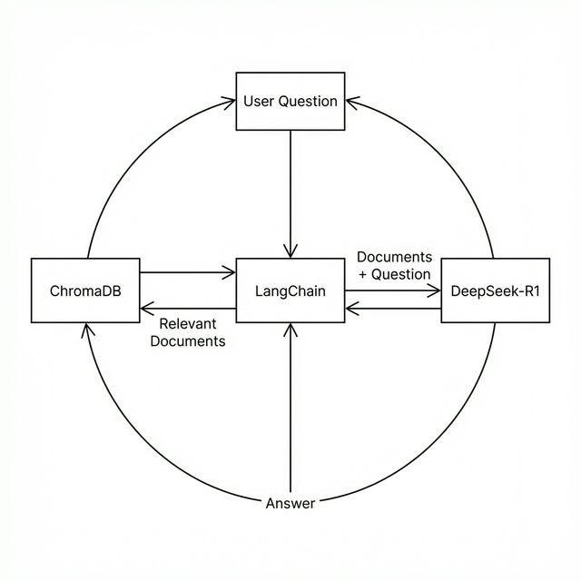

# 7장. RAG 엔진 가동: DeepSeek-R1과의 연결

드디어 **지식(VectorDB)** 과 **두뇌(DeepSeek-R1)** 를 연결할 차례입니다. 본 장에서는 LangChain을 사용하여 질문을 분석하고, 필요한 지식을 찾아, 최종 답변을 생성하는 **완전한 RAG 엔진** 을 구축합니다.

---

## 1. RAG 파이프라인 구조

우리가 만들 시스템의 내부 동작 과정입니다.


*그림 7-1: LangChain을 통한 지식 검색 및 LLM 답변 생성 파이프라인*

단순히 검색만 하는 것이 아니라, 검색된 문서를 **프롬프트(Prompt)** 라는 틀에 넣어 LLM에게 "이 문서를 보고 대답해"라고 지시하는 것이 핵심입니다.

---

## 2. [실습] RAG 엔진 실행

이미 3장에서 클론한 `ai-llm-rag-study` 저장소 내의 실습 폴더로 이동합니다.

### 1단계: 실습 폴더로 이동

실습 폴더인 `07_rag` 로 이동합니다.

### 2단계: 의존성 설치

`langchain` 과 `langchain-ollama` 등을 설치합니다.

```bash
pip install -r requirements.txt
```

### 3단계: 기본 RAG 실행

`basic_rag.py` 파일을 확인합니다. **6장** 에서 구축한 ChromaDB를 불러와서 연결합니다.

```bash
python basic_rag.py
```

> **Tip**: `basic_rag.py`는 가장 기초적인 RAG 파이프라인(검색 -> 질문 결합 -> LLM 답변)을 구현한 예제입니다.

- **실행 결과**:
  ```text
  질문: 연차는 며칠 전에 신청해야 해?
  --------------------------------------------------
  답변: 인사 규정에 따르면, 연차 휴가는 최소 3일 전까지 부서장에게 신청해야 합니다.
  ```

DeepSeek-R1이 우리가 저장한 문서를 바탕으로 정확한 사실을 답변하는 것을 볼 수 있습니다.

---

## 3. [실습] 프롬프트 튜닝과 출처 확인

단순한 답변을 넘어, AI에게 **페르소나(인격)** 를 부여하고 답변의 **근거(출처)** 를 표시해 봅니다.

### 1단계: 고급 RAG 실행

`advanced_rag.py` 파일을 열어 프롬프트가 어떻게 설정되었는지 확인해 봅니다.

```python
template = """
당신은 친절하고 꼼꼼한 '인사팀 AI 비서'입니다.
아래의 [참고 문서]를 바탕으로 직원의 질문에 정중하게 답변하십시오.
만약 문서에 없는 내용이라면 "죄송합니다, 해당 내용은 규정에 없습니다."라고 답하십시오.

[참고 문서]
{context}

질문: {question}
"""
```

이제 코드를 실행합니다.

```bash
python advanced_rag.py
```

> **Tip**: `advanced_rag.py`는 기본 RAG에 **프롬프트 템플릿**을 적용하여 페르소나를 부여하고, 답변에 출처(Source)를 함께 표시하도록 개선한 예제입니다.

- **실행 결과**:

  ```text
  질문: 식대는 얼마까지 지원돼?
  --------------------------------------------------
  답변: 네, 복지 규정에 따르면 야근 식대는 1회당 최대 15,000원까지 실비 지원됩니다.

  [참고 문서]
  - 복지_식대지원규정_v1.1.pdf (Page 3)
  ```

### 2단계: 결과 분석

1. **페르소나**: "네, ~입니다"와 같이 정중한 어조를 사용합니다.
2. **그라운딩**: 문서에 있는 15,000원이라는 정확한 수치를 인용했습니다.
3. **출처 명시**: 답변의 신뢰도를 높이기 위해 참고한 파일을 함께 보여줍니다.

---

## 4. RAG의 한계와 다음 단계

지금까지 **비정형 문서(PDF)** 에 대한 질의응답 시스템을 완성했습니다. 하지만 회사의 중요한 정보는 문서에만 있지 않습니다.

- **연차 잔여 일수**: 문서가 아닌 **DB** 에 있습니다.
- **지난달 매출**: 문서가 아닌 **DB** 에 있습니다.

다음 장(8장)에서는 문서뿐만 아니라 회사의 데이터베이스까지 조회하여 **"남은 연차(DB)를 확인하고 휴가 규정(문서)을 안내하는"** 진정한 통합 에이전트를 설계해 보겠습니다.
