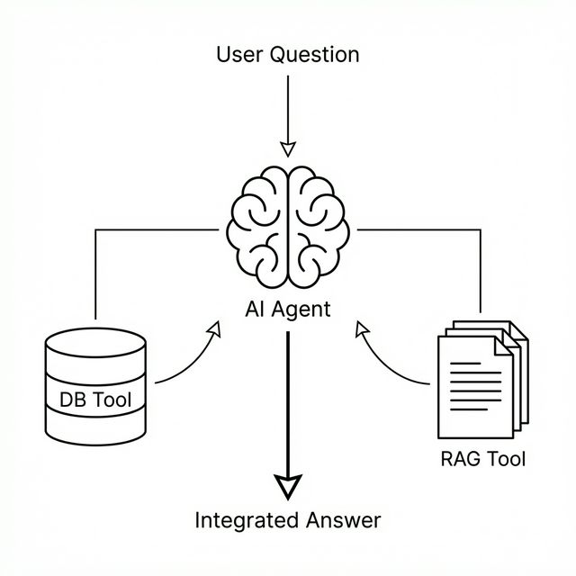

# 8장. 통합 지능: RAG와 DB의 만남 (Agent)

지금까지 우리는 문서를 검색하는 **RAG(7장)** 와 데이터를 조회하는 **DB 시스템(4장)** 을 각각 구축했습니다. 하지만 진정한 AI 비서는 이 둘을 자유자재로 오가며 업무를 처리해야 합니다.

본 장에서는 **도구(Tool)** 를 사용하여 스스로 판단하고 행동하는 **에이전트(Agent)** 를 설계합니다.

---

## 1. 에이전트 아키텍처: 생각하고 행동하라

우리가 만들 에이전트의 사고 과정입니다.


*그림 8-1: 도구 선택 및 지식 합성을 수행하는 AI 에이전트의 사고 과정*

에이전트는 질문을 분석하여 어떤 도구를 사용할지 **스스로 결정(Routing)** 합니다.

---

## 2. [실습] 도구(Skills) 만들기

이미 3장에서 클론한 `ai-llm-rag-study` 저장소 내의 실습 폴더로 이동합니다.

### 1단계: 실습 폴더로 이동

실습 폴더인 `08_agent` 로 이동합니다.

### 2단계: 의존성 설치

`langgraph` 등 최신 에이전트 라이브러리를 설치합니다.

```bash
pip install -r requirements.txt
```

### 3단계: 도구(Tool) 확인

`tools` 폴더 안에 두 개의 핵심 도구가 준비되어 있습니다.

1.  **RAG 도구 (`rag_tool.py`)** : 7장에서 만든 검색 엔진을 함수로 포장했습니다.
    - 기능: "인사 규정", "복지 혜택" 등 문서 내용을 검색합니다.
2.  **DB 도구 (`db_tool.py`)** : 4장의 DB에 접속하여 직원의 정보를 조회합니다.
    - 기능: "김철수 사원의 연차 잔여일", "영업팀 매출" 등을 조회합니다.

---

## 3. [실습] 통합 에이전트 실행

이제 이 두 도구를 가진 에이전트에게 복합적인 질문을 던져봅니다.

`agent.py` 파일을 실행합니다. 이 코드는 **DeepSeek-R1** 에게 위 두 가지 도구를 쥐어주고, 질문에 따라 적절히 사용하도록 지시합니다.

```bash
python agent.py
```

> **Tip**: `agent.py`는 RAG 도구와 DB 도구를 모두 가진 AI 에이전트를 생성하고, 사용자 질문을 분석하여 어떤 도구를 사용할지 스스로 결정(Routing)하게 하는 핵심 스크립트입니다.

- **질문 1 (복합 질문)**:
  `"김철수 사원의 남은 연차를 알려주고, 연차 사용 규정도 같이 설명해줘."`

- **실행 결과**:

  ```text
  [Thought]
  사용자가 두 가지 정보를 요청했습니다.
  1. 김철수의 연차 정보 -> 'DB 조회 도구' 사용 필요.
  2. 연차 사용 규정 -> '문서 검색 도구' 사용 필요.

  [Action]
  1. db_tool("김철수") 호출 -> {잔여: 5일, 사용: 10일}
  2. rag_tool("연차 사용 규정") 호출 -> "최소 3일 전 신청..."

  [Final Answer]
  김철수 사원님의 남은 연차는 5일입니다.
  인사 규정에 따라 연차는 사용하기 최소 3일 전에 부서장 승인을 받아야 합니다.
  ```

에이전트가 **정형 데이터(DB)** 와 **비정형 데이터(문서)** 를 완벽하게 결합하여 답변했습니다.

---

## 4. DeepSeek-R1의 추론 능력 (Reasoning)

우리가 사용하는 모델인 DeepSeek-R1은 단순한 답변 생성을 넘어, 위와 같이 **"어떤 도구를 먼저 쓸까?"**, **"정보가 부족하지 않은가?"** 를 스스로 고민합니다. 이를 **추론(Reasoning)** 이라고 하며, 에이전트 시스템에서 가장 중요한 역량입니다.

이제 우리의 AI 비서는 지식(문서)과 눈(DB)을 모두 갖추었습니다. 다음 장(9장)에서는 이 강력한 비서를 사용자가 편리하게 쓸 수 있도록 **웹 인터페이스(UI)** 를 입혀서 완성해 보겠습니다.
