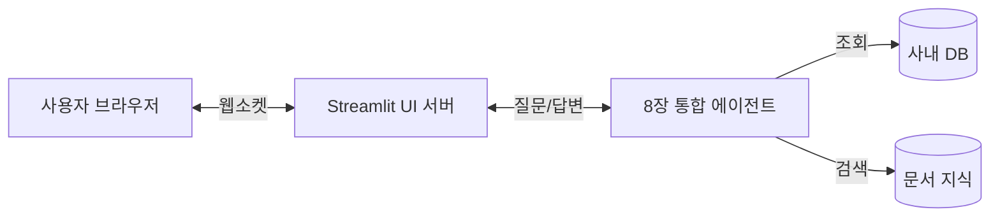

# 9장. 최종 시스템: 대화형 인터페이스(UI) 연결

지금까지 만든 에이전트는 터미널(검은 화면)에서만 대화할 수 있었습니다. 하지만 일반 직원이 터미널을 열고 명령어를 칠 수는 없습니다.

본 장에서는 **Streamlit** 을 사용하여 누구나 쉽게 사용할 수 있는 **웹 채팅 화면(UI)** 을 연결합니다. 이것이 바로 우리 **"AI 사내 비서"** 의 최종 완성 모습입니다.

---

## 1. UI 아키텍처: 사용자와 AI의 만남



우리는 복잡한 프론트엔드 코딩(HTML/CSS/JS) 없이, 파이썬 코드만으로 웹 화면을 만들 수 있는 **Streamlit** 을 사용합니다.

---

## 2. [실습] 채팅 서버 실행

이미 3장에서 클론한 `ai-llm-rag-study` 저장소 내의 실습 폴더로 이동합니다.

### 1단계: 실습 폴더로 이동

실습 폴더인 `09_ui` 로 이동합니다.

### 2단계: 의존성 설치

```bash
pip install -r requirements.txt
```

### 3단계: 웹 서버 실행

터미널에 다음 명령어를 입력하면 브라우저가 자동으로 열립니다.

```bash
streamlit run app.py
```

> **Tip**: `streamlit run` 명령어는 파이썬 코드를 웹 애플리케이션으로 실행해줍니다. 서버가 켜지면 자동으로 브라우저 새 탭이 열리며 채팅 화면을 볼 수 있습니다.

- **예상 화면**:
  브라우저(`http://localhost:8501`)에 "사내 AI 업무 비서"라는 제목과 함께 채팅창이 뜹니다.


*그림 9-1: 최종 구현된 채팅 UI 화면*

---

## 3. [실습] 시나리오 테스트 (종합)

이제 진짜 직원처럼 AI 비서에게 업무를 시켜봅시다.

### 시나리오 1: 단순 규정 질문 (RAG)

- **질문**: `"야근 식대 얼마까지 나와?"`
- **동작**: 에이전트가 **문서(규정)** 를 검색하여 `15,000원` 이라고 답변하는지 확인합니다.

### 시나리오 2: 개인 정보 조회 (DB)

- **질문**: `"내 남은 연차 며칠이야? (사번: 1001)"`
- **동작**: 에이전트가 **DB** 를 조회하여 `5일` 이라고 답변하는지 확인합니다.
  _(참고: 실습 코드에서는 편의상 사번을 입력받거나, 로그인된 사용자로 가정합니다)_

### 시나리오 3: 복합 업무 처리 (Reasoning)

- **질문**: `"나 연차 5일 남았는데, 이번에 3일 다녀오면 며칠 남아?"`
- **동작**: 에이전트가 **DB 조회(5일 확인)** -> **계산(5 - 3 = 2)** -> **최종 답변** 을 수행하는지 확인합니다.

---

## 4. 스트리밍(Streaming) 답변 경험

AI가 한 번에 답변을 "퍽" 하고 던지는 것이 아니라, 타자기를 치듯이 **한 글자씩 실시간으로(Streaming)** 보여주는지 확인하십시오. 이는 사용자가 AI가 생각하고 있다는 것을 느끼게 해주는 중요한 **UX(사용자 경험)** 요소입니다.

---

## 5. 마무리

축하합니다! 여러분은 이제 **"문서도 읽고, DB도 조회하며, 스스로 생각하는 AI 비서"** 를 로컬 환경에 구축했습니다.

하지만 실전 도입을 위해서는 아직 몇 가지 과제가 남았습니다.

- 검색이 부정확하면 어떡하지?
- 속도가 너무 느리면?

마지막 장(10장)에서는 시스템의 품질을 높이기 위한 **최적화(Tuning)** 기법을 다루며 대장정을 마무리하겠습니다.
