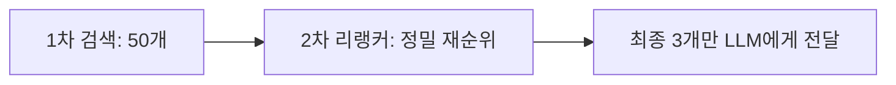

# 10장. RAG 튜닝: "되는 수준"에서 "쓸만한 수준"으로

9장까지 우리는 "작동하는" 시스템을 만들었습니다. 하지만 실전은 냉혹합니다.

- 질문: "사과랑 배의 차이가 뭐야?" (키워드 매칭 실패)
- 질문: "과장님 연차 말고 대리님 연차..." (문맥 파악 실패)

본 장에서는 검색의 품질을 비약적으로 높여주는 **고급 튜닝(Optimization)** 기술을 실습합니다.

---

## 1. 검색 품질 높이기: 리랭커(Reranker)

벡터 검색은 의미가 비슷한 것을 잘 찾지만, 가끔 엉뚱한 문서를 1등으로 가져오기도 합니다. 이때 **리랭커(Reranker)** 는 검색된 상위 10개 문서를 다시 꼼꼼히 읽어 순위를 재배치합니다.



---

## 2. [실습] 리랭커 적용 효과 확인

이미 3장에서 클론한 `ai-llm-rag-study` 저장소 내의 실습 폴더로 이동합니다.

### 1단계: 실습 폴더로 이동

실습 폴더인 `10_optimization` 으로 이동합니다.

### 2단계: 의존성 설치

고성능 검색을 위한 `rank_bm25` 등을 설치합니다.

```bash
pip install -r requirements.txt
```

### 3단계: 리랭커 테스트

`rerank_test.py` 를 실행하여 일반 검색과 리랭커 적용 검색의 차이를 비교합니다.

```bash
python rerank_test.py
```

> **Tip**: `rerank_test.py`는 Cross-Encoder 방식의 리랭커 모델을 사용하여, 벡터 검색으로 찾아온 문서들의 순위를 더욱 정교하게 재조정하고 성능 차이를 비교하는 스크립트입니다.

- **실행 결과 비교**:

```text
[일반 벡터 검색 결과]
1. 사내 동호회 규정 (유사도 0.81) -> (질문과 무관한 문서가 상위에 뜸)
2. 인사 규정 (유사도 0.79)

[리랭커 적용 후 결과]
1. 인사 규정 (관련도 Score 0.98) -> (정확한 문서가 1등으로 올라옴)
2. 사내 동호회 규정 (관련도 Score 0.12)
```

리랭커를 쓰면 속도는 약간 느려지지만, 정확도는 인간 수준으로 높아집니다.

---

## 3. 대화의 맥락 기억하기 (Memory)

지금까지의 에이전트는 금붕어 기억력이었습니다.

- 사용자: "내 연차 몇 개야?" -> AI: "5개입니다."
- 사용자: "그럼 3개 쓰면?" -> AI: "네? 무엇을 3개 쓴다는 건가요?"

이를 해결하기 위해 **대화 내역(History)** 을 저장하는 기능을 추가합니다.

### 1단계: 메모리 기능 테스트

`chat_memory.py` 를 실행합니다.

```bash
python chat_memory.py
```

> **Tip**: `chat_memory.py`는 LangChain의 메모리 기능을 활용하여, AI가 이전 대화 내용을 기억하고 문맥을 이어나갈 수 있는지 테스트하는 예제입니다.

- **실행 결과**:
  ```text
  User: 제 이름은 김철수입니다.
  AI: 안녕하세요 김철수님!
  User: 제 이름이 뭐라고 했죠?
  AI: 김철수님이라고 하셨습니다.
  ```

이제 에이전트는 이전 대화를 기억하고, 문맥에 맞는 답변을 할 수 있습니다.

---

## 4. 맺으며: AI와 함께하는 업무 혁신

우리는 **1장부터 10장까지**의 긴 여정을 통해, 제로 베이스에서 시작하여 **"보고, 듣고, 기억하고, 생각하는"** 사내 AI 비서를 완성했습니다.

- **DeepSeek-R1 (두뇌)**
- **VectorDB (지식)**
- **Streamlit (입/출력)**
- **Agent (판단력)**

이 책에서 다룬 코드는 시작일 뿐입니다. 이제 여러분의 회사 데이터를 넣고, 여러분만의 로직을 추가하여 세상에 단 하나뿐인 시스템을 만들어 보십시오.

여러분의 비즈니스에 AI가 든든한 날개가 되기를 응원합니다. 고생하셨습니다!
