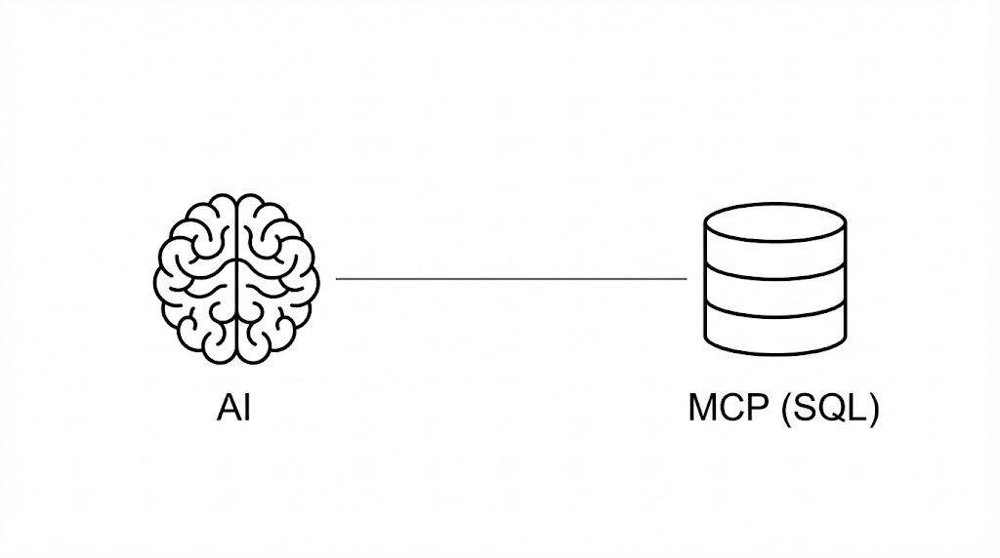
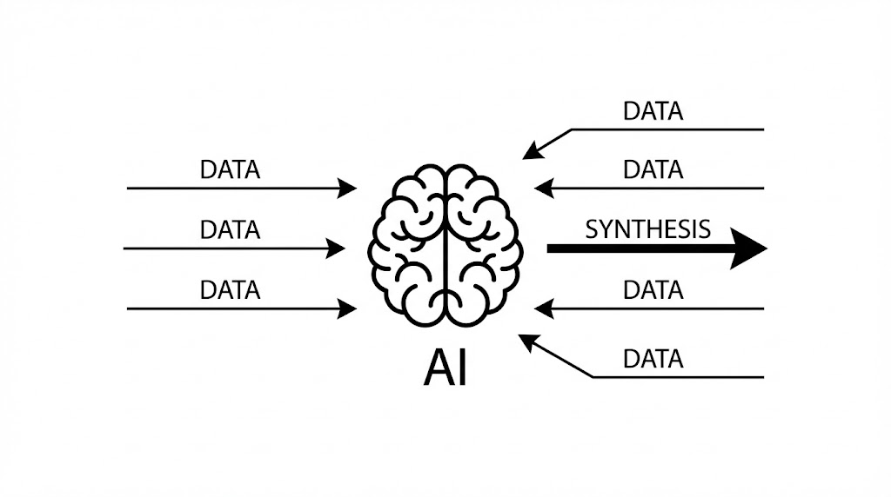
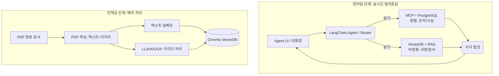

# 1장. 이 책의 목표와 최종 완성본 미리보기

사내 비즈니스 지식 엔진 구축의 긴 여정을 시작하기 전, 우리가 도달하게 될 최종 목적지를 확인합니다. 본 장에서는 시스템의 핵심 철학인 RAG와 MCP의 결합 전략을 소개하고, 완성된 'AI 업무 비서'가 실제 비즈니스 현장에서 어떻게 동작하는지 미리 살펴봅니다.

---

## 1. 이 책이 다루는 범위와 핵심 전략

기업 내부의 지식은 파편화되어 있습니다. 직원의 인사 정보는 데이터베이스(정형)에, 회사의 규정은 수많은 PDF 문서(비정형) 속에 잠들어 있습니다. 이 책은 이러한 흩어진 지식들을 하나로 묶어 LLM이 자유롭게 다룰 수 있는 통합 시스템을 구축하는 방법을 제시합니다.

### 1.1 모델 Fine-tuning이 아닌 'RAG 파이프라인 튜닝'

과거에는 특정 도메인 지식을 주입하기 위해 모델 자체를 재학습시키는 파인튜닝(Fine-tuning)이 필수적이었습니다. 하지만 이는 비용이 높고 최신성 유지가 어렵다는 단점이 있습니다.
본 서적은 모델을 건드리지 않는 대신, 외부 지식을 실시간으로 참조하는 **검색 증강 생성(RAG, Retrieval-Augmented Generation)**과 외부 도구를 호출하는 **모델 컨텍스트 프로토콜(MCP, Model Context Protocol)**을 결합합니다. 우리는 모델 자체를 고치는 대신, 최적의 정보를 찾아주는 '시스템 파이프라인 최적화'에 집중합니다.

### 1.2 비용 효율적이며 안전한 로컬 환경

사내 데이터 보안을 위해 외부 API 호출을 최소화합니다. Ollama를 활용하여 로컬 환경에서 LLM(DeepSeek R1, LLaVA)을 직접 실행하고, 모든 데이터 처리를 사내망 내에서 완결하는 보안 강화형 구축 전략을 기본으로 삼습니다.

---

## 2. 최종 결과물 데모 시나리오

우리가 완성할 시스템은 단순한 챗봇을 넘어, 정형 데이터와 비정형 문서를 넘나드는 진정한 '지능형 비서'입니다. 다음은 시스템이 처리하게 될 주요 시나리오입니다.

### 2.1 정형+비정형 복합 질의

> _"김대리님 남은 연차 개수와 올해 휴가 신청 절차를 함께 알려줘."_


- **처리**: MCP로 DB에서 실시간 연차 정보를 조회하고, RAG로 사내 규정 문서를 검색하여 하나의 문장으로 통합 답변합니다.

---

### 2.2 실시간 정형 데이터 조회

> _"지난 분기 우리 팀 총 매출액은 얼마야?"_



- **처리**: MCP 기술을 활용하여 LLM이 직접 데이터베이스(PostgreSQL)에서 정확한 수치를 추출합니다.

---

### 2.3 비정형 문서 검색 및 근거 제시

> _"신입사원 온보딩 절차와 관련 서류를 알려줘."_


- **처리**: VectorDB를 검색하여 방대한 문서 중 필요한 정보를 찾아내고, 답변 시 반드시 참고한 문서명과 섹션을 명시하여 신뢰도를 확보합니다.

---

### 2.4 지식 요약 및 합성

> _"위 내용들을 바탕으로 이번 달 업무 보고서를 요약해줘."_



- **처리**: 수집된 정형/비정형 데이터를 LLM이 종합적으로 분석하여 환각(Hallucination) 없이 최종 요약본을 생성합니다.

---

## 3. 시스템 아키텍처 한 장 요약

전체 시스템은 실시간 질의응답을 처리하는 **런타임 단계**와 문서를 지식화하는 **인덱싱 단계**로 나뉩니다.

### 3.1 아키텍처 다이어그램 (System Architecture)



### 3.2 핵심 기술 스택

| 영역               | 기술 스택                | 용도                            |
| :----------------- | :----------------------- | :------------------------------ |
| **추론 엔진**      | Ollama + DeepSeek R1     | 런타임 추론 및 답변 생성        |
| **멀티모달**       | Ollama + LLaVA / EasyOCR | 이미지 의미 분석 및 텍스트 추출 |
| **백엔드**         | FastAPI + Jinja2         | 시스템 API 및 웹 UI 템플릿      |
| **데이터베이스**   | PostgreSQL / ChromaDB    | 정형 데이터 및 텍스트 벡터 저장 |
| **오케스트레이션** | LangChain                | 에이전트 브레인 및 도구 연동    |

---

## 4. 이 책을 마치면 얻게 될 역량

이 과정을 완수하면 여러분은 다음과 같은 실무 능력을 확보하게 됩니다.

- **로컬 LLM 기반 보안 시스템 운영**: 기업 보안을 유지하며 AI 인프라를 구축하는 역량.
- **하이브리드 데이터 설계**: DB와 문서를 통합하여 다루는 차세대 AI 아키텍처 설계 기술.
- **고도화된 RAG 파이프라인**: 텍스트를 넘어 이미지와 표까지 처리하는 지능형 검색 엔진 구현 능력.

이제 본격적인 학습을 시작하겠습니다. 다음 장(2장)에서는 DeepSeek-R1을 활용하여 RAG의 핵심 원리를 직접 실습해 보겠습니다.
# 2장. DeepSeek-R1으로 시작하는 기초 RAG 정복

본 장에서는 복잡한 시스템 구축에 앞서, RAG(Retrieval-Augmented Generation)의 핵심 원리를 단계별 실습을 통해 학습합니다. LLM이 모르는 지식에 대해 어떻게 답변을 실패하고, 이를 RAG가 어떻게 보완하는지 코드로 직접 확인합니다.

---

## 1. LLM은 왜 내 데이터를 모를까?

LLM은 방대한 데이터로 사전 학습되었지만, 우리 회사의 어제 수정된 규정이나 내부 문서는 알 수 없습니다.

### 1.1 [실패] LLM 단독 질의의 한계

가장 먼저, 모델이 학습했을 리 없는 가상의 회사 규정("테크컴퍼니 신입사원 연차 규정")을 질문해 봅니다.

- **결과**: 모델은 일반적인 법규를 말하거나 모른다고 답변합니다. 이는 지식의 부재로 인한 당연한 결과입니다.

### 1.2 [성공] 컨텍스트 직접 주입 (Context Injection)

문서가 짧을 경우, 질문 앞에 규정을 복사해서 전달할 수 있습니다.

- **방식**: `[규정내용] + [질문]` 형태로 프롬프트를 구성합니다.
- **결과**: 모델이 제공된 텍스트를 바탕으로 정확한 답변을 내놓습니다. 이것이 RAG의 가장 원초적인 형태입니다.

---

## 2. VectorDB와 RAG의 시작

데이터가 수천 페이지라면 직접 주입은 불가능합니다. 이때 필요한 것이 VectorDB입니다.

### 2.1 문장을 좌표로: 임베딩(Embedding)

문장을 숫자의 나열(Vector)로 바꿉니다. 비슷한 의미를 가진 문장끼리 공간상에서 가깝게 위치하게 됩니다.

### 2.2 검색과 추론 파이프라인

1. **검색(Retrieval)**: 질문과 가장 가까운 규정 조각을 VectorDB(Chroma)에서 찾아옵니다.
2. **생성(Generation)**: 찾아온 정보를 LLM(DeepSeek-R1)에게 전달하여 최종 답변을 생성합니다.

---

## 3. 실습: DeepSeek-R1의 추론(Reasoning) 활용

DeepSeek-R1 모델은 단순히 정보를 읽어주는 것을 넘어, 찾은 내용을 바탕으로 복잡한 사고 과정을 거칩니다.

- **실습 예시**: "입사 3개월 차인데 휴가를 2일 썼어. 남은 휴가는?"
- **AI의 사고**:
  1. 규정 검색: "신입은 매월 1일 발생" 확인.
  2. 연산: "3개월 = 3일 발생".
  3. 최종: "3일 - 2일 = 1일 남음" 출력.

---

## 4. 마무리

이 짧은 실습을 통해 우리는 **Search(VectorDB), Context(Prompt), Reasoning(DeepSeek-R1)**이라는 RAG의 3대 요소를 확인했습니다. 이제 이 원리를 실제 대규모 시스템으로 확장할 차례입니다.

다음 장(3장)에서는 이러한 시스템을 구축하기 위한 환경 설정을 시작하겠습니다.
# 3장. 개발 환경 설정

본 장에서는 'AI 업무 비서'를 구축하기 위한 개발 인프라를 로컬 환경에 구성합니다. 우리는 외부 클라우드 의존성을 최소화하고 보안을 강화하기 위해 모든 LLM 추론과 데이터 관리를 로컬 머신 내에서 수행하는 것을 원칙으로 합니다.

---

## 1. 필수 시스템 요구사항

원활한 실습과 로컬 LLM 구동을 위해 다음과 같은 사양을 권장합니다.

- **CPU**: Apple Silicon (M1/M2/M3) 또는 Intel/AMD (AVX2 지원)
- **RAM**: 16GB 이상 (모델 구동 및 DB 동시 실행 시 필수)
- **저장공간**: 최소 20GB 이상의 여유 공간 (모델 및 VectorDB 저장 공간)
- **OS**: macOS, Windows (WSL2 권장), 또는 Linux

---

## 2. 로컬 LLM 환경: Ollama 및 모델 설치

Ollama는 로컬 환경에서 LLM을 가장 쉽고 효율적으로 구동할 수 있게 돕는 도구입니다.

### 2.1 Ollama 설치

공식 홈페이지(https://ollama.com)에서 자신의 OS에 맞는 설치 파일을 다운로드하여 설치합니다.

### 2.2 DeepSeek-R1 및 LLaVA 모델 다운로드

우리는 텍스트 추론용 모델과 이미지 분석용 멀티모달 모델을 각각 내려받습니다.

- **추론 모델**: `ollama pull deepseek-r1:7b` (또는 사양에 따라 1.5b, 8b 등 선택)
- **시각 모델**: `ollama pull llava`

---

## 3. 데이터베이스 인프라: PostgreSQL 설치

정형 데이터 관리를 위해 관계형 데이터베이스인 PostgreSQL을 설치합니다. Docker를 활용하는 것이 가장 깔끔한 방법입니다.

### 3.1 Docker Compose를 통한 설치

`hands-on/03_setup` 폴더 내의 `docker-compose.yml` 파일을 실행하여 데이터베이스를 즉시 구동합니다.

```bash
docker-compose up -d
```

---

## 4. 실습용 베이스 시스템 확보 (Git Clone)

우리는 밑바닥부터 웹 UI와 DB 스키마를 짤 시간을 아끼기 위해, 미리 준비된 **베이스 시스템**을 사용합니다.

- **임시 저장소**: `https://github.com/nomadlab/ai-agent-base-system.git`
- **클론 명령어**:

```bash
git clone https://github.com/nomadlab/ai-agent-base-system.git
```

이제 모든 도구가 준비되었습니다. 다음 장(4장)에서는 클론한 베이스 시스템을 실행하고 내부 구조를 분석해 보겠습니다.
# 4장. 베이스 시스템 설정: "초간단 사내 시스템" 구축

AI 에이전트가 똑똑하게 작동하려면 먼저 대화할 대상, 즉 **데이터와 시스템 환경**이 있어야 합니다. 본 장에서는 미리 준비된 사내 시스템 코드를 확보하고, 에이전트의 활동 무대가 될 DB 구조를 분석합니다.

---

## 1. 베이스 소스 코드 확보 (Git Clone)

우리는 이미 3장에서 기술 스택을 준비했습니다. 이제 실제 코드와 UI가 포함된 베이스 프로젝트를 실습 환경으로 가져옵니다.

- **프로젝트 주소**: `https://github.com/nomadlab/ai-agent-base-system.git`
- **로컬 복제**:

```bash
# 실습 폴더로 이동 후 클론 실행
git clone https://github.com/nomadlab/ai-agent-base-system.git .
```

프로젝트 폴더 내에는 다음과 같은 핵심 구성 요소가 포함되어 있습니다.

- `app.py`: FastAPI 기반의 백엔드 서버
- `templates/`: Jinja2 기반의 관리자 화면 UI
- `static/`: 스타일시트 및 정적 자산

---

## 2. 데이터 아키텍처 이해 (3대 핵심 테이블)

에이전트가 MCP(Model Context Protocol)를 통해 조회하게 될 데이터베이스는 3개의 핵심 테이블로 구성되어 있습니다.

### 2.1 직원(Employee) 테이블

사내 구성원의 기본 정보를 담고 있습니다. (`id`, `name`, `dept`, `email`, `hire_date`)

### 2.2 휴가 잔여(Leave Balance) 테이블

전형적인 정형 데이터로, 수치 연산이 중요한 영역입니다. (`employee_id`, `total`, `used`, `remaining`)

### 2.3 매출(Sales) 테이블

날짜와 부서별 실적이 기록됩니다. AI가 통계적인 답변을 내놓을 때 사용됩니다. (`dept`, `amount`, `date`)

---

## 3. 실행 및 기본 UI 확인

환경 변수(`.env`) 설정을 마친 후 서버를 실행하여 기본 시스템이 가동되는지 확인합니다.

```bash
# 의존성 설치 및 실행
pip install -r requirements.txt
uvicorn app:app --reload
```

브라우저에서 `http://localhost:8000`에 접속하여 관리자 대시보드가 정상적으로 출력되는지 확인하십시오. 화면에 나타나는 데이터들이 앞으로 우리가 구축할 에이전트가 학습하고 답변하게 될 실습의 재료입니다.

이제 에이전트의 '몸체'인 시스템을 갖추었습니다. 다음 장(5장)에서는 에이전트가 읽게 될 '지식'인 사내 문서를 수집하고 표준화하는 전략을 학습하겠습니다.
# 5장. 사내 문서 수집 전략과 문서 표준 만들기

RAG 시스템의 성능은 "문서 품질이 반"입니다. 아무리 좋은 모델을 써도 문서가 엉망이면 비서도 엉망이 됩니다. 본 장에서는 AI가 가장 잘 이해할 수 있는 형태의 문서 표준을 정의합니다.

---

## 1. 어떤 문서를 수집할 것인가

에이전트에게 주입할 핵심 지식 세트를 선정합니다.

- **인사/행정**: 휴가 규정, 온보딩 매뉴얼, 사내 복지 가이드.
- **업무 프로세스**: 품의서 작성법, 장애 대응 매뉴얼(Runbook).
- **기술 데이터**: API 명세서, 시스템 아키텍처 정의서.

---

## 2. AI를 위한 문서 표준 규칙

AI가 검색(Retrieval)하기 쉬운 구조를 갖춰야 합니다.

### 2.1 파일명 및 메타데이터 규칙

- **규칙**: `{부서}_{문서명}_v{버전}.pdf`
- **예시**: `HR_Leave_Policy_v1.2.pdf`

### 2.2 구조적 헤더 규칙

- **# (H1)**: 문서 제목
- **## (H2)**: 대범주 (예: 휴가 신청 절차)
- **### (H3)**: 상세 항목 (예: 신청 시기 및 방법)

---

## 3. 문서 형식별 대응 전략

- **Markdown (.md)**: AI가 가장 좋아하는 형식. 별도 처리 없이 즉시 사용 가능.
- **PDF (.pdf)**: 텍스트 추출 시 표(Table)가 깨질 수 있으므로 구조적 파싱 전략 필요.
- **Excel (.xlsx)**: 정형 데이터가 섞여 있으므로 '텍스트화' 과정을 거쳐야 함.

---

## 4. 마무리

이제 에이전트가 학습할 '교과서'의 준비가 끝났습니다. 다음 장(6장)에서는 이 문서들을 기계가 읽을 수 있는 벡터(Vector) 데이터로 변환하여 데이터베이스에 저장해 보겠습니다.
# 6장. VectorDB 구축: 문서를 “검색 가능한 지식”으로 바꾸기

수집된 문서를 AI가 실시간으로 검색할 수 있는 지식 창고로 변환합니다. 이 과정을 '인덱싱 파이프라인(Indexing Pipeline)'이라고 부릅니다.

---

## 1. 지식의 디지털화: 텍스트 추출

PDF나 Word 문서에서 글자를 뽑아냅니다.

- **도구**: `pypdf`, `langchain-community`
- **핵심**: 단순 텍스트뿐만 아니라 문맥 정보를 보존하며 추출하는 것이 중요합니다.

---

## 2. 청킹 전략 (Chunking)

컴퓨터가 한 번에 읽을 수 있도록 문서를 적절한 크기로 자릅니다.

- **RecursiveCharacterTextSplitter**: 문맥이 끊기지 않게 의미 단위(문단, 마침표 등)로 자르는 지능형 분할 도구입니다.
- **Overlap 설정**: 조각들 사이에 일부 내용을 겹치게(예: 100자) 두어 정보의 단절을 방지합니다.

---

## 3. 임베딩(Embedding) 및 저장

자른 텍스트 조각을 벡터(숫자 좌표)로 변환하여 **ChromaDB**에 저장합니다.

- **임베딩 모델**: `ko-sroberta-multitask` (한국어의 의미를 정확히 파악하는 특화 모델)
- **VectorDB**: 로컬에서 가볍고 강력하게 작동하는 Chroma를 사용합니다.

---

## 4. 마무리

이제 우리 시스템은 수만 페이지의 문서 중 질문과 가장 관련 있는 내용을 밀리초(ms) 단위로 찾아낼 수 있게 되었습니다. 다음 장(7장)에서는 이 지식 창고를 활용하여 실제 답변을 생성하는 RAG 엔진을 완성해 보겠습니다.
# 7장. RAG로 Q&A 엔진 만들기

검색된 문서를 바탕으로 LLM이 완벽한 답변을 생성하도록 조율합니다. "일단 작동하는 수준"을 넘어 근거가 명확한 답변 시스템을 구축합니다.

---

## 1. RAG 최소 동작 구현

LangChain의 `RetrievalQA` 체인을 사용하여 질문부터 답변까지의 전체 흐름을 연결합니다.

1. **질문**: 사용자가 "휴가 신청 어떻게 해?"라고 묻습니다.
2. **검색**: VectorDB에서 관련 내용을 찾아옵니다.
3. **생성**: LLM이 찾아온 내용을 참고하여 정중한 답변을 만듭니다.

---

## 2. RAG 전용 프롬프트 템플릿

AI가 제멋대로 답변하지 않도록 가이드라인을 제공합니다.

- **제약 조건**: "문서에 없는 내용은 반드시 '확격되지 않은 내용'이라고 답하십시오."
- **형식 지정**: "답변 끝에는 반드시 참고한 문서명을 명시하십시오."

---

## 3. 답변의 신뢰도: 출처(Citation) 표시

단순한 답변만으로는 사내에서 활용하기 어렵습니다. 답변이 어디서 왔는지 '근거'를 함께 보내줍니다.

- **데이터 구조**: `{"answer": "...", "sources": ["인사가이드 v1.2", "p.4"]}` 식으로 구성하여 신뢰를 확보합니다.

---

## 4. 마무리

비정형 문서에 대한 지능형 Q&A 시스템이 완성되었습니다. 하지만 비서는 문서뿐만 아니라 회사의 '계산 데이터(DB)'도 볼 줄 알아야 합니다. 다음 장(8장)에서는 DB와 문서를 동시에 다루는 통합 에이전트를 설계해 보겠습니다.
# 8장. 정형 MCP, 비정형 VectorDB+RAG: 통합 에이전트 설계

진정한 '사내 비서'는 사실(숫자)과 지식(규정)을 구분할 줄 알아야 합니다. 본 장에서는 시스템의 브레인인 '라우팅 에이전트(Routing Agent)'를 설계합니다.

---

## 1. 정형/비정형 데이터의 명확한 분리

- **정형 데이터 (사실/수치)**: 매출, 연차 잔여일 등 DB에 있는 것. -> **MCP(Model Context Protocol)** 서비스로 연결.
- **비정형 데이터 (설명/지식)**: 휴가 규정, 온보딩 절차 등 문서에 있는 것. -> **VectorDB + RAG**로 연결.

---

## 2. 질문 라우팅(Routing) 전략

사용자의 질문 의도에 따라 어떤 통로를 이용할지 결정합니다.

1. **키워드/패턴 분석**: "몇 명", "금액" 등 숫자가 포함되면 DB 조회(MCP) 우선.
2. **의도 기반 라우팅**: LLM이 질문을 분석하여 'DB가 필요함' 또는 '문서 검색이 필요함'을 스스로 판단하게 합니다.

---

## 3. 통합 지식 합성 (Synthesis)

만약 "나 남은 휴가 얼마고, 규정이 뭐야?"라는 질문이 들어오면 에이전트는 두 곳에서 모두 정보를 가져와서 하나의 자연스러운 문장으로 합침니다. 이것이 우리가 구축할 시스템의 백미인 **하이브리드 지식 엔진**의 핵심 동작입니다.

---

## 4. 마무리

두뇌 설계가 완료되었습니다. 이제 이 강력한 두뇌를 사용자가 직접 만질 수 있는 인터페이스와 연결할 차례입니다. 다음 장(9장)에서는 실시간 대화 기능이 포함된 현대적인 UI를 연동해 보겠습니다.
# 9장. 최종 시스템 연결 및 UI 연동

에이전트의 강력한 두뇌를 사용자가 경험할 수 있도록 현대적인 채팅 인터페이스(Chat UI)를 입힙니다. 우리는 미리 준비된 프리미엄 UI 템플릿을 활용하여 빠르게 시스템을 완성합니다.

---

## 1. UI 모듈 확보 (Git Clone)

프론트엔드 디자인과 실시간 스트리밍 대화 기능이 포함된 UI 코드베이스를 확보합니다.

- **UI 저장소 주소**: `https://github.com/nomadlab/ai-agent-qa-ui.git`
- **복제 명령어**:

```bash
git clone https://github.com/nomadlab/ai-agent-qa-ui.git
```

### 주요 구성 파일

- `index.html`: 다크 모드와 글래스모피즘이 적용된 메인 채팅 화면.
- `app.py\*\*: 에이전트 브레인과 UI를 연결하는 통로.
- `static/js/chat.js`: 실시간 메시지 처리 및 애니메이션 구현.

---

## 2. 에이전트와 UI의 결합

백엔드에서 완성된 `AgentExecutor`를 UI의 API 엔드포인트와 연결합니다. 사용자가 입력한 메시지가 에이전트를 거쳐 다시 브라우저로 실시간 출력되는 과정을 확인합니다.

---

## 3. 스트리밍 응답 구현

AI가 한 자씩 타이핑하듯 답변을 내놓는 스트리밍(Streaming) 기능을 활성화합니다.

- **장점**: 답변이 길어져도 사용자가 대기 시간을 지루하게 느끼지 않고 실시간으로 정보를 확인할 수 있습니다.

---

## 4. 마무리

이제 우리만의 '사내 AI 업무 비서'가 완성되었습니다. 브라우저에서 직접 질문하고 답변을 받아보십시오. 하지만 실전에서는 검색 정확도가 낮거나 이미지를 인식하지 못하는 등 해결해야 할 과제들이 남아있습니다.

마지막 장(10장)에서는 시스템을 더욱 완벽하게 다듬는 실전 튜닝 과정을 다루겠습니다.
# 10장. RAG 튜닝: "되는 수준"에서 "쓸만한 수준"으로

완성된 시스템을 더 똑똑하고 안전하게 만드는 마무리학업 단계입니다. 실전에서 발생하는 검색 오차를 줄이고 이미지를 인식하는 강력한 기능을 추가합니다.

---

## 1. 하이브리드 검색과 리랭커 (ReRanker)

단순한 키워드 검색은 한계가 있습니다.

- **Hybrid Search**: 의미 기반의 벡터 검색과 키워드 기반의 BM25 검색을 결합하여 정확도를 획기적으로 높입니다.
- **ReRanker**: 검색된 10개의 문서 중 가장 관련 있는 문서를 다시 한번 순위 매김하여 최적의 컨텍스트를 LLM에게 전달합니다.

---

## 2. 이미지 및 표 처리 전략 (멀티모달)

회사의 문서에는 텍스트만 있는 것이 아닙니다. 표(Table)와 이미지도 지식입니다.

- **OCR (EasyOCR)**: 이미지 내의 텍스트를 추출하여 검색 인덱스에 포함합니다.
- **Vision LLM (LLaVA)**: 도표나 사진의 의미를 텍스트로 캡션화하여 인덱싱합니다. 이제 AI가 "지난 영업팀 실적 그래프 요약해줘" 같은 질문에도 답할 수 있게 됩니다.

---

## 3. 환각 현상(Hallucination) 방지 튜닝

비서가 거짓말을 하면 안 됩니다.

- **Self-Correction**: 답변 생성 후 AI가 스스로 "이 답변이 제공된 문서에 근거하는가?"를 자가 검증하게 합니다.
- **지식 필터링**: 최신 버전의 문서만 참조하도록 메타데이터 필터링을 강화합니다.

---

## 4. 맺으며: AI와 함께하는 업무 혁신

우리는 기초부터 시작하여 로컬 LLM 환경 구축, 사내 지식 디지털화, 그리고 지능형 에이전트 연동까지 전 과정을 마쳤습니다. 이제 이 시스템은 단순한 도구가 아니라 여러분의 업무를 가장 잘 아는 든든한 동료가 될 것입니다.

이 책을 통해 얻은 기술적 토대 위에서 각자의 비즈니스 현장에 맞는 더 강력한 AI 시스템을 구축해 나가시길 응원합니다. 고생하셨습니다!
