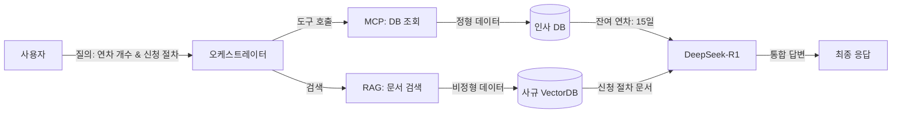
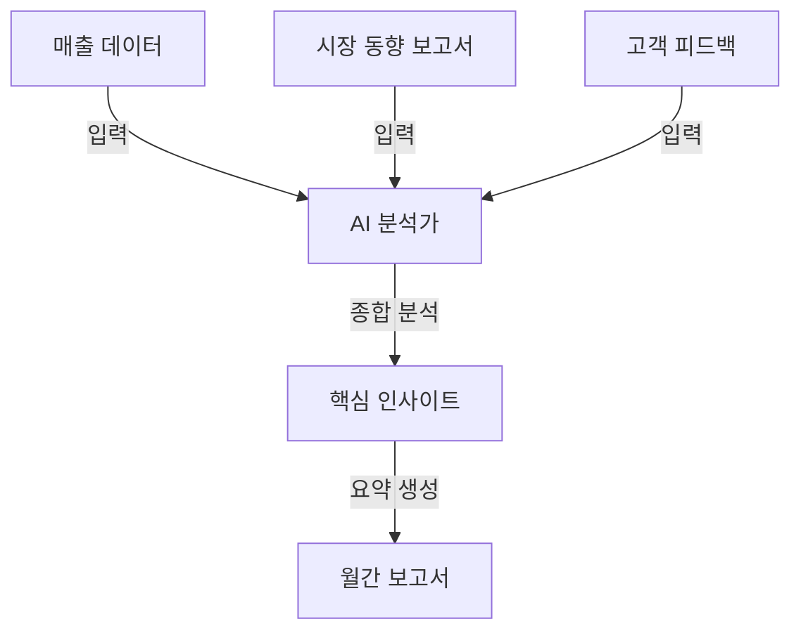
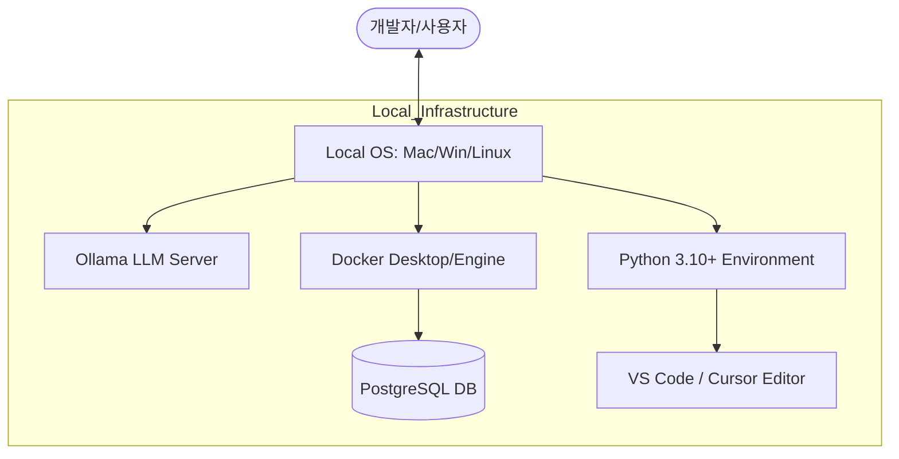
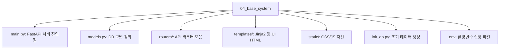
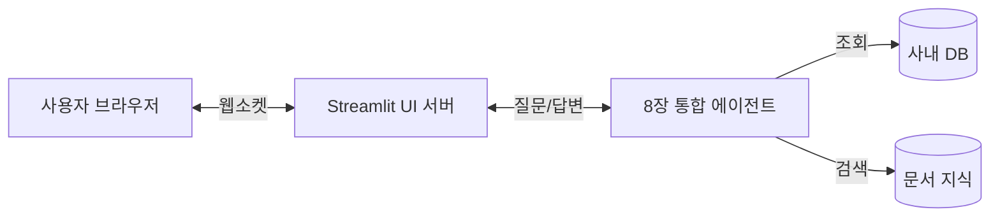

# 1장. 이 책의 목표와 최종 완성본 미리보기

사내 비즈니스 지식 엔진 구축 과정을 시작하기 전, 우리가 도달하게 될 최종 목적지를 확인합니다. 본 장에서는 시스템의 핵심 철학인 RAG와 MCP의 결합 전략을 소개하고, 완성된 'AI 업무 비서'가 실제 비즈니스 현장에서 어떻게 동작하는지 미리 살펴봅니다.

---

## 1. 이 책이 다루는 범위와 핵심 전략

기업 내부의 지식은 파편화되어 있습니다. 직원의 인사 정보는 데이터베이스(정형)에, 회사의 규정은 수많은 PDF 문서(비정형) 속에 잠들어 있습니다. 이 책은 이러한 흩어진 지식들을 하나로 묶어 LLM이 자유롭게 다룰 수 있는 통합 시스템을 구축하는 방법을 제시합니다.

### 1.1 모델 Fine-tuning이 아닌 'RAG 파이프라인 튜닝'

과거에는 특정 도메인 지식을 주입하기 위해 모델 자체를 재학습시키는 **파인튜닝** (Fine-tuning)이 필수적이었습니다. 하지만 이는 비용이 높고 최신성 유지가 어려우며, 데이터베이스의 실시간 값을 반영하지 못한다는 치명적인 단점이 있습니다.

본 서적은 모델을 건드리지 않는 대신, 외부 지식을 실시간으로 참조하는 **검색 증강 생성(RAG)** 과 외부 도구를 호출하는 **모델 컨텍스트 프로토콜(MCP)** 을 결합합니다. 특히 **DeepSeek-R1의 사고 능력(Reasoning)** 을 파이프라인의 컨트롤 타워로 배치하여, 단순한 검색을 넘어선 '문제 해결형' 시스템을 구축합니다.

### 1.2 비용 효율적이며 안전한 로컬 환경

사내 데이터 보안을 위해 외부 API 호출을 최소화합니다. Ollama를 활용하여 로컬 환경에서 **LLM** (DeepSeek R1, LLaVA)을 직접 실행하고, 모든 데이터 처리를 사내망 내에서 완결하는 보안 강화형 구축 전략을 기본으로 삼습니다.

---

## 2. 최종 결과물 데모 시나리오

우리가 완성할 시스템은 단순한 챗봇을 넘어, 정형 데이터와 비정형 문서를 넘나드는 진정한 '지능형 비서'입니다. 다음은 시스템이 처리하게 될 주요 시나리오입니다.

### 2.1 정형+비정형 복합 질의

> _"김대리님 남은 연차 개수와 올해 휴가 신청 절차를 함께 알려줘."_



_그림 1-1: 정형(MCP) + 비정형(RAG) 하이브리드 처리 흐름도_

- **처리**: MCP로 DB에서 실시간 연차 정보를 조회하고, RAG로 사내 규정 문서를 검색하여 하나의 문장으로 통합 답변합니다.

---

### 2.2 실시간 정형 데이터 조회

> _"지난 분기 우리 팀 총 매출액은 얼마야?"_

```mermaid
graph LR
    User[사용자] -->|질의: 1분기 매출액| Agent[AI 에이전트]
    Agent -->|도구 선택| SQL[SQL 생성기]
    SQL -->|Query: SELECT sum(amount)...| DB[(매출 DB)]
    DB -->|결과: 5억 4천만원| Agent
    Agent -->|자연어 변환| Answer[최종 응답]
```

_그림 1-2: MCP를 활용한 실시간 정형 데이터 조회 구조_

- **처리**: MCP 기술을 활용하여 LLM이 직접 데이터베이스(PostgreSQL)에서 정확한 수치를 추출합니다.

---

### 2.3 비정형 문서 검색 및 근거 제시

> _"신입사원 온보딩 절차와 관련 서류를 알려줘."_


_그림 1-3: 벡터 검색을 통한 비정형 지식 추출_

- **처리**: VectorDB를 검색하여 방대한 문서 중 필요한 정보를 찾아내고, 답변 시 반드시 참고한 문서명과 섹션을 명시하여 신뢰도를 확보합니다.

---

### 2.4 지식 요약 및 합성

> _"위 내용들을 바탕으로 이번 달 업무 보고서를 요약해줘."_



_그림 1-4: 수집된 지식의 분석 및 요약 리포트 생성_

- **처리**: 수집된 정형/비정형 데이터를 LLM이 종합적으로 분석하여 환각(Hallucination) 없이 최종 요약본을 생성합니다.

---

## 3. 시스템 아키텍처 한 장 요약

전체 시스템은 실시간 질의응답을 처리하는 **런타임 단계** 와 문서를 지식화하는 **인덱싱 단계** 로 나뉩니다.

### 3.1 아키텍처 다이어그램 (System Architecture)

```mermaid
graph TD
    subgraph Client [사용자 환경]
        User[사용자]
        Web[Web UI (Jinja2)]
    end

    subgraph Server [백엔드 시스템]
        API[FastAPI 서버]
        Orch[LangChain 오케스트레이터]
    end

    subgraph AI [AI 엔진 (Ollama)]
        LLM[DeepSeek-R1 (추론)]
        Vision[LLaVA (시각)]
        Embed[Embedding 모델]
    end

    subgraph Data [데이터 저장소]
        DB[(PostgreSQL: 정형)]
        Vector[(ChromaDB: 비정형)]
    end

    User --> Web
    Web --> API
    API --> Orch
    Orch -->|질의| LLM
    Orch -->|이미지 분석| Vision
    Orch -->|SQL 쿼리| DB
    Orch -->|문서 검색| Vector

    %% 인덱싱 파이프라인
    Docs[PDF/이미지 문서] -->|전처리 & 임베딩| Embed
    Embed -->|벡터 저장| Vector
```

_그림 1-5: 사내 업무 비서 시스템 전체 아키텍처 (런타임 & 인덱싱 파이프라인)_

### 3.2 핵심 기술 스택

| 영역               | 기술 스택                | 용도                                |
| :----------------- | :----------------------- | :---------------------------------- |
| **추론 엔진**      | Ollama + DeepSeek R1     | 논리적 사고(Reasoning) 및 답변 생성 |
| **멀티모달**       | Ollama + LLaVA / EasyOCR | 이미지 의미 분석 및 텍스트 추출     |
| **백엔드**         | FastAPI + Jinja2         | 시스템 API 및 웹 UI 템플릿          |
| **데이터베이스**   | PostgreSQL / ChromaDB    | 정형 데이터 및 텍스트 벡터 저장     |
| **오케스트레이션** | LangChain                | 에이전트 브레인 및 도구 연동        |

---

## 4. 이 책을 마치면 얻게 될 역량

이 과정을 완수하면 여러분은 다음과 같은 실무 능력을 확보하게 됩니다.

- **로컬 LLM 기반 보안 시스템 운영**: 기업 보안을 유지하며 AI 인프라를 구축하는 역량.
- **하이브리드 데이터 설계**: DB와 문서를 통합하여 다루는 차세대 AI 아키텍처 설계 기술.
- **고도화된 RAG 파이프라인**: 텍스트를 넘어 이미지와 표까지 처리하는 지능형 검색 엔진 구현 능력.

이제 본격적인 학습을 시작하겠습니다. 다음 장(2장)에서는 DeepSeek-R1을 활용하여 RAG의 핵심 원리를 직접 실습해 보겠습니다.


---


# 2장. DeepSeek-R1으로 시작하는 기초 RAG 정복

본 장에서는 복잡한 시스템 구축에 앞서, RAG(Retrieval-Augmented Generation)의 핵심 원리를 단계별 실습을 통해 학습합니다. LLM이 모르는 지식에 대해 어떻게 답변을 실패하고, 이를 RAG가 어떻게 보완하는지 코드로 직접 확인합니다.

---

## 1. 사전 준비 및 핵심 기술 이해

이 책의 모든 실습 코드는 GitHub 저장소에 공개되어 있습니다. 실습을 시작하기 전, 아래 명령어로 전체 프로젝트 코드를 클론(Clone)하십시오.

```bash
git clone https://github.com/nomadlab/ai-llm-rag-study.git
cd ai-llm-rag-study
```

> **참고**: 2장의 실습 코드는 `02_basic_rag` 폴더에 위치합니다.

### 1.1 파이썬(Python) 설치 확인

실습을 위해서는 **Python 3.10 이상** 버전이 필요합니다. 터미널(또는 명령 프롬프트)에서 아래 명령어로 설치 여부를 확인하십시오.

```bash
python --version
# 또는
python3 --version
```

설치되어 있지 않다면 공식 홈페이지(python.org)에서 다운로드하여 설치합니다.
**Windows 사용자**는 설치 화면 하단의 **"Add Python to PATH"** 옵션을 반드시 체크해야 터미널에서 명령어가 인식됩니다.

### 1.2 필수 라이브러리 설치

파이썬이 준비되었다면, 다음 명령어로 RAG 실습에 필요한 4대장 라이브러리를 설치합니다.

```bash
pip install langchain langchain-community langchain-ollama langchain-chroma
```

#### macOS (맥) 사용자

`pip` 대신 `python3 -m pip`를 사용하여 현재 실행 중인 파이썬에 확실하게 설치합니다.

```bash
python3 -m pip install langchain langchain-community langchain-chroma langchain-ollama
```

#### Windows (윈도우) 사용자

`py` 명령어를 사용하여 파이썬 런처가 올바른 버전을 찾도록 합니다.

```bash
py -m pip install langchain langchain-community langchain-chroma langchain-ollama
```

---

### 1.3 Ollama 모델 설치 (공통)

실습을 위해서는 AI의 두뇌 역할을 하는 **생성 모델**과, 언어를 숫자로 변환하는 **임베딩 모델**이 모두 필요합니다.

먼저, 로컬 LLM 실행 도구인 **Ollama**를 설치해야 합니다.

- **다운로드**: [ollama.com](https://ollama.com) 접속 후 OS에 맞는 버전을 설치합니다.

설치가 완료되면 터미널(또는 명령 프롬프트)을 열고, 아래 명령어를 한 줄씩 실행하여 모델을 다운로드합니다.

> **주의**: Ollama 프로그램이 실행 중이어야 합니다.

1.  **추론 모델 (DeepSeek-R1)** : 논리적 사고를 담당합니다.

    ```bash
    ollama pull deepseek-r1:8b
    ```

2.  **임베딩 모델 (Nomic Embed Text)** : 텍스트를 벡터로 변환합니다.
    ```bash
    ollama pull nomic-embed-text
    ```

---

### 1.4 RAG 핵심 용어 이해

- **임베딩(Embedding)** : 인간의 언어를 컴퓨터가 이해할 수 있는 **숫자(벡터)의 나열** 로 바꾸는 과정입니다. "사과"와 "배"는 숫자가 비슷하고, "자동차"와는 거리가 멉니다.
- **벡터DB(VectorDB)** : 임베딩된 숫자들을 저장하고, 질문과 가장 숫자가 비슷한(거리가 가까운) 문서를 찾아주는 데이터베이스입니다.
- **청킹(Chunking)** : 긴 문서를 한 번에 처리할 수 없으므로, **의미 단위로 잘게 쪼개는** 작업입니다.

---

## 2. [실습 1] LLM 단독 질의의 한계 (step1_fail.py)

### 학습 목표

1. LLM이 학습하지 않은 비공개 정보(사내 규정)에 대해 어떻게 답변하는지 확인합니다.
2. **할루시네이션(Hallucination)** 현상을 직접 목격하고 그 위험성을 이해합니다.

가장 먼저, 모델이 학습했을 리 없는 가상의 회사 규정("테크컴퍼니 신입사원 연차 규정")을 질문해 봅니다.

### 0단계: 실습 폴더로 이동

GitHub에서 코드를 클론했다면 `02_basic_rag` 폴더로 이동합니다.

### 1단계: 실습 파일 확인

`step1_fail.py` 파일은 LLM에게 아무런 정보 없이 질문을 던지는 기본 코드입니다.

📁 **실습 파일**: `02_basic_rag/step1_fail.py`

### 2단계: 코드 실행

```bash
python step1_fail.py
```

- **결과**: 모델은 일반적인 근로기준법을 말하거나 모른다고 답변합니다. (지식의 부재)

```text
질문: 우리 회사(테크컴퍼니)의 신입사원 연차 발생 규정이 어떻게 돼?

답변:
죄송하지만 저는 해당 회사의 내부 규정을 알 수 없습니다.
보편적인 근로기준법에 따르면 1년간 80% 이상 출근 시 15일의 연차가 발생하지만,
정확한 내용은 귀사의 사규나 인사팀에 문의하시기 바랍니다.
```

### 결과 분석: 왜 실패했나요?

1.  **지식의 부재**: DeepSeek-R1은 인터넷에 공개된 데이터만 학습했습니다. **'테크컴퍼니'** 라는 가상 회사의 내부 규정은 알 수 없습니다.
2.  **그럴싸한 거짓말 (Hallucination)** : 모델은 종종 자신이 아는 **일반적인 근로기준법** 을 마치 정답인 것처럼 이야기하는 실수를 범합니다.
3.  **결론**: 외부 지식(우리 회사 데이터)이 없는 LLM은 내부 업무에 활용하기 어렵습니다. "정보를 줘야 답을 한다"는 원칙을 확인했습니다.

---

## 3. [실습 2] RAG의 첫 걸음: 컨텍스트 직접 주입

### 학습 목표

1. LLM에게 참고할 정보를 직접 전달하여 답변의 정확도를 높이는 방법을 익힙니다.
2. AI를 근거에 묶어두는 **그라운딩(Grounding)** 의 개념을 이해합니다.

문서가 짧을 경우, 질문 앞에 규정을 복사해서 전달할 수 있습니다. 이를 **컨텍스트 주입(Context Injection)** 이라 합니다.

### 1단계: 실습 파일 확인

`step2_context.py` 파일은 질문과 함께 참고할 정보를 프롬프트에 직접 넣어 전달하는 코드입니다.

📁 **실습 파일**: `02_basic_rag/step2_context.py`

### 2단계: 코드 실행

```bash
python step2_context.py
```

- **결과**: AI가 정확하게 답변합니다. 하지만 문서가 수만 페이지라면 이 방식은 불가능합니다.

```text
답변:
[테크컴퍼니 취업규칙]에 따르면, 신입사원은 입사 후 3년 동안은 연차가 발생하지 않습니다.
대신 매월 1회 유급으로 제공되는 '리프레시 데이'를 사용할 수 있습니다.
```

### 결과 분석: 반쪽짜리 성공인 이유

1.  **정확도 향상**: 외부 데이터(`context_data`)를 주었으므로 AI가 정확하게 답변합니다. 이를 **그라운딩(Grounding)** 이라 합니다.
2.  **치명적인 한계**:
    - **입력 길이 제한**: 문서가 수천 페이지라면 프롬프트에 다 넣을 수 없습니다. (Context Window 초과)
    - **비용 문제**: 입력하는 글자 수가 많을수록 처리 시간이 늘어나고 비용이 발생합니다.
3.  **결론**: 이 방법은 문서가 매우 짧을 때만 유효하며, 방대한 데이터를 처리하기 위해서는 **3단계(VectorDB & RAG)** 가 필요합니다.

---

## 4. [실습 3] VectorDB와 시맨틱 검색

### 학습 목표

1. 수만 개의 정보 중 필요한 것만 골라내는 **RAG 아키텍처**를 이해합니다.
2. 데이터를 잘라 저장하는 **청킹(Chunking)** 의 중요성을 배웁니다.

데이터가 많을 때를 대비해, 정보를 조각내어 저장하고 필요한 부분만 검색하는 방식이 필요합니다.

### 4.1 RAG 프로세스 다이어그램


*그림 2-1: 사용자 질문부터 최종 답변까지의 RAG 데이터 흐름도*

### 1단계: 실습 파일 확인

`step3_rag.py` 파일은 VectorDB를 생성하고, 질문과 관련된 문서만 찾아 LLM에게 전달하는 RAG의 핵심 로직이 담겨 있습니다.

📁 **실습 파일**: `02_basic_rag/step3_rag.py`

### 2단계: 코드 실행

```bash
python step3_rag.py
```

```text
답변:
신입사원은 입사 후 처음 3년 동안은 연차가 없습니다.
대신 매월 1회 '리프레시 데이'를 사용합니다.
```

### 결과 분석: 청킹(Chunking)의 마법

1.  **동작 특징**: AI가 질문을 받으면 전체 문서 중 가장 관련 있는 문단([인사규정])만 쏙 뽑아서 읽습니다.
2.  **효율성**: 수만 페이지의 문서가 있어도 필요한 부분만 검색(Search)하여 읽기 때문에 속도가 빠르고 정확도가 높습니다.
3.  **결론**: VectorDB는 **"AI를 위한 전용 도서관 사서"** 역할을 합니다. 방대한 자료 속에서 정답이 있는 페이지만 찾아줍니다.

---

## 5. [실습 4] DeepSeek-R1의 추론(Reasoning) 활용

RAG의 진가는 단순 검색을 넘어 LLM이 찾은 정보를 바탕으로 논리적인 사고를 할 때 나타납니다.

### 1단계: 실습 파일 확인

`step4_rag.py` 파일은 LLM의 추론(Reasoning) 능력을 활용하여 문서 기반으로 계산하고 판단하는 실습 코드입니다.

📁 **실습 파일**: `02_basic_rag/step4_rag.py`

**질문**: "입사 6개월 차인데 리프레시 데이 2번 썼어. 몇 번 남았는지 계산해줘."

**AI의 사고 과정**:

1. **규정 검색**: VectorDB에서 "매월 1회 발생"이라는 핵심 규정을 찾아냅니다.
2. **논리 연산**: "입사 6개월 = 총 6회 발생"이라는 사실을 도출하고, "6회 - 2회 사용 = 4회 남음"을 계산합니다.
3. **답변 생성**: 계산된 결과를 바탕으로 최종 답변을 구성합니다.

### 2단계: 코드 실행

```bash
python step4_rag.py
```

```text
질문: 입사 6개월 차인데 리프레시 데이 2번 썼어. 몇 번 남았는지 계산해줘.

--- AI 답변 ---
입사 6개월 차라면 총 6회의 리프레시 데이가 발생했습니다.
그중 2회를 사용했으므로, 남은 리프레시 데이는 **6 - 2 = 4회**입니다.

(근거: [인사규정] 신입사원은... 매월 1회 '리프레시 데이'를 사용합니다.)
```

### 결과 분석: 왜 '추론 모델'인가요?

실험에 사용된 **DeepSeek-R1**과 같은 모델은 단순 요약을 넘어 다음과 같은 사고 과정을 거칩니다.

1.  **생각의 사슬 (Chain of Thought)** : 답을 내놓기 전, 스스로 문제를 단계별로 쪼갭니다. (6개월 발생 -> 2개 사용 -> 뺄셈)
2.  **복합 문맥 이해**: 문서에 없는 '사용자의 현재 상황(6개월차)'을 문서의 '일반 규칙(매월 1회)'에 대입하여 계산합니다.
3.  **결론**: 진정한 사내 AI 비서는 단순히 정보를 찾아주는 것을 넘어, **찾은 정보를 바탕으로 업무를 대신 처리(계산, 판단)** 해 줄 수 있어야 합니다.

---

## 6. 요약: RAG의 3대 요소

| 요소          | 기술        | 역할                                      |
| :------------ | :---------- | :---------------------------------------- |
| **Search**    | VectorDB    | 방대한 데이터 중 관련 정보 찾기           |
| **Context**   | Prompt      | 찾은 정보를 AI에게 전달                   |
| **Reasoning** | DeepSeek-R1 | 전달받은 정보를 바탕으로 논리적 답변 생성 |

이제 기초를 다졌습니다. 다음 장(3장)부터는 실제 사내 시스템과 연동하기 위한 인프라 구축을 시작하겠습니다.


---


# 3장. 개발 환경 설정

본 장에서는 'AI 업무 비서'를 구축하기 위한 개발 인프라를 로컬 환경에 구성합니다. 우리는 외부 클라우드 의존성을 최소화하고 보안을 강화하기 위해 모든 LLM 추론과 데이터 관리를 로컬 머신 내에서 수행하는 것을 원칙으로 합니다.

---

## 1. 필수 시스템 요구사항

원활한 실습과 로컬 LLM 구동을 위해 다음과 같은 사양을 권장합니다.

- **CPU**: Apple Silicon (M1/M2/M3) 또는 Intel/AMD (AVX2 지원)
- **RAM**: 16GB 이상 (모델 구동 및 DB 동시 실행 시 필수)
- **저장공간**: 최소 20GB 이상의 여유 공간
- **OS**: macOS, Windows (WSL2 권장), 또는 Linux

---

## 2. 개발 환경 아키텍처

우리가 구축할 개발 환경의 구성 요소와 연결 구조입니다.



---

## 3. 실습용 프로젝트 초기화 (Git Clone)

우리는 미리 준비된 **베이스 시스템** 을 클론하여 실습을 시작합니다. 먼저 이 작업을 수행해야 이후의 DB 설정 등을 진행할 수 있습니다.

- **클론 명령어**:

```bash
git clone https://github.com/nomadlab/ai-llm-rag-study.git
cd ai-llm-rag-study
```

이 저장소에는 실습에 필요한 `docker-compose.yaml`, 파이썬 스크립트, 예제 문서들이 포함되어 있습니다.

---

## 4. 로컬 LLM 환경: 모델 확장 및 점검

2장에서 Ollama와 추론 모델(DeepSeek-R1)을 이미 설치했습니다. 본 장에서는 이미지 처리를 위한 **멀티모달 모델** 을 추가하고, 시스템이 정상적으로 API 요청을 받을 준비가 되었는지 점검합니다.

### 4.1 추가 모델 설치 (LLaVA)

이미지를 이해하고 분석하는 시각 지능 모델인 **LLaVA** 를 다운로드합니다. 이 모델은 이후 8장 (멀티모달 RAG)에서 사용됩니다.

```bash
ollama pull llava
```

### 4.2 Ollama 동작 상태 확인

터미널에서 다음 명령어를 입력하여 설치된 모델 목록과 서비스 상태를 확인합니다.

```bash
ollama list
# 출력 예시:
# NAME                ID              SIZE    MODIFIED
# deepseek-r1:8b      (hash값)       (용량)  (시간)
# nomic-embed-text    (hash값)       (용량)  (시간)
# llava               (hash값)       (용량)  (시간)
```

만약 목록이 보이지 않거나 연결 오류가 발생한다면, `ollama serve` 명령어로 백그라운드 서버를 실행해야 합니다.

> **Tip**: macOS나 Windows 앱 설치 시 Ollama는 자동으로 실행됩니다. 만약 `Error: address already in use` 메시지가 뜬다면 이미 서버가 잘 돌아가고 있다는 뜻이니 안심하고 다음 단계로 넘어가십시오.


_그림 3-1: Ollama 모델 목록 확인_

---

## 5. 데이터베이스 인프라: PostgreSQL 설치

정형 데이터(사원 정보, 급여 대장 등)를 관리하기 위해 PostgreSQL을 사용합니다.

> **Q. MCP만 있으면 되는 것 아닌가요?**
> MCP(Model Context Protocol)는 AI가 데이터를 조회할 수 있게 해주는 **'연결 통로(Interface)'**입니다. 하지만 실제로 데이터가 저장될 **'창고(Database)'**는 별도로 필요합니다. 우리는 그 창고로 **PostgreSQL**을 사용하며, 설치와 관리를 쉽게 하기 위해 **Docker**를 활용합니다.

로컬 환경을 더럽히지 않기 위해 **Docker** 로 컨테이너화하여 실행합니다. 이때 설정된 계정 정보는 다음과 같습니다:

- **User**: `metacoding`
- **Password**: `metacoding1234`
- **Database**: `metacoding_db`

### 5.1 Docker 설치 및 실행

- **Docker Desktop 설치**: [docker.com](https://www.docker.com/)에서 OS에 맞는 버전을 설치합니다.
- **실행 확인**: 터미널에서 `docker ps`를 입력했을 때 에러가 없어야 합니다.

### 5.2 데이터베이스 실행

방금 클론한 프로젝트 폴더 내의 `docker-compose.yaml` 파일을 사용하여 DB를 실행합니다.

```bash
# DB 컨테이너 백그라운드 실행
docker-compose up -d
```

실행 후 `docker ps` 명령어로 `postgres` 컨테이너가 `Up` 상태인지 또는 Docker Desktop에서 03_setup을 확인하십시오.


_그림 3-2: Docker 컨테이너 실행 확인_

---

이제 모든 도구가 준비되었습니다. 다음 장(4장)에서는 클론한 베이스 시스템을 실행하고 내부 구조를 분석해 보겠습니다.


---


# 4장. 베이스 시스템 설정: 사내 AI 비서의 무대

AI 에이전트가 똑똑하게 작동하려면 먼저 대화할 대상, 즉 **데이터와 시스템 환경**이 있어야 합니다. 본 장에서는 `git clone`으로 미리 준비된 사내 시스템 코드를 확보하고, 에이전트의 활동 무대가 될 DB 구조와 API를 분석합니다.

---

## PART 1. FastAPI로 "초간단 사내 시스템" 만들기

우리의 목표는 **`git clone`으로 바로 시작할 수 있는 기본 시스템**을 구축하는 것입니다. 복잡한 설정 없이 명령 한 줄로 사내 시스템(ERP)을 내 로컬 환경에 띄우는 것부터 시작합니다.

### 1.1 프로젝트 구성

이미 3장에서 클론한 `ai-llm-rag-study` 저장소 내의 실습 폴더(`04_base_system`)로 이동합니다. 이 폴더는 AI 비서가 탑재될 가상의 사내 시스템(백엔드 + DB)을 담고 있습니다.

#### 폴더 구조 설명



- **환경변수 설정 (.env)**: DB 접속 정보나 API 키 등 민감한 정보를 관리합니다. 실습에서는 `sqlite:///./company.db`로 설정되어 있습니다.
- **실행 방법**: `uvicorn main:app --reload` 명령어로 서버를 실행합니다.

---

## 1.2 데이터 모델 설계 (3테이블)

에이전트가 조회하고 관리하게 될 데이터베이스는 3개의 핵심 테이블로 구성되어 있습니다.


_그림 4-1: 데이터베이스 ER 다이어그램 (Employee, Leave_Balance, Sales)_

### 테이블 컬럼 설명

| 테이블 명                | 주요 컬럼                                                 | 설명                                            |
| :----------------------- | :-------------------------------------------------------- | :---------------------------------------------- |
| **직원 (Employee)**      | `id`, `name`, `dept`, `email`, `hire_date`                | 사내 구성원의 기본 인적 사항 및 소속 부서 정보. |
| **휴가 (Leave_Balance)** | `id`, `employee_id`, `year`, `total`, `used`, `remaining` | 직원의 연차 총량, 사용량, 잔여량 관리.          |
| **매출 (Sales)**         | `id`, `dept`, `amount`, `date`, `description`             | 부서별 실적 데이터 및 날짜별 매출 기록.         |

---

## 1.3 CRUD API 구현

시스템의 핵심 기능인 데이터 조회 및 조작(Create, Read, Update, Delete)을 위한 API가 미리 구현되어 있습니다.

### 주요 API 목록

1.  **직원 관리 API**:
    - `POST /employees`: 신규 직원 등록
    - `GET /employees/{id}`: 특정 직원 정보 조회
    - `PUT /employees/{id}`: 직원 정보 수정
    - `DELETE /employees/{id}`: 직원 삭제

2.  **휴가 관리 API**:
    - `GET /leaves/{emp_id}`: 특정 직원의 잔여 휴가 조회
    - `POST /leaves/usage`: 휴가 사용 등록 (잔여량 자동 차감)
    - `PUT /leaves/{id}`: 휴가 데이터 강제 수정 (관리자용)

3.  **매출 관리 API**:
    - `POST /sales`: 매출 데이터 입력
    - `GET /sales/period`: 특정 기간별 매출 조회
    - `GET /sales/dept/{dept_name}`: 부서별 매출 집계 결과 조회

---

## 1.4 관리자 Admin UI

백엔드 API만 있으면 사용하기 불편하므로, **Jinja2 템플릿**을 기반으로 한 간단한 관리자 UI가 제공됩니다.

### 주요 기능 화면

1.  **간단한 입력 화면**: 직원 등록, 휴가 신청, 매출 입력을 위한 HTML 폼(Form).
2.  **데이터 조회/수정**: DB에 저장된 데이터를 테이블 형태로 조회하고 즉시 수정할 수 있는 어드민 페이지.


_그림 4-2: 관리자 대시보드 메인 화면_


_그림 4-3: 직원 데이터 리뷰 화면_

---

## 1.5 시스템 실행 실습

이제 실제로 서버를 띄워보고 위에서 설명한 기능들이 정상 작동하는지 확인해 봅시다.

### 1단계: 의존성 설치 및 DB 초기화

```bash
cd 04_base_system
pip install -r requirements.txt
python init_db.py
```

### 2단계: 서버 실행

```bash
uvicorn main:app --reload
```

브라우저에서 `http://localhost:8000`으로 접속하여 대시보드를 확인합니다.

---

## 마무리

이제 에이전트의 활동 무대인 **시스템(System)**과 **데이터(Data)**가 준비되었습니다. 다음 5장에서는 에이전트가 읽어야 할 **지식(Knowledge)**인 사내 문서(PDF, 이미지)를 수집하고 표준화하는 과정을 다루겠습니다.


---


# 5장. 지식의 디지털화: 문서를 AI가 읽도록 만들기

RAG 시스템의 성능은 문서 품질에 직결됩니다. 아무리 똑똑한 모델이라도 깨진 글자를 주면 엉뚱한 답을 합니다. 본 장에서는 PDF와 이미지 같은 **비정형 데이터**를 AI가 이해하기 가장 좋은 형식인 **Markdown**으로 통합하여 지식화하는 과정을 실습합니다.

---

## 1. 왜 그냥 PDF를 쓰면 안 되나요?

사람은 PDF의 레이아웃, 표, 다단 편집을 눈으로 쉽게 구분합니다. 하지만 컴퓨터가 이를 그대로 읽으면 순서가 뒤죽박죽 섞이거나 표가 텍스트 뭉치로 깨지는 문제가 발생합니다.


_그림 5-1: PDF 파싱 오류 예시_

---

## 2. 사내 문서 수집 전략과 문서 표준 만들기

문서를 무작정 수집한다고 해서 좋은 지식 베이스가 되는 것은 아닙니다. RAG 시스템의 검색 품질을 높이기 위해 어떤 데이터를 선별하고 어떻게 표준화해야 하는지 구체적인 전략을 알아보겠습니다.

### 2.1 문서 수집 대상 (Target Artifacts)

실무에서 가장 효과가 좋은 문서 세트는 다음과 같습니다.

| 분류            | 예시 데이터                                | 비고                                 |
| :-------------- | :----------------------------------------- | :----------------------------------- |
| **사내 규정**   | 인사/휴가/근태/보안 규정                   | 가장 빈번하게 검색되는 정답형 데이터 |
| **업무 매뉴얼** | 신입사원 온보딩, 결재/보고 프로세스        | 업무 흐름 파악에 필수                |
| **기술 문서**   | 운영 가이드, 장애 대응(Runbook), 배포 절차 | 엔지니어를 위한 문제 해결 지식       |
| **교육 자료**   | 사내 교육 슬라이드, 핸드북                 | 핵심 내용이 요약되어 있어 RAG에 적합 |
| **FAQ**         | 자주 묻는 질문/답변 모음                   | Q&A 쌍으로 된 최고의 데이터셋        |

### 2.2 문서 형식 지원 범위

다양한 포맷의 문서를 어떻게 처리할지에 대한 가이드라인입니다.

| 형식               | 지원 여부   | 처리 전략                                   |
| :----------------- | :---------- | :------------------------------------------ |
| **Markdown (.md)** | ✅ **Best** | 별도 처리 없이 즉시 사용 가능               |
| **PDF (.pdf)**     | ✅          | 텍스트 추출 및 구조화 필요 (본 장에서 실습) |
| **Word (.docx)**   | ✅          | `python-docx` 라이브러리로 텍스트 변환      |
| **Excel (.xlsx)**  | ✅          | 표 데이터를 마크다운/CSV로 변환             |
| **HWP (.hwp)**     | ⚠           | 호환성 문제로 PDF 변환 후 처리를 권장       |

### 2.3 문서 표준 규칙 (RAG 품질의 핵심)

AI가 문서를 헷갈리지 않게 하기 위한 최소한의 규칙입니다.

1.  **파일명 규칙**: `{부서}_{문서종류}_{버전}.pdf` (예: `HR_휴가규정_v2.0.pdf`)
2.  **메타데이터**: 문서 상단에 YAML 형태로 문서명, 버전, 발행일 등을 명시합니다.
3.  **섹션 헤더 규칙**: `##`, `1.`, `1.1` 등 통일된 계층 구조를 사용합니다.
4.  **개정 이력**: 문서 상단에 최신 수정 내역을 기록하여 AI가 최신 정보를 우선하도록 유도합니다.

### 2.4 문서 수집 파이프라인 (폴더 구조)

실습에서는 아래와 같이 주제별로 폴더를 나누어 데이터를 관리합니다.

```
docs/
├── hr/          # 인사 및 휴가 규정
├── ops/         # 운영 및 업무 매뉴얼
├── security/    # 보안 정책 문서
├── onboarding/  # 신입사원 교육 자료
└── faq/         # 자주 묻는 질문
```

---

## 3. [실습] PDF 지식화: Markdown 변환

지저분한 텍스트를 정제된 지식으로 바꾸는 데는 두 가지 길이 있습니다. 본 섹션에서는 고전적이지만 확실한 **방법 A: 규칙 기반(Rule-based)** 방식과, **방법 B: AI 기반(AI-based)** 정제 실습을 모두 배우게 됩니다. 상황에 맞는 최적의 도구를 선택하는 눈을 길러보겠습니다.

이미 3장에서 클론한 `ai-llm-rag-study` 저장소 내의 실습 폴더로 이동합니다.

### [실습 준비물 확인]

실습을 시작하기 전에 `05_preprocessing/data` 폴더에 다음과 같은 파일들이 준비되어 있는지 확인하십시오.


_그림 5-2: 실습을 위해 준비된 비정형 데이터(PDF, PNG) 구조_

- **metacoding 사내 규정 및 정책.pdf**: 텍스트 추출 및 표준화 실습용 문서.
- **metacoding_sales_statement.png**: LLaVA를 이용한 시각 지능 실습용 차트 이미지.

### 1단계: 실습 환경 준비

실습 폴더인 `05_preprocessing`으로 이동하여 필요한 라이브러리를 설치합니다.

```bash
cd 05_preprocessing
pip install -r requirements.txt
```

### 1단계: [방법 A] 규칙 기반 마크다운 변환 (Python & Regex)

프로그래밍 규칙(정규표현식)을 사용하여 번호 체계를 인식하고 마크다운 헤더로 변환합니다. 속도가 빠르고 비용이 들지 않는 장점이 있습니다.

```bash
python pdf_to_md.py
```

#### 🔍 코드는 어떻게 작동하나요?

- **패턴 인식**: `re.match(r'^\d+\.\s+', line)` 정규표현식을 사용하여 `1. 개요`와 같은 번호 체계를 찾아냅니다.
- **헤더 변환**: 인식된 번호 체계에 마크다운 기호(`###`, `####`)를 붙여 위계 구조를 만듭니다.
- **메타데이터 삽입**: 파이썬의 `datetime` 모듈을 사용해 문서 상단에 작성일과 출처 정보를 자동으로 생성합니다.

- **실행 결과**: `parsed_data/standard_policy.md` 파일이 생성됩니다. 상단에 YAML 메타데이터가 붙고, 페이지별 헤더(`##`)가 생성된 정제된 문서를 볼 수 있습니다.


_그림 5-3: 마크다운 변환 결과 경로 확인_


_그림 5-4: 메타데이터가 포함된 표준 마크다운 파일_

### 2단계: [방법 B] AI 기반 지능형 정제 (LLM)

단순한 규칙으로 처리하기 힘든 복잡한 문서(표, 깨진 문장)는 AI에게 정제를 맡깁니다. 여기서 중요한 점은 AI가 PDF 파일을 직접 읽는 것이 아니라, **'PDF → Text 추출 → AI 정제'** 라는 2단계 파이프라인을 거친다는 것입니다.

- **추출(Extraction)**: 파이썬 라이브러리가 PDF의 바이너리 데이터에서 글자만 긁어옵니다.
- **정제(Refinement)**: AI가 긁어온 '지저분한 텍스트'를 읽고 문서의 맥락을 파악하여 완벽한 마크다운으로 재구성합니다.

```bash
python ai_pdf_to_md.py
```

#### 🔍 코드는 어떻게 작동하나요?

- **추출(Extraction)**: `PyMuPDF(fitz)` 라이브러리를 사용해 PDF의 각 페이지에서 텍스트를 긁어모읍니다.
- **지시문(Prompting)**: AI에게 "전문 문서 편집가"라는 페르소나를 부여하고, 깨진 줄바꿈 복구와 표 복원을 구체적으로 핵심 지시사항으로 전달합니다.
- **표준화(Standardization)**: AI가 맥락을 이해하고 가장 읽기 좋은 형태의 마크다운으로 최종 결과물을 출력합니다.

- **실행 결과**: `parsed_data/ai_standard_policy.md` 파일이 생성됩니다. 규칙 기반보다 훨씬 정교하게 다듬어진 지식 데이터를 확인할 수 있습니다.

> **💡 Q. ChatGPT나 Claude도 이렇게 텍스트를 따로 뽑나요?**
> **네, 그렇습니다.** 우리가 채팅창에 PDF를 업로드하면, 내부적으로는 파이썬(Python) 스크립트가 돌거나 OCR 엔진이 작동하여 텍스트를 먼저 추출합니다.
>
> - **ChatGPT (Advanced Data Analysis)**: 내부적으로 `pdfplumber` 같은 라이브러리를 사용해 텍스트를 긁어냅니다.
> - **Gemini / Claude**: 대용량 처리가 가능하지만, 정확한 검색(Retrieval)을 위해 텍스트 레이어를 최우선으로 분석합니다.
>
> 즉, 여러분이 지금 실습한 **'추출(Extraction) → 정제(Refinement)'** 파이프라인은 구글이나 오픈AI가 사용하는 방식과 본질적으로 동일한 **업계 표준(Industry Standard)**입니다.

> **💡 선택의 기준**: 수만 장의 문서를 빠르게 변환할 때는 **방법 A(규칙 기반)** 가 유리하고, 한 장 한 장의 품질이 최고로 중요한 사규나 지침서는 **방법 B(AI 기반)** 가 압도적으로 우수합니다.

---

## 4. [실습] 시각 지능의 활용: 이미지 지식화

문서 내 도표나 이미지는 정보의 보물창고지만, 텍스트 추출만으로는 그 의미를 알 수 없습니다. **LLaVA(멀티모달 모델)** 를 사용하여 이미지의 의미를 해석하고, 이를 마크다운 파일로 저장하여 에이전트의 지식으로 만듭니다.

### 1단계: 검색 품질을 높이는 '이중 언어(Bilingual)' 지식화

이미지 설명은 한글과 영문을 동시에 생성하는 것이 좋습니다. 에이전트가 나중에 영어 질문으로도 이미지를 찾을 수 있게 되고, 한글 모델의 한계(환각)를 보완하는 효과도 있기 때문입니다. 특히, AI가 분석한 내용을 **Markdown 표기법(헤더, 목록, 굵게)** 에 맞춰 저장하면 가독성이 비약적으로 상승합니다.

```bash
python image_to_md.py
```

#### 🔍 코드는 어떻게 작동하나요?

- **멀티모달 호출**: 이미지를 **Base64** 형식으로 인코딩하여 LLaVA 모델에게 전달합니다.
- **이중 언어 분석**: 프롬프트를 통해 한국어와 영어 설명을 동시에 요구하여 지식의 풍부함을 더합니다.
- **시각 지능 결합**: 텍스트로는 도저히 뽑아낼 수 없는 '차트의 경향성'이나 '이미지의 함축적 의미'를 문장으로 풀어내어 지식화합니다.

- **실행 결과**: `05_preprocessing/parsed_data/chart_description.mdchart_description.md` 파일에 구조화된 이중 언어 설명이 생성됩니다.


_그림 5-5: 마크다운 구조로 생성된 이미지 지식 데이터(Bilingual)_

> **⚠️ Troubleshooting: 멀티모달의 환각(Hallucination)**
> 실습 중 이미지 내용과 전혀 다른 답변(예: 로봇 공급량 등)이 나올 수 있습니다. 이는 AI가 이미지 속의 작은 한글이나 숫자를 정확히 읽지 못하고, 시각적 패턴만으로 오해하여 발생하는 '환각' 현상입니다.
>
> **해결책**: 실무에서는 텍스트 정보가 중요한 차트의 경우, 멀티모달 모델에만 의존하지 않고 **OCR(광학 문자 판독)** 라이브러리로 수치를 먼저 뽑아낸 뒤 LLM에게 전달하거나, 더 고성능의 대형 모델을 사용하여 정확도를 높입니다.

이렇게 생성된 이미지 마크다운은 일반 텍스트 문서와 동일한 지위를 갖게 됩니다. 나중에 사용자가 "최근 매출 추이가 어때?"라고 물을 때, 에이전트는 이 마크다운 설명본을 근거로 답변합니다.

---

## 5. 지식 통합의 완성: "모든 것은 Markdown이다"

우리는 PDF와 이미지라는 서로 다른 형태의 데이터를 **표준 Markdown**이라는 하나의 언어로 통합했습니다.

- **PDF**: `pdf_to_md.py`를 통해 구조화된 텍스트로 변환.
- **이미지**: `image_to_md.py`를 통해 텍스트 설명본으로 변환.

이제 우리 시스템의 지식 창고(`parsed_data/`)에는 AI가 가장 읽기 좋아하는 깨끗한 마크다운 파일들만 남게 되었습니다.

---

## 6. 마무리


---


# 6장. 지식 저장소 구축: 임베딩과 벡터DB 실습

5장에서 우리는 문서를 깨끗한 **텍스트** 로 만들었습니다. 하지만 컴퓨터는 텍스트의 의미를 바로 이해하지 못합니다. 본 장에서는 텍스트를 **숫자(벡터)** 로 변환하여 AI가 검색할 수 있는 **지식 저장소(VectorDB)** 를 구축합니다.

---

## 1. 텍스트를 숫자로: 임베딩(Embedding)

임베딩은 단어의 의미를 다차원 공간의 좌표로 변환하는 기술입니다.


*그림 6-1: 임베딩 개념도*

위 그림처럼 "사과"와 "배"는 가깝게, "자동차"는 멀게 배치됩니다. 이를 통해 AI는 단순 키워드 매칭이 아니라 **의미적 유사성(Semantic Similarity)** 을 판단할 수 있습니다.

---

## 2. [실습] 지식 적재(Ingestion) 파이프라인

이미 3장에서 클론한 `ai-llm-rag-study` 저장소 내의 실습 폴더로 이동합니다.

### 1단계: 실습 폴더로 이동

실습 폴더인 `06_vector_db` 로 이동합니다.

### 2단계: 의존성 설치

`chromadb` 와 `langchain-chroma` 등을 설치합니다.

```bash
pip install -r requirements.txt
```

### 3단계: 청킹(Chunking) 확인

AI 모델은 한 번에 읽을 수 있는 글자 수에 제한이 있습니다. 따라서 긴 문서를 의미 단위로 잘라야 합니다.

`chunking.py` 파일을 확인합니다. 이 코드는 문서를 500자 단위로 자르고, 문맥이 끊기지 않도록 50자를 겹치게(Overlap) 설정했습니다.

```bash
python chunking.py
```

> **Tip**: `chunking.py`는 긴 문서를 AI가 처리하기 좋은 크기(Chunk)로 잘라내는 스크립트입니다. `chunk_size`를 조절하여 자르는 단위를 변경할 수 있습니다.

- **실행 결과**: 문서가 여러 개의 `Document` 객체로 분할된 것을 확인할 수 있습니다.

### 4단계: 벡터DB 저장 (Ingest)

이제 잘라낸 텍스트를 벡터로 변환하여 **ChromaDB** 에 저장합니다. 이때 2장에서 설치한 `nomic-embed-text` 모델을 사용합니다.

`ingest.py` 파일을 확인하고 실행합니다.

```bash
python ingest.py
```

> **Tip**: `ingest.py`는 잘라낸 텍스트 청크를 임베딩 모델을 통해 벡터로 변환하고, 이를 ChromaDB에 영구 저장하는 스크립트입니다.

- **실행 결과**:
  터미널에 "Stored 15 chunks to ChromaDB" 같은 메시지가 뜨며, 폴더 내에 `chroma_db/` 라는 디렉토리가 생성됩니다. 이것이 바로 우리만의 **지식 저장소** 입니다.

---

## 3. [실습] 잘 저장되었나? 검색 테스트

저장이 잘 되었는지 확인하기 위해 질문을 던져봅니다.

### 1단계: 검색 실행

`query.py` 파일을 확인합니다. "연차 규정 알려줘"라는 질문과 가장 유사한 문서를 DB에서 찾아옵니다.

```bash
python query.py
```

> **Tip**: `query.py`는 사용자의 질문을 벡터로 변환한 뒤, DB에 저장된 문서 중 코사인 유사도가 가장 높은 문서를 찾아오는 검색 테스트 스크립트입니다.

- **실행 결과**:

```text
질문: 신입사원 연차 규정
--------------------------------------------------
검색된 문서 1: [인사규정] 신입사원은 입사 후 3년 동안...
유사도 점수: 0.85
--------------------------------------------------
```

질문과 가장 관련 높은 문서를 정확히 찾아냈다면 성공입니다.

---

## 4. 로컬 벡터DB의 장점

우리는 클라우드(Pinecone 등)를 쓰지 않고 **로컬 ChromaDB** 를 구축했습니다.

- **보안**: 사내 데이터가 외부로 나가지 않습니다.
- **비용**: 100% 무료이며, API 비용이 들지 않습니다.
- **속도**: 네트워크 대기 시간이 없어 검색이 매우 빠릅니다.

이제 우리 시스템은 수만 페이지의 문서 중 질문과 가장 관련 있는 내용을 밀리초(ms) 단위로 찾아낼 수 있게 되었습니다. 다음 장(7장)에서는 이 지식 창고를 활용하여 실제 답변을 생성하는 **RAG 엔진** 을 완성해 보겠습니다.


---


# 7장. RAG 엔진 가동: DeepSeek-R1과의 연결

드디어 **지식(VectorDB)** 과 **두뇌(DeepSeek-R1)** 를 연결할 차례입니다. 본 장에서는 LangChain을 사용하여 질문을 분석하고, 필요한 지식을 찾아, 최종 답변을 생성하는 **완전한 RAG 엔진** 을 구축합니다.

---

## 1. RAG 파이프라인 구조

우리가 만들 시스템의 내부 동작 과정입니다.


*그림 7-1: LangChain을 통한 지식 검색 및 LLM 답변 생성 파이프라인*

단순히 검색만 하는 것이 아니라, 검색된 문서를 **프롬프트(Prompt)** 라는 틀에 넣어 LLM에게 "이 문서를 보고 대답해"라고 지시하는 것이 핵심입니다.

---

## 2. [실습] RAG 엔진 실행

이미 3장에서 클론한 `ai-llm-rag-study` 저장소 내의 실습 폴더로 이동합니다.

### 1단계: 실습 폴더로 이동

실습 폴더인 `07_rag` 로 이동합니다.

### 2단계: 의존성 설치

`langchain` 과 `langchain-ollama` 등을 설치합니다.

```bash
pip install -r requirements.txt
```

### 3단계: 기본 RAG 실행

`basic_rag.py` 파일을 확인합니다. **6장** 에서 구축한 ChromaDB를 불러와서 연결합니다.

```bash
python basic_rag.py
```

> **Tip**: `basic_rag.py`는 가장 기초적인 RAG 파이프라인(검색 -> 질문 결합 -> LLM 답변)을 구현한 예제입니다.

- **실행 결과**:
  ```text
  질문: 연차는 며칠 전에 신청해야 해?
  --------------------------------------------------
  답변: 인사 규정에 따르면, 연차 휴가는 최소 3일 전까지 부서장에게 신청해야 합니다.
  ```

DeepSeek-R1이 우리가 저장한 문서를 바탕으로 정확한 사실을 답변하는 것을 볼 수 있습니다.

---

## 3. [실습] 프롬프트 튜닝과 출처 확인

단순한 답변을 넘어, AI에게 **페르소나(인격)** 를 부여하고 답변의 **근거(출처)** 를 표시해 봅니다.

### 1단계: 고급 RAG 실행

`advanced_rag.py` 파일을 열어 프롬프트가 어떻게 설정되었는지 확인해 봅니다.

```python
template = """
당신은 친절하고 꼼꼼한 '인사팀 AI 비서'입니다.
아래의 [참고 문서]를 바탕으로 직원의 질문에 정중하게 답변하십시오.
만약 문서에 없는 내용이라면 "죄송합니다, 해당 내용은 규정에 없습니다."라고 답하십시오.

[참고 문서]
{context}

질문: {question}
"""
```

이제 코드를 실행합니다.

```bash
python advanced_rag.py
```

> **Tip**: `advanced_rag.py`는 기본 RAG에 **프롬프트 템플릿**을 적용하여 페르소나를 부여하고, 답변에 출처(Source)를 함께 표시하도록 개선한 예제입니다.

- **실행 결과**:

  ```text
  질문: 식대는 얼마까지 지원돼?
  --------------------------------------------------
  답변: 네, 복지 규정에 따르면 야근 식대는 1회당 최대 15,000원까지 실비 지원됩니다.

  [참고 문서]
  - 복지_식대지원규정_v1.1.pdf (Page 3)
  ```

### 2단계: 결과 분석

1. **페르소나**: "네, ~입니다"와 같이 정중한 어조를 사용합니다.
2. **그라운딩**: 문서에 있는 15,000원이라는 정확한 수치를 인용했습니다.
3. **출처 명시**: 답변의 신뢰도를 높이기 위해 참고한 파일을 함께 보여줍니다.

---

## 4. RAG의 한계와 다음 단계

지금까지 **비정형 문서(PDF)** 에 대한 질의응답 시스템을 완성했습니다. 하지만 회사의 중요한 정보는 문서에만 있지 않습니다.

- **연차 잔여 일수**: 문서가 아닌 **DB** 에 있습니다.
- **지난달 매출**: 문서가 아닌 **DB** 에 있습니다.

다음 장(8장)에서는 문서뿐만 아니라 회사의 데이터베이스까지 조회하여 **"남은 연차(DB)를 확인하고 휴가 규정(문서)을 안내하는"** 진정한 통합 에이전트를 설계해 보겠습니다.


---


# 8장. 통합 지능: RAG와 DB의 만남 (Agent)

지금까지 우리는 문서를 검색하는 **RAG(7장)** 와 데이터를 조회하는 **DB 시스템(4장)** 을 각각 구축했습니다. 하지만 진정한 AI 비서는 이 둘을 자유자재로 오가며 업무를 처리해야 합니다.

본 장에서는 **도구(Tool)** 를 사용하여 스스로 판단하고 행동하는 **에이전트(Agent)** 를 설계합니다.

---

## 1. 에이전트 아키텍처: 생각하고 행동하라

우리가 만들 에이전트의 사고 과정입니다.


*그림 8-1: 도구 선택 및 지식 합성을 수행하는 AI 에이전트의 사고 과정*

에이전트는 질문을 분석하여 어떤 도구를 사용할지 **스스로 결정(Routing)** 합니다.

---

## 2. [실습] 도구(Skills) 만들기

이미 3장에서 클론한 `ai-llm-rag-study` 저장소 내의 실습 폴더로 이동합니다.

### 1단계: 실습 폴더로 이동

실습 폴더인 `08_agent` 로 이동합니다.

### 2단계: 의존성 설치

`langgraph` 등 최신 에이전트 라이브러리를 설치합니다.

```bash
pip install -r requirements.txt
```

### 3단계: 도구(Tool) 확인

`tools` 폴더 안에 두 개의 핵심 도구가 준비되어 있습니다.

1.  **RAG 도구 (`rag_tool.py`)** : 7장에서 만든 검색 엔진을 함수로 포장했습니다.
    - 기능: "인사 규정", "복지 혜택" 등 문서 내용을 검색합니다.
2.  **DB 도구 (`db_tool.py`)** : 4장의 DB에 접속하여 직원의 정보를 조회합니다.
    - 기능: "김철수 사원의 연차 잔여일", "영업팀 매출" 등을 조회합니다.

---

## 3. [실습] 통합 에이전트 실행

이제 이 두 도구를 가진 에이전트에게 복합적인 질문을 던져봅니다.

`agent.py` 파일을 실행합니다. 이 코드는 **DeepSeek-R1** 에게 위 두 가지 도구를 쥐어주고, 질문에 따라 적절히 사용하도록 지시합니다.

```bash
python agent.py
```

> **Tip**: `agent.py`는 RAG 도구와 DB 도구를 모두 가진 AI 에이전트를 생성하고, 사용자 질문을 분석하여 어떤 도구를 사용할지 스스로 결정(Routing)하게 하는 핵심 스크립트입니다.

- **질문 1 (복합 질문)**:
  `"김철수 사원의 남은 연차를 알려주고, 연차 사용 규정도 같이 설명해줘."`

- **실행 결과**:

  ```text
  [Thought]
  사용자가 두 가지 정보를 요청했습니다.
  1. 김철수의 연차 정보 -> 'DB 조회 도구' 사용 필요.
  2. 연차 사용 규정 -> '문서 검색 도구' 사용 필요.

  [Action]
  1. db_tool("김철수") 호출 -> {잔여: 5일, 사용: 10일}
  2. rag_tool("연차 사용 규정") 호출 -> "최소 3일 전 신청..."

  [Final Answer]
  김철수 사원님의 남은 연차는 5일입니다.
  인사 규정에 따라 연차는 사용하기 최소 3일 전에 부서장 승인을 받아야 합니다.
  ```

에이전트가 **정형 데이터(DB)** 와 **비정형 데이터(문서)** 를 완벽하게 결합하여 답변했습니다.

---

## 4. DeepSeek-R1의 추론 능력 (Reasoning)

우리가 사용하는 모델인 DeepSeek-R1은 단순한 답변 생성을 넘어, 위와 같이 **"어떤 도구를 먼저 쓸까?"**, **"정보가 부족하지 않은가?"** 를 스스로 고민합니다. 이를 **추론(Reasoning)** 이라고 하며, 에이전트 시스템에서 가장 중요한 역량입니다.

이제 우리의 AI 비서는 지식(문서)과 눈(DB)을 모두 갖추었습니다. 다음 장(9장)에서는 이 강력한 비서를 사용자가 편리하게 쓸 수 있도록 **웹 인터페이스(UI)** 를 입혀서 완성해 보겠습니다.


---


# 9장. 최종 시스템: 대화형 인터페이스(UI) 연결

지금까지 만든 에이전트는 터미널(검은 화면)에서만 대화할 수 있었습니다. 하지만 일반 직원이 터미널을 열고 명령어를 칠 수는 없습니다.

본 장에서는 **Streamlit** 을 사용하여 누구나 쉽게 사용할 수 있는 **웹 채팅 화면(UI)** 을 연결합니다. 이것이 바로 우리 **"AI 사내 비서"** 의 최종 완성 모습입니다.

---

## 1. UI 아키텍처: 사용자와 AI의 만남



우리는 복잡한 프론트엔드 코딩(HTML/CSS/JS) 없이, 파이썬 코드만으로 웹 화면을 만들 수 있는 **Streamlit** 을 사용합니다.

---

## 2. [실습] 채팅 서버 실행

이미 3장에서 클론한 `ai-llm-rag-study` 저장소 내의 실습 폴더로 이동합니다.

### 1단계: 실습 폴더로 이동

실습 폴더인 `09_ui` 로 이동합니다.

### 2단계: 의존성 설치

```bash
pip install -r requirements.txt
```

### 3단계: 웹 서버 실행

터미널에 다음 명령어를 입력하면 브라우저가 자동으로 열립니다.

```bash
streamlit run app.py
```

> **Tip**: `streamlit run` 명령어는 파이썬 코드를 웹 애플리케이션으로 실행해줍니다. 서버가 켜지면 자동으로 브라우저 새 탭이 열리며 채팅 화면을 볼 수 있습니다.

- **예상 화면**:
  브라우저(`http://localhost:8501`)에 "사내 AI 업무 비서"라는 제목과 함께 채팅창이 뜹니다.


*그림 9-1: 최종 구현된 채팅 UI 화면*

---

## 3. [실습] 시나리오 테스트 (종합)

이제 진짜 직원처럼 AI 비서에게 업무를 시켜봅시다.

### 시나리오 1: 단순 규정 질문 (RAG)

- **질문**: `"야근 식대 얼마까지 나와?"`
- **동작**: 에이전트가 **문서(규정)** 를 검색하여 `15,000원` 이라고 답변하는지 확인합니다.

### 시나리오 2: 개인 정보 조회 (DB)

- **질문**: `"내 남은 연차 며칠이야? (사번: 1001)"`
- **동작**: 에이전트가 **DB** 를 조회하여 `5일` 이라고 답변하는지 확인합니다.
  _(참고: 실습 코드에서는 편의상 사번을 입력받거나, 로그인된 사용자로 가정합니다)_

### 시나리오 3: 복합 업무 처리 (Reasoning)

- **질문**: `"나 연차 5일 남았는데, 이번에 3일 다녀오면 며칠 남아?"`
- **동작**: 에이전트가 **DB 조회(5일 확인)** -> **계산(5 - 3 = 2)** -> **최종 답변** 을 수행하는지 확인합니다.

---

## 4. 스트리밍(Streaming) 답변 경험

AI가 한 번에 답변을 "퍽" 하고 던지는 것이 아니라, 타자기를 치듯이 **한 글자씩 실시간으로(Streaming)** 보여주는지 확인하십시오. 이는 사용자가 AI가 생각하고 있다는 것을 느끼게 해주는 중요한 **UX(사용자 경험)** 요소입니다.

---

## 5. 마무리

축하합니다! 여러분은 이제 **"문서도 읽고, DB도 조회하며, 스스로 생각하는 AI 비서"** 를 로컬 환경에 구축했습니다.

하지만 실전 도입을 위해서는 아직 몇 가지 과제가 남았습니다.

- 검색이 부정확하면 어떡하지?
- 속도가 너무 느리면?

마지막 장(10장)에서는 시스템의 품질을 높이기 위한 **최적화(Tuning)** 기법을 다루며 대장정을 마무리하겠습니다.


---


# 10장. RAG 튜닝: "되는 수준"에서 "쓸만한 수준"으로

9장까지 우리는 "작동하는" 시스템을 만들었습니다. 하지만 실전은 냉혹합니다.

- 질문: "사과랑 배의 차이가 뭐야?" (키워드 매칭 실패)
- 질문: "과장님 연차 말고 대리님 연차..." (문맥 파악 실패)

본 장에서는 검색의 품질을 비약적으로 높여주는 **고급 튜닝(Optimization)** 기술을 실습합니다.

---

## 1. 검색 품질 높이기: 리랭커(Reranker)

벡터 검색은 의미가 비슷한 것을 잘 찾지만, 가끔 엉뚱한 문서를 1등으로 가져오기도 합니다. 이때 **리랭커(Reranker)** 는 검색된 상위 10개 문서를 다시 꼼꼼히 읽어 순위를 재배치합니다.


*그림 10-1: 검색 품질 향상을 위한 리랭커(Reranker) 동작 구조*

---

## 2. [실습] 리랭커 적용 효과 확인

이미 3장에서 클론한 `ai-llm-rag-study` 저장소 내의 실습 폴더로 이동합니다.

### 1단계: 실습 폴더로 이동

실습 폴더인 `10_optimization` 으로 이동합니다.

### 2단계: 의존성 설치

고성능 검색을 위한 `rank_bm25` 등을 설치합니다.

```bash
pip install -r requirements.txt
```

### 3단계: 리랭커 테스트

`rerank_test.py` 를 실행하여 일반 검색과 리랭커 적용 검색의 차이를 비교합니다.

```bash
python rerank_test.py
```

> **Tip**: `rerank_test.py`는 Cross-Encoder 방식의 리랭커 모델을 사용하여, 벡터 검색으로 찾아온 문서들의 순위를 더욱 정교하게 재조정하고 성능 차이를 비교하는 스크립트입니다.

- **실행 결과 비교**:

```text
[일반 벡터 검색 결과]
1. 사내 동호회 규정 (유사도 0.81) -> (질문과 무관한 문서가 상위에 뜸)
2. 인사 규정 (유사도 0.79)

[리랭커 적용 후 결과]
1. 인사 규정 (관련도 Score 0.98) -> (정확한 문서가 1등으로 올라옴)
2. 사내 동호회 규정 (관련도 Score 0.12)
```

리랭커를 쓰면 속도는 약간 느려지지만, 정확도는 인간 수준으로 높아집니다.

---

## 3. 대화의 맥락 기억하기 (Memory)

지금까지의 에이전트는 금붕어 기억력이었습니다.

- 사용자: "내 연차 몇 개야?" -> AI: "5개입니다."
- 사용자: "그럼 3개 쓰면?" -> AI: "네? 무엇을 3개 쓴다는 건가요?"

이를 해결하기 위해 **대화 내역(History)** 을 저장하는 기능을 추가합니다.

### 1단계: 메모리 기능 테스트

`chat_memory.py` 를 실행합니다.

```bash
python chat_memory.py
```

> **Tip**: `chat_memory.py`는 LangChain의 메모리 기능을 활용하여, AI가 이전 대화 내용을 기억하고 문맥을 이어나갈 수 있는지 테스트하는 예제입니다.

- **실행 결과**:
  ```text
  User: 제 이름은 김철수입니다.
  AI: 안녕하세요 김철수님!
  User: 제 이름이 뭐라고 했죠?
  AI: 김철수님이라고 하셨습니다.
  ```

이제 에이전트는 이전 대화를 기억하고, 문맥에 맞는 답변을 할 수 있습니다.

---

## 4. 맺으며: AI와 함께하는 업무 혁신

우리는 **1장부터 10장까지**의 긴 여정을 통해, 제로 베이스에서 시작하여 **"보고, 듣고, 기억하고, 생각하는"** 사내 AI 비서를 완성했습니다.

- **DeepSeek-R1 (두뇌)**
- **VectorDB (지식)**
- **Streamlit (입/출력)**
- **Agent (판단력)**

이 책에서 다룬 코드는 시작일 뿐입니다. 이제 여러분의 회사 데이터를 넣고, 여러분만의 로직을 추가하여 세상에 단 하나뿐인 시스템을 만들어 보십시오.

여러분의 비즈니스에 AI가 든든한 날개가 되기를 응원합니다. 고생하셨습니다!