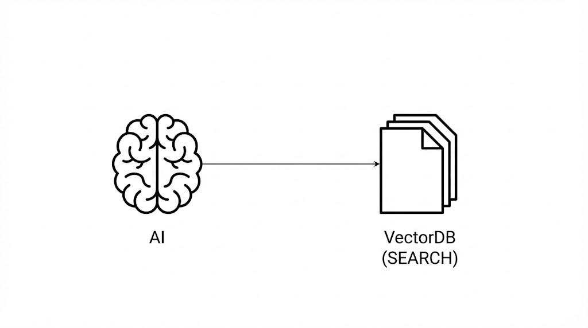
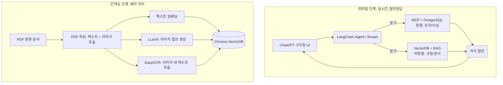

# PART 0. 이 책의 목표와 최종 완성본 미리보기

> **들어가며: 왜 단순한 챗봇이 아닌 'AI 업무 비서'인가?**
> 최근 기업용 AI의 핵심은 단순히 질문에 답하는 것을 넘어, 사내의 **정형 데이터(DB)**와 **비정형 데이터(문서)**를 자유자재로 넘나들며 정확한 근거를 바탕으로 업무를 보조하는 것입니다. 이 책을 통해 여러분은 단순한 RAG를 넘어, MCP(Model Context Protocol)를 결합한 진정한 의미의 '지능형 비서'를 구축하게 됩니다.

---

## 0.1 이 책이 다루는 범위

본 프로젝트는 다음과 같은 기술적 도전 과제를 해결하며 프로젝트를 진행합니다.

- **미세 조정(Fine-tuning) 대신 검색 증강 생성(RAG)**: 사내 시스템 구축 시 모델을 새로 학습시키는 것보다 검색 증강 생성(RAG, Retrieval-Augmented Generation)과 에이전트 구조가 왜 효율적인지 고찰합니다.
- **DeepSeek R1 및 Ollama**: 로컬 환경에서도 강력한 추론 성능을 발휘하는 오픈소스 거대언어모델(LLM) 활용법을 습득합니다.
- **모델 컨텍스트 프로토콜(MCP, Model Context Protocol)**: LLM이 직접 관계형 데이터베이스(PostgreSQL)에 접근하여 정형 데이터를 조회하는 최신 프로토콜을 구현합니다.
- **하이브리드 인덱싱(Hybrid Indexing)**: PDF 내의 텍스트뿐만 아니라 표(Table)와 이미지까지 처리하는 고도화된 데이터 파이프라인을 구축합니다.

---

## 0.2 최종 결과물 시나리오 미리보기

우리가 완성할 시스템은 사내 메신저나 웹 대시보드에서 다음과 같은 복합적인 업무를 수행합니다.

**① 정형 및 비정형 데이터 복합 처리**
> *"김대리님 남은 연차 개수와 올해 휴가 사용 규정을 같이 알려줘"*

- **처리 방식**: **모델 컨텍스트 프로토콜(MCP)**을 통해 실시간 연차 잔여량을 조회하고, 동시에 **검색 증강 생성(RAG)**으로 사내 규정 문서를 검색합니다. 두 소스의 정보를 LLM이 통합하여 최종 답변을 생성합니다.

---

**② 실시간 정형 데이터 조회**
> *"우리 영업팀의 이번 달 매출 합계가 얼마야?"*

- **처리 방식**: **MCP** 기술을 활용합니다. LLM이 직접 자연어를 SQL로 변환하거나 정의된 도구를 호출하여 관계형 데이터베이스에서 정확한 수치를 추출합니다.

---

**③ 비정형 문서 검색 및 추론**
> *"신입사원이 첫 주에 받아야 할 교육 절차가 뭐야?"*

- **처리 방식**: **벡터 데이터베이스(VectorDB, Chroma)**를 검색합니다. 방대한 문서 중 질문과 가장 관련성이 높은 내용을 찾아내어 단계별 가이드를 생성합니다.

---

**④ 근거 기반 정보 요약 및 합성**
> *"이번 달 영업팀 매출 요약과 함께 그 근거를 제시해줘"*

- **처리 방식**: 파편화된 데이터들을 하나로 모으는 **지식 합성(Synthesis)** 단계를 거칩니다. 수치와 텍스트 근거를 대조하여 환각(Hallucination) 없는 신뢰도 높은 리포트를 출력합니다.

---

## 0.3 아키텍처 한 장 요약 (System Architecture)

우리가 구축할 시스템은 실시간 답변을 생성하는 '런타임 단계'와 문서를 지식화하는 '인덱싱 단계'로 나뉩니다.

**핵심 아키텍처 포인트**
- **하이브리드 라우팅**: AI 에이전트가 질문을 분석하여 '정형(DB)'과 '비정형(문서)' 소스 중 최적의 도구를 선택합니다.
- **멀티모달 인덱싱**: 문서 내의 텍스트뿐만 아니라 표(OCR)와 이미지(Vision LLM)까지 자동으로 파악하여 지식화합니다.

---

## 0.4 사용 기술 스택 (상세 사양)

성능과 보안을 동시에 잡기 위해 선정된 핵심 도구들입니다.

| 영역 | 기술 스택 | 용도 | 권장 메모리 |
| :--- | :--- | :--- | :--- |
| **텍스트 LLM** | Ollama + DeepSeek R1 | 추론 및 답변 생성 (런타임) | 8-16GB |
| **Vision LLM** | Ollama + LLaVA | 이미지 의미 분석 (인덱싱) | 4-8GB |
| **OCR 엔진** | EasyOCR | 이미지 내 텍스트 추출 | 1-2GB |
| **Backend** | FastAPI + Jinja2 | 웹 프레임워크 및 UI 템플릿 | 1GB |
| **정형 DB** | PostgreSQL | 직원/휴가/매출 데이터 관리 | 1GB |
| **벡터 DB** | ChromaDB | 문서 임베딩 영구 저장 | 1GB |
| **오케스트레이션** | LangChain | 에이전트 및 도구 연동 제어 | 1GB |
| **한국어 임베딩** | ko-sroberta-multitask | 텍스트 의미 수치화 | 1GB |

> **최소 요구사항**: 쾌적한 실습을 위해 **RAM 16GB 이상**의 환경을 권장합니다.
> 💡 **알아두기**: 만약 개인 컴퓨터 사양이 위 요구사항에 미치지 못할 경우, 로컬 모델(Ollama) 대신 **OpenAI API(gpt-4o 등)**를 연결하여 모든 실습을 동일하게 진행할 수 있습니다. 각 파트에서 OpenAI 전환 방법을 함께 안내해 드립니다.

---

## 0.5 이 책을 마치면 할 수 있는 것

본 과정을 완주한 여러분은 다음과 같은 실무 역량을 확보합니다.

- **실전형 AI 비서 구축**: 사내 데이터베이스와 문서를 통합하여 답변하는 지능형 챗봇을 완성합니다.
- **하이브리드 데이터 처리**: 정형 데이터(Structured Data)와 비정형 지식(Unstructured Knowledge)을 자유자재로 다루는 설계 역량을 배양합니다.
- **고도화된 RAG 파이프라인**: 단순 텍스트 검색을 넘어 이미지와 표까지 처리하는 고성능 엔진을 구현합니다.
- **로컬 LLM 도입 전략**: 외부 클라우드 의존 없이 기업 보안을 유지하며 AI를 도입하는 전문 방법론을 습득합니다.

---

## 0.6 다음 단계: 개발 환경 구축

이제 프로젝트의 지도가 완성되었습니다. 이어지는 **PART 0.5**에서는 본격적인 구현에 앞서, 앞서 살펴본 아키텍처를 실제 구동하기 위한 개발 환경 설정과 필수 도구 설치를 진행하겠습니다.
