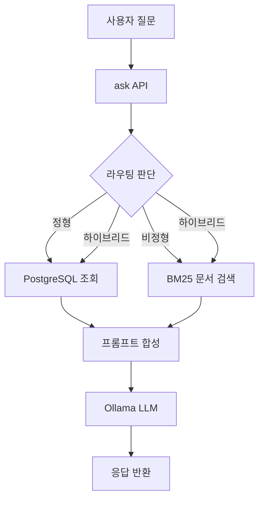

# 사내 문서 기반 AI 업무 비서 (RAG + MCP)

로컬 LLM 환경에서 사내 문서(비정형)와 DB(정형)를 함께 질의응답하는 하이브리드 프로젝트입니다. `docs/`의 문서를 변환/인덱싱하고, Jinja2 템플릿으로 Q&A 프롬프트를 생성해 문서 기반 질문과 정형 데이터 질의를 모두 처리할 수 있도록 구성했습니다.

## 핵심 목표

- 비정형 문서(RAG)와 정형 데이터(DB/MCP)를 결합한 하이브리드 Q&A
- Jinja2 템플릿 기반 Q&A 프롬프트 생성
- 로컬 LLM(Ollama) 기반 응답 생성

## 아키텍처 개요

1. 문서 인제스트 (비정형)

- `docs/` 내 PDF/DOCX/XLSX/이미지를 Markdown으로 변환
- 변환 결과를 `data/processed/`에 저장
- 문서 해시 기반 `doc_id` 부여

2. 인덱싱 및 검색 (RAG)

- 기본값은 `BM25` 검색
- `RAG_BACKEND=chroma` 설정 시 Chroma(VectorDB) 검색 사용
- 검색 결과는 `answer_prompt.j2`에 주입

3. 정형 데이터 (MCP/DB)

- PostgreSQL에 직원/휴가/매출 테이블 구성 (docker-compose)
- `mcp/mcp_server.py`에서 MCP 도구로 노출
- 라우터가 정형/비정형/하이브리드 경로 결정

4. 응답 생성 (LLM)

- Jinja2 템플릿으로 프롬프트 구성
- 로컬 LLM(Ollama) 호출로 최종 답변 생성

## 동작 흐름 (요약)

1. 사용자 질문 수신

- `/ask`로 질문이 들어오면 라우터가 정형/비정형/하이브리드를 판단합니다.

2. 정형 데이터 경로

- 정형 키워드가 감지되면 PostgreSQL에서 직원/휴가/매출 데이터를 조회합니다.

3. 비정형 데이터 경로

- 문서 인덱스(BM25 또는 Chroma)에서 관련 청크를 검색합니다.

4. 프롬프트 생성

- 정형 결과 + 비정형 컨텍스트를 `answer_prompt.j2`에 주입합니다.

5. LLM 응답 생성

- Ollama를 호출해 최종 답변을 생성하고, 메타 정보와 함께 반환합니다.

## 인덱싱이란?

- 인덱싱은 문서를 **검색 가능한 형태로 미리 정리**하는 과정입니다.
- 흐름: `문서 → 텍스트 변환 → 청킹 → 임베딩 → VectorDB(Chroma) 저장`
- 런타임 질의 시 빠르게 유사 문서를 찾을 수 있도록 도와줍니다.

## BM25란?

- **키워드 기반 문서 검색 알고리즘**입니다.
- 질문과 문서에 **같은 단어가 얼마나 많이/고르게 등장하는지**를 점수화합니다.
- 임베딩 없이도 동작하여 **가볍고 빠르지만**, 의미 유사도에는 한계가 있습니다.

## manifest.jsonl 이란?

- 인제스트 결과를 기록하는 **메타데이터 로그 파일(JSONL)** 입니다.
- 한 줄에 한 문서의 `doc_id`, `source_path`, `processed_path`, `hash`가 저장됩니다.
- 변환/인덱싱 이력 추적 및 재처리에 활용됩니다.

## Mermaid 다이어그램

### 1) 질문 처리 흐름 (/ask)



### 2) 문서 인제스트 흐름


## 디렉터리 구조

```text
ai-project/
├── app/                  # FastAPI API
├── core/                 # 라우터, RAG, LLM, 프롬프트
├── mcp/                  # MCP 서버 및 SQLite 스키마
├── scripts/              # 인제스트, Q&A 생성, 시드
├── templates/            # Jinja2 템플릿
├── data/                 # 변환/인덱스/QA 산출물
├── docs/                 # 사내 문서 원본
├── requirements.txt
├── requirements-optional.txt
└── README.md
```

## 파일 역할 상세

**app**

- `app/main.py`: `/ask` API. 라우팅 -> RAG/정형 데이터 조회 -> 프롬프트 렌더링 -> LLM 호출
- `app/schemas.py`: 요청/응답 스키마

**core**

- `core/config.py`: 경로 및 환경 변수 설정
- `core/prompts.py`: Jinja2 템플릿 로더 및 렌더링
- `core/router.py`: 질문 유형 분류(정형/비정형/하이브리드)
- `core/rag.py`: BM25 기반 로컬 검색기 + 컨텍스트 포맷팅
- `core/vectordb.py`: Chroma 인덱싱/검색
- `core/embeddings.py`: 문서 임베딩 생성
- `core/structured.py`: PostgreSQL 기반 정형 질의 함수
- `core/db.py`: PostgreSQL 스키마/시드 유틸
- `core/llm.py`: Ollama 호출 래퍼
- `core/utils.py`: 토큰화/청킹/해시 유틸

**mcp**

- `mcp/db.py`: PostgreSQL 스키마/시드 래퍼
- `mcp/mcp_server.py`: FastMCP 기반 도구 정의

**scripts**

- `scripts/ingest.py`: `docs/` -> `data/processed/` 변환/인제스트
- `scripts/convert.py`: 파일 포맷별 변환 로직
- `scripts/build_qa.py`: Jinja2 템플릿으로 Q&A 프롬프트 생성
- `scripts/seed_db.py`: 정형 DB 시드
- `scripts/index_docs.py`: Chroma 인덱싱
- `scripts/cleaner/`: 정제 스크립트 모음 (`make_raw.py`, `make_clean.py`, `make_structured.py`)

**templates**

- `templates/router_prompt.j2`: 질문 라우팅용 프롬프트
- `templates/answer_prompt.j2`: 최종 답변 생성용 프롬프트
- `templates/qa_generation_prompt.j2`: 문서 기반 Q&A 생성용 프롬프트

**data**

- `data/processed/`: 변환된 Markdown 및 `manifest.jsonl`
- `data/embeddings/`: 확장 시 벡터 DB 저장 위치
- `data/qa/`: Q&A 프롬프트/응답 산출물

## 빠른 시작

0. 가상환경 생성 (권장)

```bash
python3 -m venv .venv
source .venv/bin/activate
```

1. 의존성 설치

```bash
pip3 install -r requirements.txt
pip3 install -r requirements-indexing.txt  # 인덱싱용 최소 세트
pip3 install -r requirements-optional.txt  # 문서 변환(OCR)/MCP 사용 시
```

2. 문서 인제스트

```bash
PYTHONPATH=. python scripts/ingest.py
```

3. Chroma 인덱싱 (선택, RAG_BACKEND=chroma 사용 시)

```bash
PYTHONPATH=. python scripts/index_docs.py
```

4. PostgreSQL 컨테이너 실행

```bash
docker compose -f ../docker-compose.yml up -d
```

5. 정형 데이터 시드

```bash
PYTHONPATH=. python scripts/seed_db.py
```

6. MCP 서버 실행(선택)

```bash
python -m mcp.mcp_server
```

7. API 실행

```bash
uvicorn app.main:app --reload
```

8. 질문 예시

```bash
curl -X POST http://localhost:8000/ask \
  -H 'Content-Type: application/json' \
  -d '{"question": "2026년 4분기 부서별 매출 알려줘"}'
```

## Q&A 프롬프트 생성 (Jinja2)

문서를 Q&A 질문으로 만들기 위해 `templates/qa_generation_prompt.j2`를 사용합니다.

```bash
python scripts/build_qa.py --num-questions 5
```

- 출력: `data/qa/qa_tasks.jsonl`
- 각 줄은 문서별 Q&A 생성 프롬프트를 포함합니다.
- `--generate` 옵션을 주면 Ollama로 즉시 응답까지 생성합니다.

## 라우팅 규칙

- **정형**: 매출, 휴가, 직원 등 DB 질의가 필요한 질문
- **비정형**: 규정, 보안정책, 가이드 등 문서 기반 질문
- **하이브리드**: 두 유형이 섞이거나 불확실한 질문

## 확장 포인트

- 벡터 DB(Chroma/FAISS)로 교체
- MCP 도구 추가(예: 외부 API, ERP, CRM)
- 템플릿 추가로 응답 스타일/평가 데이터 생성

## 주의 사항

- OCR 사용 시 `pytesseract`와 로컬 `tesseract` 바이너리가 필요합니다.
- 샘플 DB는 데모용이며 실제 환경에서는 별도 DB 연결이 필요합니다.
- Chroma 인덱싱은 `sentence-transformers` 모델 다운로드가 필요합니다.

## CRUD API 목록

1. 직원 관리 API

- `POST /employees`: 신규 직원 등록
- `GET /employees/{id}`: 특정 직원 정보 조회
- `PUT /employees/{id}`: 직원 정보 수정
- `DELETE /employees/{id}`: 직원 삭제

2. 휴가 관리 API

- `GET /leaves/{emp_id}`: 특정 직원의 잔여 휴가 조회
- `POST /leaves/usage`: 휴가 사용 등록 (잔여량 자동 차감)
- `PUT /leaves/{id}`: 휴가 데이터 강제 수정 (관리자용)

3. 매출 관리 API

- `POST /sales`: 매출 데이터 입력
- `GET /sales/period`: 특정 기간별 매출 조회
- `GET /sales/dept/{dept_name}`: 부서별 매출 집계 결과 조회
