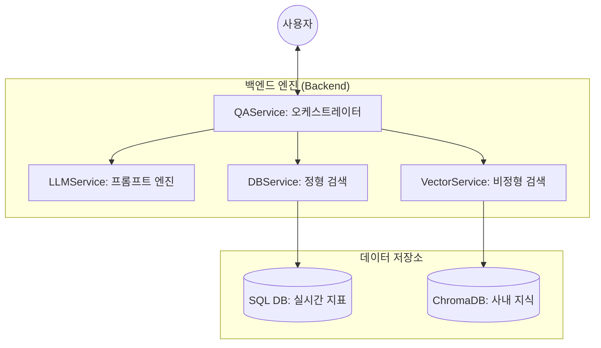

# 🤖 메타코딩 AI 비서: 하이브리드 지능형 업무 가이드

> **"사내의 흩어진 모든 데이터를 하나로 연결하여, 당신의 완벽한 업무 파트너가 되어 드립니다."**

본 프로젝트는 사내의 **정형 데이터(SQL DB)**와 **비정형 문서 데이터(파일)**를 통합 분석하여, 질문에 가장 적합한 답변을 제안하는 **지능형 하이브리드 RAG 시스템**입니다.

---

## 👋 프로젝트 소개

단순히 문서를 찾는 검색 엔진이 아닙니다. 질문자의 의도를 실시간으로 파악하여 **"데이터베이스(SQL)를 조회할 것인가?"** 아니면 **"문서(Vector)에서 찾을 것인가?"**를 스스로 결정하는 스마트한 업무 비서입니다.

### ✨ 핵심 가치 (Core Values)

- **지능형 라우팅 (Intelligent Routing)**: 질문의 성격을 AI가 판단하여 최적의 검색 경로를 선택합니다.
- **사내 보안 준수 (Local Privacy)**: 모든 모델(Ollama)이 로컬에서 구동되어 소중한 정보가 외부로 유출되지 않습니다.
- **통합 지식 관리**: 인사, 보안, 매출 등 흩어진 데이터를 하나의 채팅창에서 통합 관리하십시오.

---

## 📂 프로젝트 폴더 구조 (Project Structure)

본 프로젝트는 기능별로 명확하게 분리된 모듈형 구조를 따르고 있습니다.

```bash
ai-assistant-project/
├── 📁 app/                     # 애플리케이션 핵심 로직
│   ├── main.py                 # FastAPI 엔트리포인트 (서버 실행)
│   ├── 📁 database/            # 데이터베이스 연결 및 관리
│   │   ├── connection.py       # DB 연결 (PostgreSQL/SQLite 자동 감지)
│   │   ├── crud.py             # 데이터 생성/조회/수정/삭제 쿼리 함수
│   │   ├── models.py           # 데이터베이스 스키마 정의 (SQLAlchemy)
│   │   └── init_db.py          # 테이블 초기화 및 샘플 데이터 생성
│   ├── 📁 routers/             # API 엔드포인트 정의 (UI 및 기능별 분리)
│   │   ├── ui.py               # 관리자 페이지 렌더링
│   │   ├── qa.py               # 챗봇 질문/답변 API
│   │   └── ...                 # 기타 기능별 라우터
│   ├── 📁 services/            # 비즈니스 로직 처리 Layer
│   │   ├── qa_service.py       # RAG + SQL 하이브리드 검색 오케스트레이터
│   │   ├── llm_service.py      # LLM 연동 (Ollama/OpenAI) 및 프롬프트 관리
│   │   ├── vector_service.py   # 벡터 DB(Chroma) 검색 및 조회
│   │   └── db_service.py       # 정형 데이터(SQL) 검색 로직
│   ├── 📁 static/              # 정적 파일 (CSS, JS)
│   └── 📁 templates/           # HTML 템플릿 (Jinja2)
├── 📁 data/                    # 데이터 저장소
│   └── 📁 embedding_db/        # 벡터 데이터베이스 (ChromaDB) 저장 경로
├── 📁 docs/                    # RAG 학습용 원본 문서 (PDF, txt 등)
├── 📁 mcp/                     # MCP(Model Context Protocol) 서버 구현
├── 📁 scripts/                 # 유틸리티 스크립트
│   └── ingest.py               # 문서 학습 스크립트 (PDF -> VectorDB 변환)
├── .env                        # 환경 변수 설정 파일 (API 키, DB 경로 등)
├── docker-compose.yml          # 데이터베이스 실행 설정 (Docker)
└── requirements.txt            # 프로젝트 의존성 패키지 목록
```

### 📁 주요 디렉토리 역할

- **app/**: 웹 애플리케이션의 모든 소스 코드가 포함됩니다. FastAPI를 기반으로 라우터, 서비스, 데이터베이스 계층이 분리되어 있습니다.
- **data/**: AI가 학습한 벡터 데이터(ChromaDB)가 저장되는 공간입니다. 이 폴더를 삭제하면 학습된 내용이 초기화됩니다.
- **docs/**: AI에게 학습시킬 식당/메뉴얼/규정 등의 사내 문서를 넣어두는 곳입니다. `ingest.py`를 실행하면 이 폴더의 내용을 읽어갑니다.
- **scripts/**: 서버 실행 외에 데이터 전처리, 학습, 테스트 등을 수행하는 보조 스크립트들이 위치합니다.

---

## 🗃️ 데이터 보유 현황 (Data Inventory)

현재 시스템은 다음과 같은 정형/비정형 데이터를 통합하여 학습하고 있습니다.

#### 1. 정형 데이터 (Structured: SQL)

사내 시스템의 핵심 지표들을 실시간으로 조회할 수 있습니다.

- **직원 정보 (`employee`)**: 성명, 부서, 이메일, 입사일 등 기본 인적 사항
- **연차 관리 (`leave_balance`)**: 사원별 총 연차, 사용 일수, 잔여 연차 및 해당 연도 정보
- **매출 실적 (`sales`)**: 부서별 실적 금액, 날짜, 프로젝트 상세 설명

| 카테고리      | 성명   | 부서   | 이메일/상세          | 예시 데이터                 |
| :------------ | :----- | :----- | :------------------- | :-------------------------- |
| **직원 정보** | 홍길동 | 개발팀 | user1@metacoding.com | `2024-03-01 입사`           |
| **연차 관리** | 홍길동 | -      | 총 15일              | `사용 3일 / 잔여 12일`      |
| **매출 실적** | -      | 영업팀 | Q1 프로젝트 수입     | `50,000,000원 / 2026-02-09` |

#### 2. 비정형 데이터 (Unstructured: Docs)

- **인사(HR)**: 채용 가이드라인, 사내 규정 등 (`HR_사내규정_v1.0.pdf`)
- **보안(Security)**: 사내 보안 정책 및 보안 규정 문서 (`SEC_보안정책_v1.0.pdf`, `SEC_보안규정_v1.0.docx`)
- **운영(Ops)**: 서버 점검 및 업무 매뉴얼 (`OPS_업무매뉴얼_v1.0.pdf`)
- **온보딩(Onboarding)**: 신규 개발자를 위한 가이드라인 (`ONB_개발자가이드_v1.0.pdf`)
- **기타**: 자주 묻는 질문(FAQ) 및 공지 사항

---

## 🛠️ 기술 스택 및 라이브러리 (Tech Stack)

본 프로젝트의 핵심 기능을 구현하기 위해 사용된 주요 라이브러리와 그 역할은 다음과 같습니다.

| 라이브러리                   | 역할 및 필요성                                                                                 | 비고               |
| :--------------------------- | :--------------------------------------------------------------------------------------------- | :----------------- |
| **fastapi**                  | 현대적이고 빠른 웹 프레임워크로 API 서버의 기반이 됩니다.                                      | 웹 서버            |
| **sqlalchemy**               | 파이썬 프로젝트에서 SQL 데이터베이스를 다루기 위한 ORM 도구입니다.                             | PostgreSQL 연결    |
| **langchain**                | LLM과 다양한 데이터 소스(DB, 문서)를 연결하는 프레임워크입니다.                                | RAG 오케스트레이션 |
| **langchain-huggingface**    | **[중요]** 한국어 문장을 숫자로 변환(임베딩)하는 허깅페이스 모델을 사용하기 위해 필수적입니다. | 문서 검색의 핵심   |
| **chromadb**                 | 변환된 숫자 데이터를 저장하고 유사도 검색을 수행하는 벡터 데이터베이스입니다.                  | 지식 저장소        |
| **psycopg2-binary**          | PostgreSQL 데이터베이스와 통신하기 위한 드라이버입니다.                                        | DB 드라이버        |
| **easyocr** / **pdfplumber** | PDF나 이미지 문서에서 텍스트를 추출하는 데 사용됩니다.                                         | 데이터 인제스트    |

---

## �🚀 빠른 시작 (Quick Start)

초보자분들도 3분 안에 시스템을 실행해 보실 수 있도록 환경 구축부터 서버 실행까지 한 번에 안내합니다.

### Step 1: 파이썬 및 가상환경(venv) 준비

`fastmcp` 등 최신 라이브러리 사용을 위해 **Python 3.10 이상**이 필수입니다.

```bash
# [권장] 특정 버전(3.12 등)으로 가상환경을 생성합니다.
python3.12 -m venv venv

# 가상환경 입장 (활성화)
source venv/bin/activate  # Windows: venv\Scripts\activate
```

> [!TIP]
> **환경이 꼬였거나 버전을 바꾸고 싶나요? (재생성 팁)**
> 터미널 프롬프트 앞에 `(venv)`가 보인다면 아래 순서로 초기화하십시오.
>
> 1. `deactivate` (탈출)
> 2. `rm -rf venv` (폴더 삭제)
> 3. `python3.12 -m venv venv` (새 버전 생성)
> 4. `source venv/bin/activate` (다시 입장)

---

### Step 2: 라이브러리 설치

의존성 파일을 기능별로 분리하여 관리합니다. 메인 `requirements.txt`를 사용하면 한꺼번에 설치할 수 있습니다.

```bash
# 필수 패키지 전체 설치
pip install -r requirements.txt
```

> [!NOTE]
> **단계별로 설치하고 싶다면?**
>
> - `pip install -r requirements-core.txt`: 웹 서버 및 DB 관련
> - `pip install -r requirements-rag.txt`: AI 및 검색 엔진 관련
> - `pip install -r requirements-doc.txt`: 문서 처리 관련
> - `pip install -r requirements-mcp.txt`: MCP 서버 전용 (3.12 필수)

---

---

### Step 3: 데이터베이스(Docker) 가동

서버 실행 전에 PostgreSQL 데이터베이스가 활성화되어 있어야 합니다.

```bash
# Docker 컨테이너 실행 (백그라운드)
docker compose up -d
```

> [!TIP]
> **왜 데이터가 보관되지 않나요? (학습 모드)**
> 현재 실습 단계에서의 반복적인 학습(데이터 초기화 및 임베딩 재실습)을 위해 `docker-compose.yml`의 볼륨 설정을 주석 처리해 두었습니다. 데이터를 영구히 보존하고 싶다면 `docker-compose.yml` 내 가이드를 참고하여 주석을 해제하십시오.

> [!IMPORTANT]
> **Docker Desktop**이 실행 중인지 반드시 확인하십시오. 만약 `Connection refused` 에러가 난다면 도커 데몬이 꺼져 있을 확률이 높습니다.

---

### Step 4: 환경 변수 및 데이터 초기화

```bash
# 1. 환경 변수 설정 (.env 파일 생성)
cp .env.template .env

# 2. 정형 데이터 초기화 (직원, 매출 샘플 데이터 생성)
python app/database/init_db.py

# 3. 비정형 문서 학습 (docs 폴더 내 문서를 벡터 DB로 변환)
python scripts/ingest.py
```

---

### Step 5: 서버 실행 및 접속

```bash
# 서버 가동
python app/main.py
```

성공적으로 실행되었다면 [http://127.0.0.1:8000](http://127.0.0.1:8000) 접속이 가능해집니다!

---

## 🏗️ 시스템 아키텍처 (Architecture)



---

## 📖 주요 기능 가이드 (Usage Guide)

### 1. 지식 학습하기 (Ingest)

[인제스트 관리] 페이지에서 사내 문서를 업로드하십시오. PDF, Word 등 다양한 형식의 문서를 자동으로 분석하여 AI가 학습할 수 있는 형태로 변환합니다.

### 2. 하이브리드 질의 (Hybrid Q&A)

채팅창에 자유롭게 질문하십시오.

- **정형 질문**: "영업팀 직원 명단을 보여줘."
- **비정형 질문**: "우리 회사의 연차 규정을 요약해줘."
- **복합 질문**: "**홍길동님**의 소속과 그 팀의 **최근 매출 현황**을 알려줘."

---

## ⚙️ 모델 설정 및 전환

기본적으로 **Ollama(로컬 모델)**를 사용하도록 설정되어 있습니다. 상세 방법은 [MODEL_CONFIG_GUIDE.md](docs/MODEL_CONFIG_GUIDE.md)를 확인하십시오.

---

## ❓ 자주 묻는 질문 (FAQ)

- **Q: "fastmcp" 설치 시 에러가 납니다.**
  - A: 반드시 **Python 3.10** 이상의 가상환경을 사용해야 합니다. 위 Step 1의 재생성 팁을 확인하십시오.
- **Q: 가상환경 표시가 터미널에서 사라지지 않습니다.**
  - A: 터미널에 `deactivate`를 입력하여 종료하십시오.
- **Q: 임베딩이나 DB 데이터를 완전히 지우고 처음부터 다시 실습하고 싶어요.**
  - A: 도커의 볼륨 기능을 초기화해야 합니다. 아래 명령어를 실행하면 저장된 모든 데이터(DB, 임베딩)가 깨끗이 삭제됩니다.
    ```bash
    docker compose down -v
    ```
    이후 다시 `docker compose up -d`를 실행하고 가이드의 **Step 4**를 진행하십시오.

---

_본 프로젝트는 '메타코딩'의 업무 생산성 극대화와 데이터 통합 관리를 목표로 설계되었습니다._
집필 및 개발: **Antigravity AI Assistant**
