# AI 업무 비서 통합 프로젝트 (AI Work Assistant Interface)

본 프로젝트는 "사내 문서를 위한 AI 업무 비서" 시리즈의 실습 코드를 하나의 실행 가능한 애플리케이션 구조로 통합한 버전입니다.

## 📂 폴더 구조 (Directory Structure)

### 1. 파일 트리 (File Tree)

```
ai-assistant-project/
├── app/                    # FastAPI 백엔드 애플리케이션
│   ├── routers/            # API 라우터 (기능별 분리)
│   │   ├── employees.py    # 직원 정보 API
│   │   ├── leaves.py       # 휴가 관리 API
│   │   ├── sales.py        # 영업 실적 API
│   │   └── ui.py           # UI 렌더링 라우터
│   ├── templates/          # HTML 템플릿 (Jinja2)
│   ├── static/             # 정적 파일 (CSS, JS)
│   ├── main.py             # 앱 진입점 (Entry Point)
│   ├── app.py              # 앱 설정 및 초기화
│   ├── db.py               # 데이터베이스 설정
│   ├── models.py           # SQLAlchemy ORM 모델
│   ├── crud.py             # DB CRUD 함수
│   └── init_db.py          # DB 초기화 스크립트
├── scripts/                # 데이터 전처리 파이프라인
│   ├── pdf_to_md.py        # 기본 PDF 변환
│   ├── ai_pdf_to_md.py     # AI 기반 PDF 분석
│   └── image_to_md.py      # 이미지 문서 변환
├── data/                   # 데이터 저장소
│   ├── raw/                # 원본 문서 (주제별 분류)
│   │   ├── hr/             # 인사 및 휴가 규정
│   │   ├── ops/            # 운영 및 업무 매뉴얼
│   │   ├── security/       # 보안 정책 문서
│   │   ├── onboarding/     # 신입사원 교육 자료
│   │   └── faq/            # 자주 묻는 질문
│   └── processed/          # 처리된 마크다운
├── requirements.txt        # 의존성 패키지
└── README.md               # 프로젝트 문서
```

### 2. 아키텍처 다이어그램 (Architecture Diagram)

```mermaid
graph TD
    Project[ai-assistant-project]
    style Project fill:#f9f,stroke:#333,stroke-width:2px

    %% Directories
    AppDir[📂 app/]
    ScriptsDir[📂 scripts/]
    DataDir[📂 data/]

    Project --> AppDir
    Project --> ScriptsDir
    Project --> DataDir
    Project --> Readme[📄 README.md]
    Project --> Req[📄 requirements.txt]

    %% App Structure
    subgraph Backend [FastAPI Backend]
        AppDir --> Main[main.py<br/>Entry Point]
        AppDir --> AppPy[app.py]
        AppDir --> DB[db.py<br/>DB Config]
        AppDir --> Models[models.py<br/>ORM Models]
        AppDir --> CRUD[crud.py<br/>DB Operations]
        AppDir --> InitDB[init_db.py<br/>Setup Script]

        %% Routers
        AppDir --> RoutersDir[📂 routers/]
        RoutersDir --> RouterEmp[employees.py]
        RoutersDir --> RouterLeave[leaves.py]
        RoutersDir --> RouterSales[sales.py]
        RoutersDir --> RouterUI[ui.py]

        %% Static & Templates
        AppDir --> StaticDir[📂 static/]
        AppDir --> TemplDir[📂 templates/]
    end

    %% Scripts Structure
    subgraph Pipeline [Data Processing]
        ScriptsDir --> ScriptPDF[pdf_to_md.py]
        ScriptsDir --> ScriptAI[ai_pdf_to_md.py]
        ScriptsDir --> ScriptImg[image_to_md.py]
    end

    %% Data Structure
    subgraph Storage [Data Storage]
        DataDir --> RawDir[📂 raw/]
        DataDir --> ProcDir[📂 processed/]
        AppDir --> LocalDB[(company.db)]
    end
```



## 🚀 실행 방법 (How to Run)

1. **의존성 설치**

   ```bash
   pip install -r requirements.txt
   ```

2. **백엔드 서버 실행**

   ```bash
   uvicorn app.main:app --reload
   ```

3. **데이터 전처리 스크립트 실행 (예시)**
   ```bash
   python scripts/pdf_to_md.py
   ```
