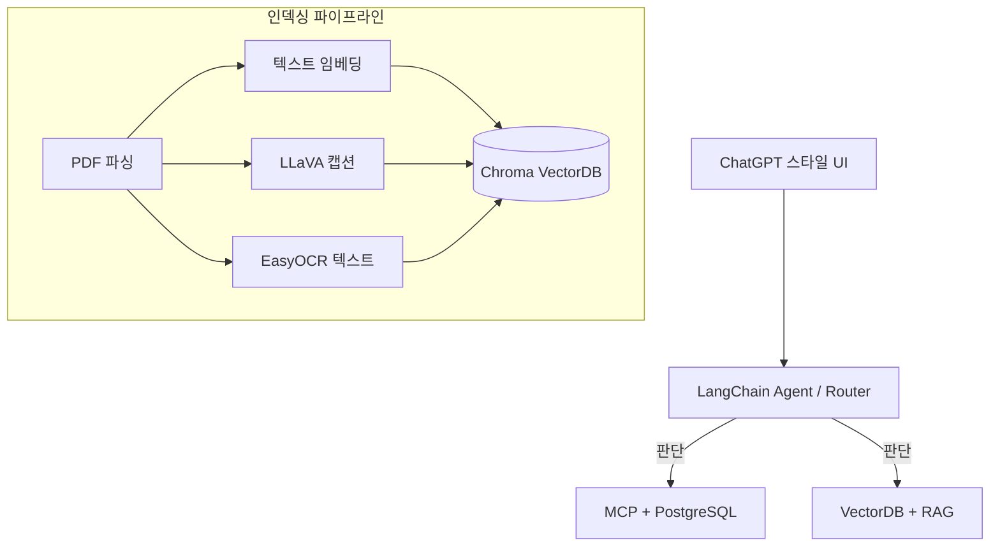

# 🤖 사내 문서 기반 AI 업무 비서 (RAG + MCP) 상세 가이드

> **작성일**: 2026-02-04
> **주요 내용**: 프로젝트 목표, 아키텍처, 기술 스택 및 단계별 구축 가이드

---

## 🎯 PART 0. 이 책의 목표와 최종 완성본 미리보기

**목적**: 독자가 "무엇을 만들 수 있는지" 먼저 보여주고 동기 부여

### 0.1 이 책이 다루는 범위

- **핵심 기술**: Fine-tuning이 아니라 **RAG + MCP**
- **방식**: 모델을 재학습하지 않고, 기존 LLM에 "회사 맥락"을 주입
- **장점**: 비용 효율적 + 데이터 보안 유지 가능

### 0.2 최종 결과물 데모 시나리오

| 질문 유형            | 예시 질문                                      | 처리 방식           |
| :------------------- | :--------------------------------------------- | :------------------ |
| **정형+비정형 복합** | "김대리 남은 연차 + 휴가 규정까지 같이 알려줘" | MCP(DB) + RAG(문서) |
| **정형 데이터 조회** | "이번 달 영업팀 매출 합계 알려줘"              | MCP(DB)             |
| **비정형 문서 검색** | "신입사원 온보딩 절차 알려줘"                  | RAG(VectorDB)       |
| **근거 포함 요약**   | "이번 달 영업팀 매출 요약해줘(근거 포함)"      | MCP + RAG           |

### 0.3 아키텍처 요약



---

## 🛠️ PART 0.4. 사용 기술 스택

| 영역               | 기술                      | 용도                           | 메모리 요구사항 |
| :----------------- | :------------------------ | :----------------------------- | :-------------- |
| **텍스트 LLM**     | Ollama + DeepSeek R1      | 질의응답 생성 (런타임)         | 8-16GB          |
| **Vision LLM**     | Ollama + LLaVA / Qwen2-VL | 이미지 캡션 생성 (인덱싱 시)   | 4-8GB           |
| **OCR**            | EasyOCR                   | 이미지 텍스트 추출 (인덱싱 시) | 1-2GB           |
| **Backend**        | FastAPI + Jinja2          | 웹 서버 + 템플릿               | 1GB             |
| **정형 DB**        | PostgreSQL                | 직원/휴가/매출 데이터          | 1GB             |
| **벡터 DB**        | Chroma                    | 문서 임베딩 저장               | 1GB             |
| **오케스트레이션** | LangChain                 | RAG + Agent 구성               | 1GB             |
| **도구 연동**      | MCP                       | LLM ↔ DB 연결                  | -               |
| **임베딩**         | ko-sroberta-multitask     | 텍스트 벡터화                  | 1GB             |

> [!IMPORTANT]
> **최소 요구사항**: RAM 16GB 이상 권장 (동시 실행 불가 시 인덱싱/런타임 분리 실행)

---

## 🚀 PART 0.5. 개발 환경 설정

**목적**: 독자가 막힘 없이 따라할 수 있도록 환경 구축 가이드 제공

### 0.5.1 필수 요구사항

- **OS**: Windows / Mac / Linux
- **Python**: 3.10 이상
- **RAM**: 16GB 이상 (로컬 LLM 실행 시)
- **저장공간**: 20GB 이상

### 0.5.2 프로젝트 클론 및 초기 설정

```bash
git clone <repository-url>
cp .env.example .env
# .env 파일 수정 (DB 접속 정보, API 키 등)
```

### 0.5.3 Python 가상환경 및 의존성

```bash
python -m venv venv
source venv/bin/activate  # Windows: venv\Scripts\activate
pip install -r requirements.txt
```

---

## 🏗️ PART 1. FastAPI로 "초간단 사내 시스템" 만들기

### 1.1 데이터 모델 설계 (3개 테이블)

| 테이블명          | 컬럼 구성                                     | 설명             |
| :---------------- | :-------------------------------------------- | :--------------- |
| **employee**      | id, name, dept, email, hire_date              | 직원 기본 정보   |
| **leave_balance** | id, employee_id, year, total, used, remaining | 연차 잔여 현황   |
| **sales**         | id, dept, amount, date, description           | 매출 실적 데이터 |

---

## 📈 PART 2. 사내 문서 수집 전략과 문서 표준 만들기

### 2.1 문서 형식 지원 범위기

| 형식               | 지원 여부 | 비고                        |
| :----------------- | :-------- | :-------------------------- |
| **Markdown (.md)** | ✅        | 가장 권장되는 형식          |
| **PDF (.pdf)**     | ✅        | 텍스트 추출 엔진 필요       |
| **Word (.docx)**   | ✅        | python-docx 활용            |
| **Excel (.xlsx)**  | ✅        | 표 데이터를 텍스트로 정규화 |

---

## 🧠 PART 3. VectorDB 구축 및 RAG 튜닝

### 3.1 핵심 튜닝 기법

- **ReRanker**: 검색 결과 재순위화를 통한 정확도 향상
- **Hybrid Search**: 키워드(BM25) + 벡터 검색 결합
- **PDF 이미지 처리**: LLaVA(캡션) + EasyOCR(텍스트) 하이브리드 전략

> [!TIP]
> **DeepSeek R1**은 텍스트 중심 질의응답을 처리하며, 이미지 의미 파악은 인덱싱 시 **LLaVA**가 담당하는 것이 효율적입니다.

---

_본 문서는 메타코딩 AI 비서 구축을 위한 가이드라인 상세본입니다._
_집필: Antigravity AI Assistant_
