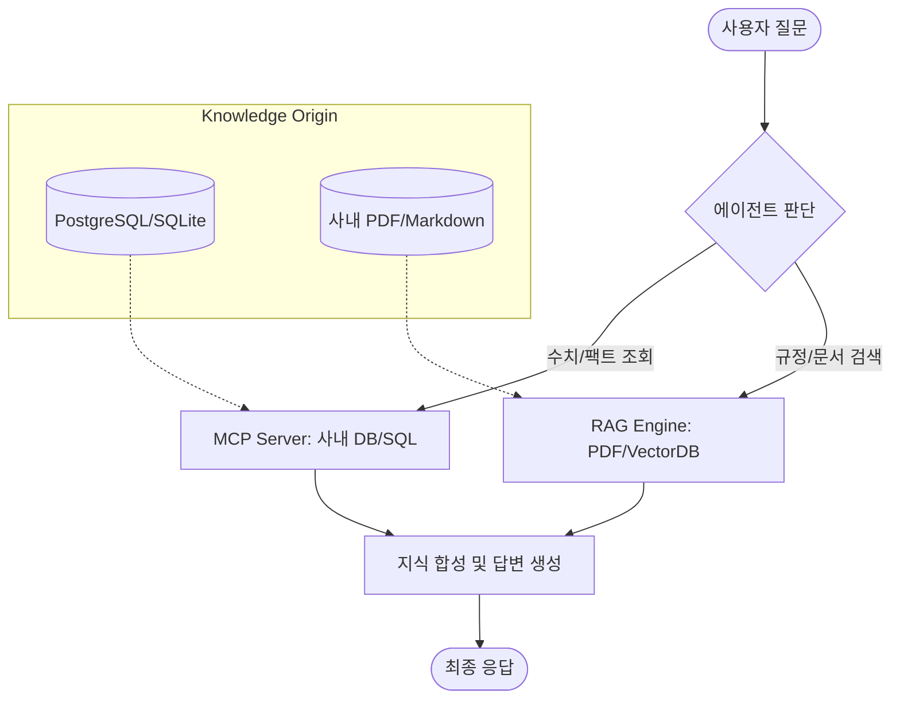

# 📘 AI 업무 비서(RAG + MCP) 실무 구축 마스터 가이드

본 가이드는 이론과 실습을 연결하는 **'사내 AI 업무 비서 전문가'** 로의 여정을 안내하는 통합 로드맵입니다. 단순한 코드 복사를 넘어, 실제 사내 데이터가 어떻게 AI의 지능으로 변모하는지 그 전 과정을 체계적으로 정복합니다.

---

## 🏗️ 1. 전체 아키텍처 및 철학 (Conceptualized View)

우리가 구축할 시스템은 **'정형 데이터(MCP)'** 와 **'비정형 지식(RAG)'** 을 한곳에 모으는 하이브리드 지능을 목표로 합니다.



---

## 🗺️ 2. 10단계 실무 로드맵 (Roadmap)

본 프로젝트는 총 10개의 장으로 구성되며, **이론(Manuscript)** 과 **실습(Hands-on)** 이 1:1로 매칭되어 있습니다.

| 단계        | 구분         | 주제                 | 핵심 실습 내용                               |
| :---------- | :----------- | :------------------- | :------------------------------------------- |
| **Phase 1** | **입문**     | 1~2장. 비전과 기초   | LLM 무지(無知) 확인 및 기초 RAG 구현         |
| **Phase 2** | **인프라**   | 3~5장. 시스템 연동   | 사내 DB(SQLite/PostgreSQL) 연동 및 문서 수집 |
| **Phase 3** | **엔진**     | 6~7장. 지식 디지털화 | PDF 임베딩, VectorDB(Chroma) 구축 및 Q&A     |
| **Phase 4** | **에이전트** | 8~10장. 통합 및 완성 | 통합 에이전트 설계, UI 연동, 시스템 튜닝     |

---

## 📂 3. 저장소 활용법 (How to use this Repo)

### 📝 원고 읽기 (`00_manuscript/`)

- 각 장의 핵심 개념과 설계 원리가 담겨 있습니다.
- 구현 전 **'집필'** 문서를 먼저 읽어 아키텍처를 이해하십시오.

### 💻 실습 진행 (`실습용/`)

- 원고의 내용을 코드로 즉시 옮겨놓은 공간입니다.
- `02_basic_rag`부터 시작하여 순차적으로 코드를 실행하며 결과를 확인하십시오.

---

## 🚀 4. 빠른 시작 가이드 (Quick Start)

실습 환경을 5분 안에 구축하고 첫 대화를 시작하는 과정입니다.

### 1단계: 모델 설치 (Ollama)

```bash
# 생성 모델 (추론형)
ollama pull deepseek-r1:8b

# 임베딩 모델 (검색형)
ollama pull nomic-embed-text
```

### 2단계: 파이썬 환경 구축

```bash
# 가상환경 생성 및 활성화
python -m venv .venv
source .venv/bin/activate  # Mac/Linux
# .venv\Scripts\activate   # Windows

# 필수 라이브러리 설치
pip install langchain langchain-community langchain-ollama langchain-chroma
```

### 3단계: 첫 RAG 체험

다음 폴더로 이동하여 첫 번째 실습 코드를 실행하십시오.

- **이동**: `실습용/02_basic_rag` 폴더
- **명령**: `python step4_rag.py`

---

## 🔍 5. 전문가를 위한 팁 (Advanced Tips)

1.  **할루시네이션(Hallucination) 제어**: 답변이 부정확하다면 `07_rag_engine`에서 프롬프트의 '제약 조건'을 강화하십시오.
2.  **검색 품질 고도화**: 문서 형식이 복잡하다면 `06_vectordb`의 청킹 전략과 `10_tuning`의 **재순위화(ReRanker)** 를 참고하십시오.
3.  **에이전트 라우팅**: 질문의 성격에 따라 올바른 도구를 선택하지 못한다면 `08_agent`의 **도구 설명(Tool Description)** 을 더 구체적으로 작성하십시오.

---

> **멘토의 한마디**: "코드를 단순히 실행하는 것에 그치지 말고, AI가 왜 이 문서를 선택했는지, 그리고 어떤 논리로 답변을 생성했는지 **생각의 과정(Reasoning)** 에 집중해 보시기 바랍니다."
